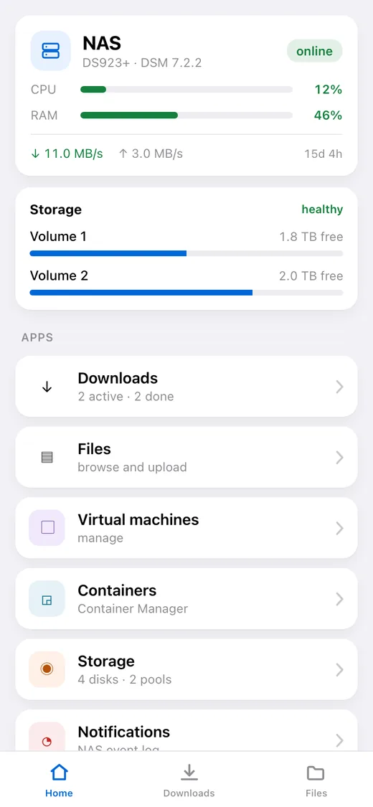
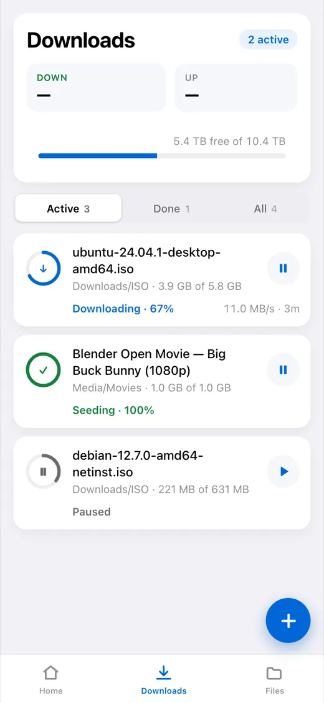
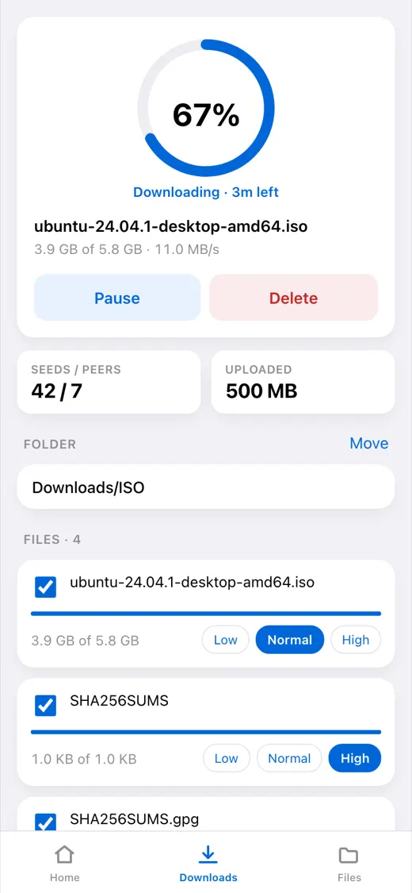
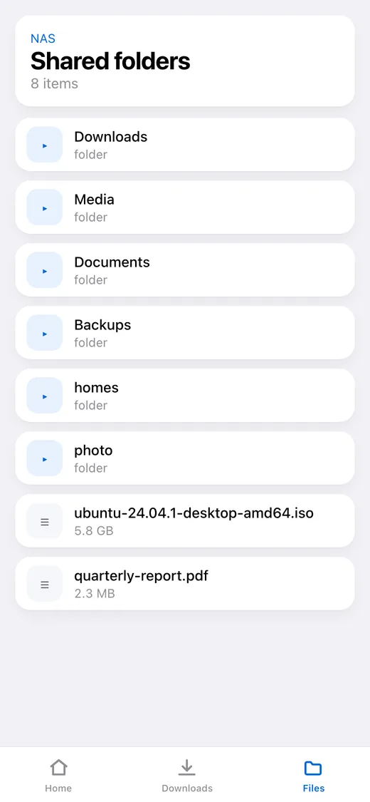
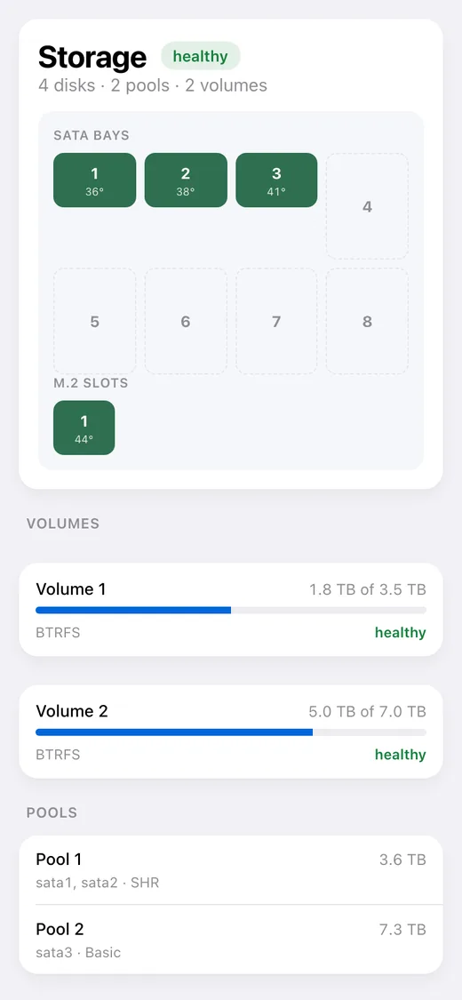

# dsm-mini

**English** · [Русский](README_RU.md) · [Español](README_ES.md) · [Português](README_PT.md) · [Deutsch](README_DE.md) · [Français](README_FR.md) · [Italiano](README_IT.md) · [Türkçe](README_TR.md) · [Українська](README_UK.md) · [Polski](README_PL.md)

[](https://github.com/alexlnos/dsm-mini/actions/workflows/ci.yml)
[](LICENSE)

A Telegram bot with a Mini App for running a home Synology NAS: Download Station
downloads and File Station files straight from the messenger, with no VPN and no
DSM web interface.

Drop a magnet link into the chat — the bot asks with buttons where to put it and
queues it. Open the app — you see what is downloading, how long is left, what is
on the disks and how the NAS is feeling.

<p align="center">
  
  
  
  
  
</p>

> Working: the bot, the Mini App and notifications. Requires DSM 7 or newer —
> the package will not install on DSM 6, and it has never been tested there.
> Checked on DSM 7.2.2 with Download Station 4.1.2 and File Station 1.4.4.

## What it can do

**Downloads**

- The task list: progress, speed, time left, seeds and peers
- Pause, resume, delete
- Adding by magnet link, by direct link and by `.torrent` file
- Choosing the destination folder, with a configurable quick-access list
- Choosing the files inside a torrent and their priority
- A message in the chat when a task finishes or fails

**Files**

- Browsing folders, previews, uploading to the NAS
- Rename, copy, move, delete

**NAS state**

- CPU and memory load, uptime, network
- Disks, pools and volumes: temperature, space used, health
- Virtual machines and containers: start and stop
- The DSM event log

**Language**

The app and the bot speak the language chosen in Telegram: English, Russian,
Spanish, Portuguese, German, French, Italian, Turkish, Ukrainian, Polish. An
unknown language gets English.

---

## Installation

Half an hour, most of it spent on the certificate rather than on the service.
You need a Synology NAS with DSM 7 and Download Station; nothing else has to be
installed beforehand.

> **Why a public address is needed.** Telegram opens a Mini App only over
> `https://` with a real certificate — a local `192.168.…` or a self-signed one
> will not open. The bot itself works without one, just without the button.

**1. Create the bot.** [@BotFather](https://t.me/BotFather) → `/newbot` → a name
and a username ending in `bot`. It answers with a token; keep it, it is the
password to your bot.

**2. Find out your number.** [@userinfobot](https://t.me/userinfobot) → Start.
It answers with the `Id` line.

**3. Make a DSM user for the service.** Control Panel → User & Group → Create.
Access to Download Station and File Station only, no two-factor verification —
a one-time code cannot be typed in from a configuration file. Do not give it an
administrator: the service can delete files.

**4. Get an address and a certificate.** Skip if the NAS already has a domain
with a valid certificate.

- Control Panel → External Access → DDNS → Add, provider `Synology` — that
  gives something like `alex-nas.synology.me`.
- On the router, forward ports **80** and **443** to the NAS. Without 80 the
  certificate will not be issued, without 443 the app will not open.
- Control Panel → Security → Certificate → Add → from Let's Encrypt, for that
  same name.

Check it from a phone on mobile internet: `https://alex-nas.synology.me:5001`
should open DSM with no warnings.

**5. Install the package.** Package Center → Settings → Package Sources → Add,
name `dsm-mini` and the address for your architecture:

- Intel and AMD, most models: `https://alexlnos.github.io/dsm-mini/amd64.json`
- ARM, budget models: `https://alexlnos.github.io/dsm-mini/arm64.json`

Then Settings → General → Trust Level → **Any publisher**, and install
**DSM mini (Telegram Mini App)** from the **Community** section. Not sure about
the architecture? Try `amd64`: a package that does not fit is simply refused.

The installer asks for seven values and explains each one as it asks —
everything for them was collected in the steps above. Or install the `.spk`
from the [releases](https://github.com/alexlnos/dsm-mini/releases) by hand,
through Package Center → Manual Install.

**6. Point the address at the service.** Control Panel → Login Portal →
Advanced → Reverse Proxy → Create. Source: `HTTPS`, your name, port `443`.
Destination: `HTTP`, `localhost`, port `8080`.

> Do not proxy port **80** for this name: DSM renews the certificate through
> it, and intercepting it breaks the renewal three months later.

**7. Check.** `https://your-address/healthz` in a browser should answer
`{"status":"ok"}`. Nothing is given away without a Telegram signature.

**8. Open the app.** Find the bot by its username, press Start, and a
**Downloads** button appears next to the input field. Send it any magnet link —
it offers folders as buttons.

## If something went wrong

| What you see | What it is | What to do |
|---|---|---|
| The bot is silent on `/start` | Wrong token, or the package is not running | Package Center → **DSM mini (Telegram Mini App)** → the log |
| "Access to this bot is closed" | Your ID is not on the list | Put the number from step 2 into the allowed IDs (see "Changing the settings" below) |
| There is no app button | The public address is empty or not `https://` | Same place: the settings file, then restart the package |
| The button is there, the app does not open | The reverse proxy or the certificate is not working | Open `https://your-address/healthz` in a browser |
| "Open the app through the bot" | The app was opened by a direct link in a browser | That is intended: open it from the bot |
| "Access denied: your Telegram ID…" | The service did not recognise you | The allowed IDs take digits only, comma separated |
| "authentication with DSM failed" in the log | The password, 2FA or the user's permissions | Step 3: password without typos, 2FA off, applications allowed |
| "Could not get the task list" in the log | Download Station is not installed, or is denied to the user | Package Center and the permissions from step 3 |
| The package stops right after starting | A setting is wrong — the log names which | The DSM notification centre shows the reason too |

The package log is the main source of truth: it names exactly what is missing.
It lives at `/var/packages/dsm-mini/var/dsm-mini.log` and opens from Package
Center.

### Changing the settings

Everything the wizard asked for lives in one file on the NAS,
`/var/packages/dsm-mini/var/config.env`, mode `600`.

Installing the package over itself will **not** ask again: the wizard runs on
installation, and an upgrade deliberately leaves the file alone — that is why
settings survive an update. So there are two ways:

- **Edit the file over SSH** (Control Panel → Terminal & SNMP → Enable SSH),
  then restart the package in Package Center. This keeps everything:

  ```bash
  sudo sed -i "s|^TELEGRAM_BOT_TOKEN=.*|TELEGRAM_BOT_TOKEN='your-new-token'|" /var/packages/dsm-mini/var/config.env
  sudo synopkg restart dsm-mini
  ```

- **Uninstall and install again** — the wizard asks for everything anew. This
  also removes the database next to the settings, so the pinned folders, the
  language and the last known task statuses are gone.

## Updating

If the package source was added, Package Center shows the update itself. Without
a source, download the fresh `.spk` from the
[releases](https://github.com/alexlnos/dsm-mini/releases) and install it over the
old one.

The settings and the database survive either way: they live in the package's
`var` directory, which an upgrade does not touch.

## Where the data is kept

Everything is in `/var/packages/dsm-mini/var/`:

- `config.env` — what the wizard asked for, mode `600`;
- `dsm-mini.db` — an SQLite database: the pinned folders, the language and the
  last known task statuses, from which the service knows what it has already
  reported;
- `dsm-mini.log` — the log.

An upgrade of the package keeps all three. Uninstalling removes them.

## Security

The service is exposed to the internet and can delete files on the NAS, so:

- **A separate DSM user**, not an administrator (step 3).
- **No two-factor verification** on that account: a one-time code cannot work
  from a configuration file.
- **The allowed IDs are an allow list.** An empty list closes access to everyone,
  it does not open it.
- Every request to `/api/` is checked twice: the `initData` signature with a key
  derived from the bot token, and the id against the allowed list. The signature
  only proves that a person opened the bot — and anyone can open it.
- The outside gets a generic phrase, the details go to the log: a message saying
  exactly what did not match in the signature would be a hint on how to forge it.
- The bot token and the DSM password live only in `config.env` on the NAS, mode
  `600`, and never reach the log: on a refusal the reason is written, never the
  value.
- The service listens on `127.0.0.1` only — from the NAS itself. Everything from
  outside goes through the DSM reverse proxy, which terminates TLS.

## Development

```bash
cd web && npm install && npm run build   # the Mini App lands in internal/web/dist
cd .. && go build ./cmd/dsm-mini         # a binary with the app embedded
go test ./...
```

The frontend on its own, with hot reload:

```bash
cd web && npm run dev    # talks to the backend on localhost:8080
```

Running the backend locally reads the same variables the package wizard writes
into `config.env`. It is convenient to keep them in a file:

```bash
cp .env.example .env     # fill it in
set -a; . ./.env; set +a
go run ./cmd/dsm-mini
```

The built interface is in the repository (`internal/web/dist`) — `go:embed`
picks it up. After changing the frontend, rebuild and commit the result,
otherwise the checks will not pass.

Integration tests run against a real NAS and are skipped by default:

```bash
DSM_URL=https://192.168.1.10:5001 DSM_USER=... DSM_PASSWORD=... \
  DSM_INSECURE_TLS=true go test -tags=integration ./...
```

Tests that change the state of the NAS need separate permission:
`DSM_TEST_MUTATIONS=1`, and for file operations also `DSM_TEST_FOLDER` — the
folder inside which temporary files may be created. They delete everything they
created.

A new interface language is one dictionary file on each side:
`web/src/i18n/<code>.ts` and `internal/i18n/<code>.go`. You cannot miss a string:
on the frontend the type watches for that, on the server a test does.

## Synology API quirks

The Synology Web API behaves differently from its documentation in places: one
and the same action answers in three different shapes, `limit = -1` takes File
Station down, and `_sid` during a file upload has to be passed differently from
everywhere else. Everything learned on a live NAS is collected in
[docs/synology-api.md](docs/synology-api.md).

## License

[MIT](LICENSE)
