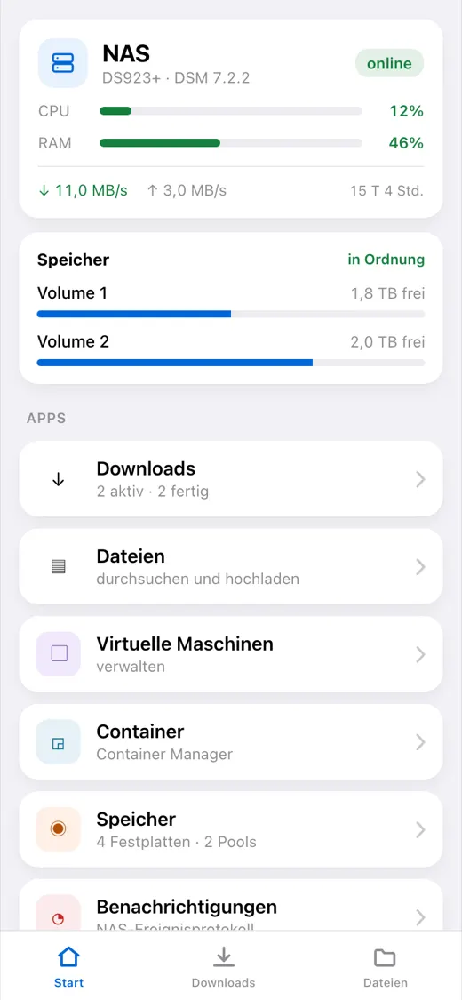
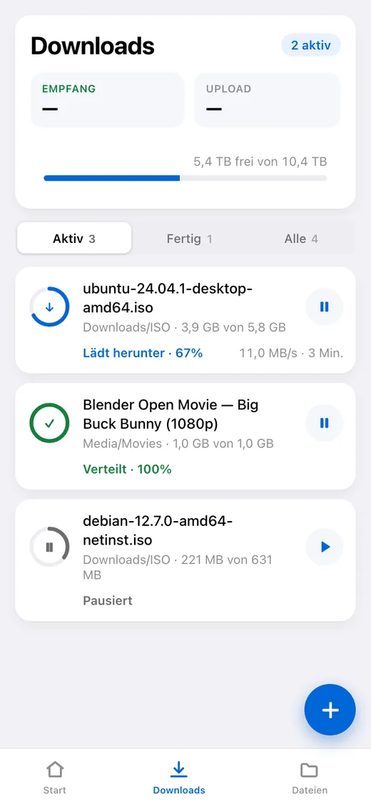
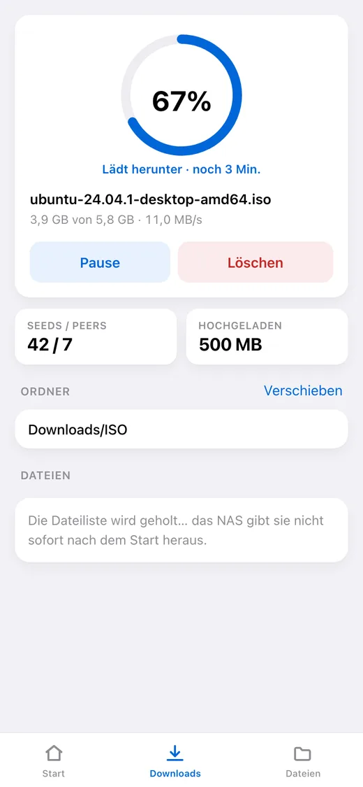
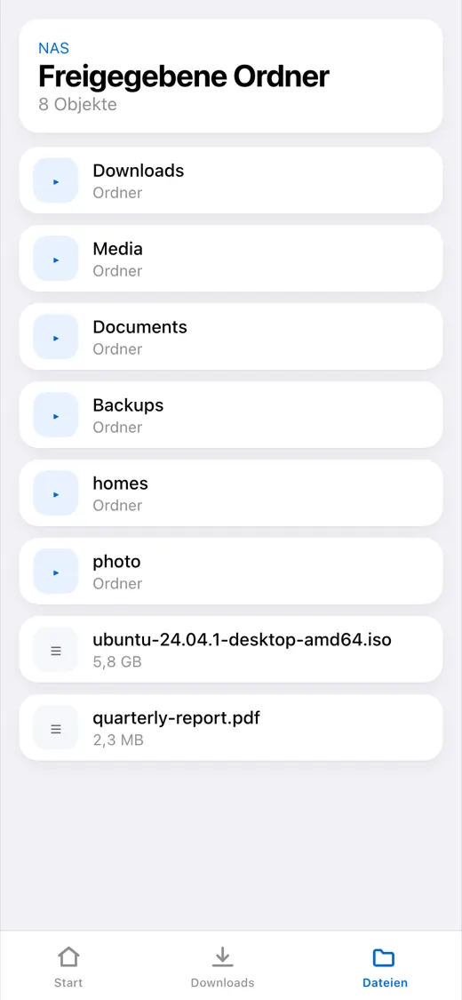
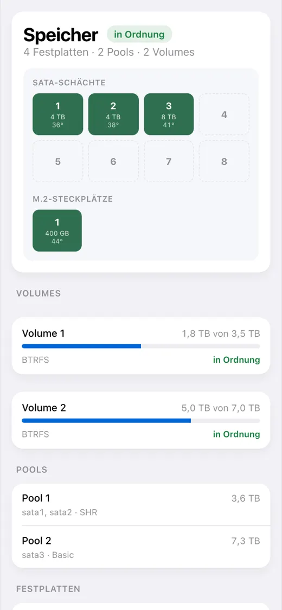

# dsm-mini

[English](README.md) · [Русский](README_RU.md) · [Español](README_ES.md) · [Português](README_PT.md) · **Deutsch** · [Français](README_FR.md) · [Italiano](README_IT.md) · [Türkçe](README_TR.md) · [Українська](README_UK.md) · [Polski](README_PL.md)

[](https://github.com/alexlnos/dsm-mini/actions/workflows/ci.yml)
[](LICENSE)

Ein Telegram-Bot mit Mini App für das heimische Synology-NAS: Downloads der
Download Station und Dateien der File Station direkt aus dem Messenger, ohne VPN
und ohne die DSM-Weboberfläche.

Einen Magnet-Link in den Chat geworfen — der Bot fragt mit Schaltflächen, wohin
damit, und stellt ihn in die Warteschlange. Die App geöffnet — und man sieht, was
lädt, wie lange es noch dauert, was auf den Platten liegt und wie es dem NAS
geht.

<p align="center">
  
  
  
  
  
</p>

> Funktioniert: der Bot, die Mini App und die Benachrichtigungen. Nötig ist DSM
> 7 oder neuer — auf DSM 6 lässt sich das Paket nicht installieren, und geprüft
> wurde es dort nie. Getestet auf DSM 7.2.2 mit Download Station 4.1.2 und
> File Station 1.4.4.

## Was es kann

**Downloads**

- Die Aufgabenliste: Fortschritt, Geschwindigkeit, Restzeit, Seeds und Peers
- Pausieren, fortsetzen, löschen
- Hinzufügen per Magnet-Link, per direktem Link und per `.torrent`-Datei
- Auswahl des Zielordners, mit einer einstellbaren Schnellzugriffsliste
- Auswahl der Dateien innerhalb eines Torrents und ihrer Priorität
- Eine Nachricht im Chat, wenn eine Aufgabe fertig ist oder scheitert

**Dateien**

- Ordner durchsehen, Vorschau, Hochladen auf das NAS
- Umbenennen, kopieren, verschieben, löschen

**Zustand des NAS**

- CPU- und Speicherauslastung, Laufzeit, Netzwerk
- Platten, Pools und Volumes: Temperatur, belegter Platz, Zustand
- Virtuelle Maschinen und Container: starten und stoppen
- Das DSM-Ereignisprotokoll

**Benachrichtigungen und Einstellungen**

- Was DSM selbst meldet — Sicherheitsberater, Platten, Updates — kommt in den Chat
- Die Wahl, was der Bot schicken darf: nichts, nur Downloads, alles
- Ein eigener Bildschirm im DSM-Hauptmenü: dort wird das Paket nach der Installation eingerichtet und später jede Einstellung geändert, ohne Neustart

**Sprache**

App und Bot sprechen die in Telegram gewählte Sprache: Englisch, Russisch,
Spanisch, Portugiesisch, Deutsch, Französisch, Italienisch, Türkisch,
Ukrainisch, Polnisch. Eine unbekannte Sprache bekommt Englisch.

---

## Installation

Eine halbe Stunde, der größte Teil davon geht für das Zertifikat drauf, nicht
für den Dienst. Nötig sind ein Synology-NAS mit DSM 7 und die Download Station;
sonst muss vorher nichts installiert werden.

> **Warum eine öffentliche Adresse nötig ist.** Telegram öffnet eine Mini App
> nur über `https://` mit einem echten Zertifikat — ein lokales `192.168.…`
> oder ein selbstsigniertes geht nicht auf. Der Bot selbst läuft auch ohne
> Adresse, nur eben ohne die Schaltfläche.

**1. Den Bot anlegen.** [@BotFather](https://t.me/BotFather) → `/newbot` → ein
Name und ein Benutzername, der auf `bot` endet. Zurück kommt ein Token; heben
Sie es auf, es ist das Passwort zu Ihrem Bot.

**2. Die eigene Nummer herausfinden.** [@userinfobot](https://t.me/userinfobot)
→ Start. Er antwortet mit der Zeile `Id`.

**3. Einen DSM-Benutzer für den Dienst anlegen.** Systemsteuerung → Benutzer &
Gruppe → Erstellen. Zugriff nur auf Download Station und File Station, ohne
zweistufige Verifizierung — einen Einmalcode kann eine Konfigurationsdatei
nicht liefern. Keinen Administrator: der Dienst kann Dateien löschen.

**4. Adresse und Zertifikat besorgen.** Überspringen, wenn das NAS schon eine
Domain mit gültigem Zertifikat hat.

- Systemsteuerung → Externer Zugriff → DDNS → Hinzufügen, Anbieter `Synology` —
  heraus kommt so etwas wie `alex-nas.synology.me`.
- Am Router die Ports **80** und **443** auf das NAS weiterleiten. Ohne 80 wird
  kein Zertifikat ausgestellt, ohne 443 geht die App nicht auf.
- Systemsteuerung → Sicherheit → Zertifikat → Hinzufügen → von Let's Encrypt,
  für genau diesen Namen.

Prüfen Sie es vom Telefon über mobiles Internet:
`https://alex-nas.synology.me:5001` muss DSM ohne Warnungen öffnen.

**5. Das Paket installieren.** Paket-Zentrum → Einstellungen → Paketquellen →
Hinzufügen, Name `dsm-mini` und die Adresse für Ihre Architektur:

- Intel und AMD, die meisten Modelle: `https://alexlnos.github.io/dsm-mini/amd64.json`
- ARM, günstige Modelle: `https://alexlnos.github.io/dsm-mini/arm64.json`

Danach Einstellungen → Allgemein → Vertrauensebene → **Beliebiger Herausgeber**,
und **DSM mini — Telegram Mini App** aus dem Bereich **Community** installieren.
Unsicher bei der Architektur? Probieren Sie `amd64`: ein unpassendes Paket wird
einfach abgelehnt.

Bei der Installation wird nichts abgefragt. Oder die `.spk` aus den
[Veröffentlichungen](https://github.com/alexlnos/dsm-mini/releases) von Hand
installieren, über Paket-Zentrum → Manuelle Installation.

**6. Einrichten.** Öffnen Sie **DSM mini** im DSM-Hauptmenü oder klicken Sie im
Paket-Zentrum auf **Öffnen**. Tragen Sie die fünf Werte ein — alles dafür wurde
in den Schritten oben zusammengetragen, und das Fenster erklärt jeden davon —
und klicken Sie auf **Speichern und starten**. Die Statuszeile oben im Fenster
zeigt, wann DSM und der Bot geantwortet haben, und was nicht stimmt, falls
nicht.

Die Reverse-Proxy-Regel für die Adresse legt das Fenster selbst an: tragen Sie
Ihren Namen unter **Einen Namen auf den Dienst richten** ein. Von Hand ist es
Systemsteuerung → Anmeldeportal → Erweitert → Reverse Proxy → Erstellen. Quelle:
`HTTPS`, Ihr Name, Port `443`. Ziel: `HTTP`, `localhost`, Port `58080`.

> Port **80** für diesen Namen nicht proxen: darüber erneuert DSM das
> Zertifikat, und ein Abfangen zerlegt die Erneuerung drei Monate später.

**7. Prüfen.** `https://ihre-adresse/healthz` im Browser muss
`{"status":"ok"}` antworten. Ohne Telegram-Signatur wird nichts herausgegeben.

**8. Die App öffnen.** Den Bot über seinen Benutzernamen finden, Start drücken —
neben dem Eingabefeld erscheint eine Schaltfläche **Downloads**. Schicken Sie
ihm irgendeinen Magnet-Link, er bietet Ordner als Schaltflächen an.

## Wenn etwas schiefgegangen ist

| Was du siehst | Woran es liegt | Was zu tun ist |
|---|---|---|
| Der Bot schweigt auf `/start` | Das Paket ist nicht eingerichtet, oder das Token ist falsch | **DSM mini** im DSM-Hauptmenü öffnen: die Statuszeile oben sagt, was davon |
| „Der Zugang zu diesem Bot ist geschlossen“ | Deine ID steht nicht auf der Liste | Die Nummer aus Schritt 2 im Fenster **DSM mini** zu den erlaubten IDs hinzufügen |
| Es gibt keine App-Schaltfläche | Die öffentliche Adresse ist leer oder nicht `https://` | Das Fenster **DSM mini**, öffentliche Adresse |
| Die Schaltfläche ist da, die App geht nicht auf | Reverse Proxy oder Zertifikat funktionieren nicht | `https://deine-adresse/healthz` im Browser öffnen |
| „Öffne die App über den Bot“ | Die App wurde per direktem Link im Browser geöffnet | So ist es gedacht: aus dem Bot heraus öffnen |
| „Zugriff verweigert: deine Telegram-ID…“ | Der Dienst hat dich nicht erkannt | In den erlaubten IDs nur Ziffern, durch Komma getrennt |
| Das Fenster meldet, DSM habe die Anmeldung abgelehnt | Das Passwort, 2FA oder die Rechte des Benutzers | Schritt 3: Passwort ohne Tippfehler, 2FA aus, Anwendungen erlaubt |
| Das Fenster meldet, Download Station laufe nicht | Sie ist nicht installiert oder dem Benutzer verboten | Paket-Zentrum und die Rechte aus Schritt 3 |
| Das Paket stoppt gleich nach dem Start | Sein Port ist anderweitig belegt — das Protokoll sagt es | `LISTEN_ADDR` in `config.env` über SSH ändern (siehe unten) |

Der erste Blick gehört der Statuszeile oben im Fenster **DSM mini**: sie sagt,
ob DSM und Telegram geantwortet haben, und wenn nicht, warum. Die Einzelheiten
stehen im Protokoll des Pakets, `/var/packages/dsm-mini/var/dsm-mini.log`, das
sich auch aus dem Paket-Zentrum öffnet. Das Protokoll läuft auf Englisch,
Fenster, Oberfläche und Bot-Nachrichten in deiner Sprache.

### Einstellungen ändern

**Öffnen Sie DSM mini im DSM-Hauptmenü** — dort sind alle Einstellungen.
Passwort und Token sind nur schreibbar: ein leeres Feld behält den alten Wert.
Gespeichertes gilt sofort: der Dienst startet sich selbst mit den neuen
Einstellungen neu, das Paket muss nicht neu gestartet werden.

Die Einstellungen stehen auf dem NAS in einer Datei,
`/var/packages/dsm-mini/var/config.env`, Rechte `600`. Sie lässt sich auch über
SSH bearbeiten (Systemsteuerung → Terminal & SNMP → SSH einschalten); danach das
Paket neu starten:

```bash
sudo sed -i "s|^TELEGRAM_BOT_TOKEN=.*|TELEGRAM_BOT_TOKEN='dein-neues-token'|" /var/packages/dsm-mini/var/config.env
sudo synopkg restart dsm-mini
```

Eine Aktualisierung lässt die Datei in Ruhe, darum überstehen die Einstellungen
ein Update.

## Aktualisieren

Ist die Paketquelle eingetragen, zeigt das Paket-Zentrum die Aktualisierung von
selbst. Ohne Quelle die frische `.spk` aus den
[Veröffentlichungen](https://github.com/alexlnos/dsm-mini/releases) laden und
darüber installieren.

Einstellungen und Datenbank bleiben in beiden Fällen: sie liegen im
`var`-Verzeichnis des Pakets, das eine Aktualisierung nicht anrührt.

## Wo die Daten liegen

Alles in `/var/packages/dsm-mini/var/`:

- `config.env` — die Einstellungen aus dem Fenster DSM mini, Rechte `600`;
- `dsm-mini.db` — eine SQLite-Datenbank: die angehefteten Ordner, die Sprache
  und die zuletzt bekannten Aufgabenzustände, an denen der Dienst erkennt,
  worüber er schon berichtet hat;
- `dsm-mini.log` — das Protokoll.

Ein Upgrade des Pakets behält alle drei. Das Deinstallieren löscht sie.

## Sicherheit

Der Dienst steht im Internet und kann Dateien auf dem NAS löschen, darum:

- **Ein eigener DSM-Benutzer**, kein Administrator (Schritt 3).
- **Ohne zweistufige Verifizierung** bei diesem Konto: ein Einmalcode kann aus
  einer Konfigurationsdatei nicht funktionieren.
- **Die erlaubten IDs sind eine Positivliste.** Eine leere Liste schließt den
  Zugang für alle, sie öffnet ihn nicht.
- Jede Anfrage an `/api/` wird zweimal geprüft: die `initData`-Signatur mit
  einem Schlüssel aus dem Bot-Token, und die Kennung gegen die Liste. Die
  Signatur beweist nur, dass jemand den Bot geöffnet hat — und öffnen kann ihn
  jeder.
- Nach außen geht ein allgemeiner Satz, die Einzelheiten ins Protokoll: eine
  Meldung, was genau an der Signatur nicht gestimmt hat, wäre ein Hinweis
  darauf, wie man sie fälscht.
- Bot-Token und DSM-Passwort stehen nur in `config.env` auf dem NAS selbst,
  Rechte `600`, und gelangen nie ins Protokoll: bei einer Ablehnung wird der
  Grund geschrieben, nie der Wert.
- Der Dienst lauscht nur auf `127.0.0.1` — also vom NAS selbst. Alles von außen
  läuft über den Reverse Proxy von DSM, der auch das TLS beendet.

## Entwicklung

```bash
cd web && npm install && npm run build   # die Mini App landet in internal/web/dist
cd .. && go build ./cmd/dsm-mini         # eine Binärdatei mit eingebetteter App
go test ./...
```

Das Frontend für sich, mit automatischem Neuladen:

```bash
cd web && npm run dev    # spricht mit dem Backend auf localhost:58080
```

Das Backend lokal zu starten liest `config.env` aus `STATE_DIR`, wie das Paket
auch, und Umgebungsvariablen ergänzen, was in der Datei fehlt. Praktisch ist es,
sie in einer Datei zu halten:

```bash
cp .env.example .env     # ausfüllen
set -a; . ./.env; set +a
go run ./cmd/dsm-mini
```

Die gebaute Oberfläche liegt im Repository (`internal/web/dist`) — von dort holt
sie `go:embed`. Nach Änderungen am Frontend neu bauen und das Ergebnis
committen, sonst gehen die Prüfungen nicht durch.

Die Integrationstests laufen gegen ein echtes NAS und werden standardmäßig
übersprungen:

```bash
DSM_URL=https://192.168.1.10:5001 DSM_USER=... DSM_PASSWORD=... \
  DSM_INSECURE_TLS=true go test -tags=integration ./...
```

Tests, die den Zustand des NAS ändern, brauchen eine gesonderte Erlaubnis:
`DSM_TEST_MUTATIONS=1`, und für Dateioperationen zusätzlich `DSM_TEST_FOLDER` —
den Ordner, in dem temporäre Dateien angelegt werden dürfen. Alles Angelegte
räumen sie hinter sich weg.

Eine neue Oberflächensprache ist je eine Wörterbuchdatei auf beiden Seiten:
`web/src/i18n/<Code>.ts` und `internal/i18n/<Code>.go`. Eine Zeile auszulassen
geht nicht: im Frontend wacht der Typ darüber, auf dem Server ein Test.

Code, Kommentare und Protokoll sind im Projekt englisch; die übrigen Sprachen
leben nur in den Wörterbüchern. Einzelheiten stehen in [CLAUDE.md](CLAUDE.md).

## Besonderheiten der Synology-API

Die Synology-Web-API verhält sich stellenweise anders als ihre Dokumentation:
ein und dieselbe Aktion antwortet in drei verschiedenen Formaten, `limit = -1`
legt die File Station lahm, und `_sid` muss beim Hochladen einer Datei anders
übergeben werden als überall sonst. Alles, was an einem echten NAS
herausgefunden wurde, steht in [docs/synology-api.md](docs/synology-api.md).

## Lizenz

[MIT](LICENSE)
