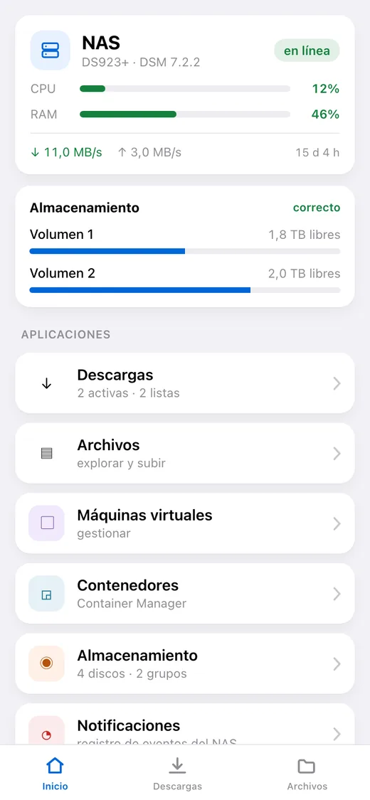
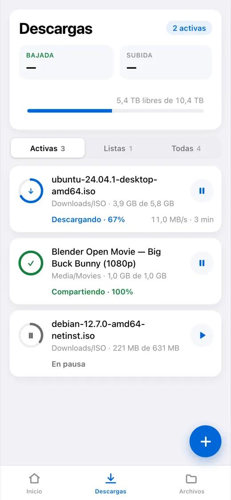
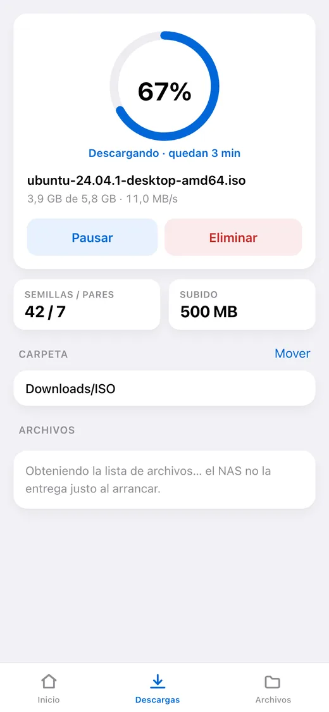
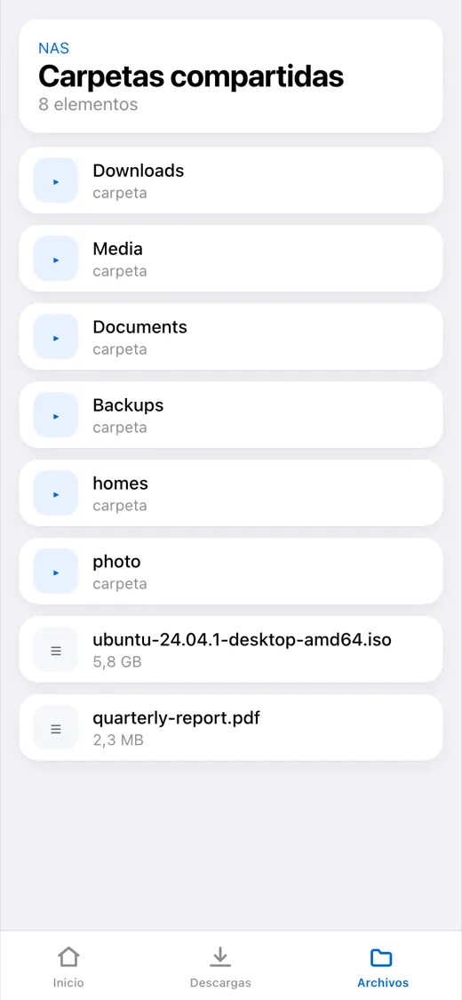
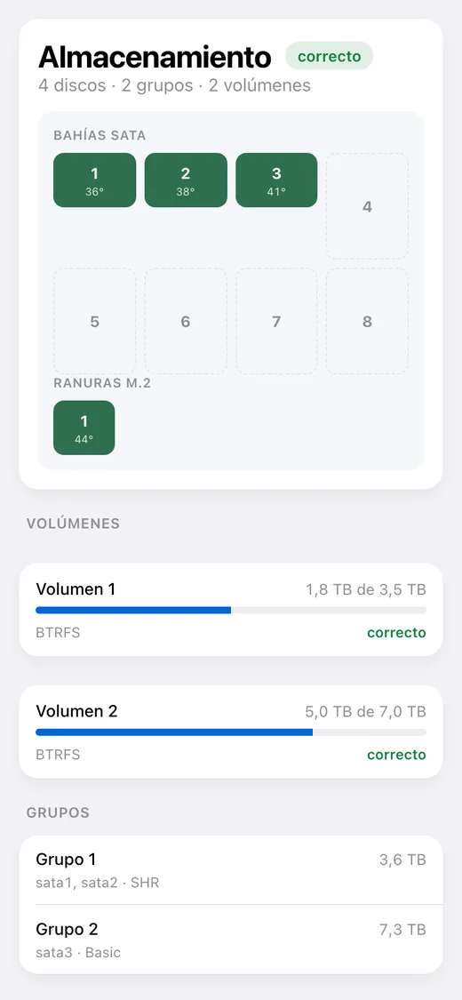

# dsm-mini

[English](README.md) · [Русский](README_RU.md) · **Español** · [Português](README_PT.md) · [Deutsch](README_DE.md) · [Français](README_FR.md) · [Italiano](README_IT.md) · [Türkçe](README_TR.md) · [Українська](README_UK.md) · [Polski](README_PL.md)

[](https://github.com/alexlnos/dsm-mini/actions/workflows/ci.yml)
[](LICENSE)

Un bot de Telegram con Mini App para gobernar un NAS Synology doméstico:
descargas de Download Station y archivos de File Station directamente desde la
mensajería, sin VPN y sin la interfaz web de DSM.

Suelta un enlace magnet en el chat: el bot pregunta con botones dónde ponerlo y
lo pone en cola. Abre la aplicación y verás qué se está descargando, cuánto
falta, qué hay en los discos y cómo se encuentra el NAS.

<p align="center">
  
  
  
  
  
</p>

> Funcionando: el bot, la Mini App y las notificaciones. Requiere DSM 7 o
> posterior: en DSM 6 el paquete no se instalará y allí nadie lo ha probado.
> Probado en DSM 7.2.2 con Download Station 4.1.2 y File Station 1.4.4.

## Qué sabe hacer

**Descargas**

- La lista de tareas: progreso, velocidad, tiempo restante, semillas y pares
- Pausar, reanudar, eliminar
- Añadir por enlace magnet, por enlace directo y por archivo `.torrent`
- Elegir la carpeta de destino, con una lista de acceso rápido configurable
- Elegir los archivos dentro de un torrent y su prioridad
- Un mensaje en el chat cuando una tarea termina o falla

**Archivos**

- Explorar carpetas, vistas previas, subir al NAS
- Renombrar, copiar, mover, eliminar

**Estado del NAS**

- Carga de CPU y memoria, tiempo encendido, red
- Discos, grupos y volúmenes: temperatura, espacio usado, salud
- Máquinas virtuales y contenedores: arrancar y parar
- El registro de eventos de DSM

**Idioma**

La aplicación y el bot hablan el idioma elegido en Telegram: inglés, ruso,
español, portugués, alemán, francés, italiano, turco, ucraniano, polaco. Un
idioma desconocido recibe inglés.

---

## Instalación

Lo que sigue va paso a paso. No hace falta saber nada de antemano, pero reserva
media hora: la mayor parte se va en el certificado, no en el servicio.

### Qué vas a necesitar

- **Un NAS Synology** con DSM 7. No hay que instalar nada de antemano: el
  servicio llega como paquete de DSM y corre en el propio NAS.
- **Download Station** — instálalo desde el Centro de paquetes si aún no está.
- **Telegram** en el teléfono.
- **Acceso al router** — hay que abrir dos puertos.

> **Por qué hace falta una dirección pública.** Telegram solo abre una Mini App
> por `https://` con un certificado de verdad. Uno autofirmado, un `192.168.…`
> local o una dirección tipo `nas:5001` no sirven: la aplicación simplemente no
> se abrirá. El bot funciona sin dirección, solo que sin el botón.

---

### Paso 1. Crear el bot

1. Abre [@BotFather](https://t.me/BotFather) en Telegram y pulsa **Start**.
2. Envía `/newbot`.
3. Escribe el **nombre** del bot — el que quieras, es lo que se ve en la
   cabecera del chat. Por ejemplo: `Mi NAS`.
4. Escribe el **usuario** del bot — en letras latinas y terminando
   obligatoriamente en `bot`. Por ejemplo: `alex_home_nas_bot`. Si está ocupado,
   BotFather pedirá otro.
5. La respuesta es una línea como
   `1234567890:AAExampleTokenReplaceThisWithYours0`. Ese es el **token**.
   Cópialo: lo necesitas en el paso 5.

> El token es la contraseña del bot. Quien lo tenga controla el bot. No lo
> publiques en chats ni en GitHub.

### Paso 2. Averiguar tu ID de Telegram

Es el número con el que el servicio sabrá que escribes tú y no un desconocido.

1. Abre [@userinfobot](https://t.me/userinfobot) y pulsa **Start**.
2. Responderá con un número en la línea `Id`, por ejemplo `123456789`. Anótalo.

### Paso 3. Crear un usuario aparte en el NAS

El servicio puede borrar archivos, así que darle un administrador es mala idea.

1. En DSM: **Panel de control → Usuario y grupo → Usuario → Crear**.
2. Nombre: `dsm-mini`. La contraseña, larga y aleatoria; anótala.
3. **No actives la verificación en dos pasos.** No hay de dónde sacar el código
   de un solo uso y el inicio de sesión simplemente no pasará.
4. Grupos: deja `users`.
5. Carpetas compartidas: da acceso **solo** a aquellas donde vayas a descargar
   (normalmente `download` o `Media`). Al resto, «Sin acceso».
6. Aplicaciones: permite **Download Station** y **File Station**, deniega el
   resto.

> Si en el paso 5 el registro dice `authentication with DSM failed`, vuelve aquí
> y permite a este usuario también la aplicación **DSM**: en algunas versiones
> el inicio de sesión no pasa sin ella, ni siquiera por la API.

### Paso 4. Conseguir una dirección y un certificado

Si ya tienes un dominio con un certificado válido en el NAS, sáltate el paso.

1. **El nombre.** Panel de control → **Acceso externo → DDNS → Añadir**.
   Proveedor `Synology`, nombre de host el que esté libre, por ejemplo
   `alex-nas`. Sale la dirección `alex-nas.synology.me`. Guarda.
2. **Puertos en el router.** En los ajustes del router redirige el **puerto 80**
   y el **puerto 443** a la dirección interna del NAS. Sin el 80 no se emitirá el
   certificado, sin el 443 no se abrirá la aplicación.
3. **El certificado.** Panel de control → **Seguridad → Certificado → Añadir →
   Obtener un certificado de Let's Encrypt**. El nombre de dominio es ese mismo
   `alex-nas.synology.me`, el correo el tuyo. Emitirlo lleva un minuto.

Compruébalo: abre `https://alex-nas.synology.me:5001` desde el móvil con datos
(no por el Wi-Fi de casa). DSM debe abrirse sin avisos de certificado.

### Paso 5. Instalar el paquete

Lo más fácil es **añadir un origen de paquetes**, así la instalación y las
actualizaciones van por el propio Centro de paquetes:

1. **Centro de paquetes → Configuración → Orígenes de paquetes → Añadir**.
2. Nombre: `dsm-mini`. La dirección depende de tu arquitectura:
   - Intel y AMD (la mayoría de modelos): `https://alexlnos.github.io/dsm-mini/amd64.json`
   - ARM (modelos básicos): `https://alexlnos.github.io/dsm-mini/arm64.json`
3. Permite paquetes de terceros: **Configuración → General → Nivel de confianza
   → Cualquier editor**.
4. A la izquierda aparecerá la sección **Comunidad** y dentro `dsm-mini`. Pulsa
   Instalar: el asistente pedirá después los ajustes.

Si no sabes tu arquitectura, prueba `amd64`: DSM se niega sin más a instalar un
paquete que no encaja, así no se rompe nada.

**O a mano, sin origen:**

1. Descarga el `.spk` de la página de
   [versiones](https://github.com/alexlnos/dsm-mini/releases): `-amd64` para
   modelos Intel y AMD (DS918+, DS923+, DS1522+, SA6400 y similares), `-arm64`
   para los básicos con ARM (DS223, DS124). Si dudas, coge `amd64`: DSM se
   niega sin más a instalar un paquete que no encaja.
2. **Centro de paquetes → Instalación manual → Examinar** y elige el archivo
   descargado.
3. DSM dirá que el editor es desconocido. Es normal en un paquete de terceros:
   permítelo una vez en **Centro de paquetes → Configuración → General → Nivel
   de confianza → Cualquier editor**.

#### Qué pregunta el asistente

El instalador tiene dos pantallas y siete campos. Todo lo que hace falta para
ellos se reunió en los pasos del 1 al 4.

| Campo | Qué poner |
|---|---|
| Dirección de DSM | Ya viene puesta: `https://localhost:5001`. El servicio corre en el propio NAS, así que déjala |
| Usuario de DSM | El nombre del usuario del paso 3, por ejemplo `dsm-mini` |
| Contraseña de DSM | La contraseña de ese usuario |
| Token del bot | El token del paso 1 |
| IDs de Telegram permitidos | Tu número del paso 2. Varias personas: separadas por comas |
| Dirección pública HTTPS | Tu dirección del paso 4, por ejemplo `https://alex-nas.synology.me` |
| Puerto local | Deja `8080`. Cámbialo solo si algo en el NAS ya ocupa ese puerto |

**Los errores que de verdad se cometen aquí:**

| Escrito | Correcto |
|---|---|
| `alex-nas.synology.me` | `https://alex-nas.synology.me` — con el protocolo |
| `https://alex-nas.synology.me/` | sin barra al final |
| Una lista de IDs vacía | vacío significa **nadie**; pon tu número |
| Tu dirección pública en el campo de la dirección de DSM | la dirección de DSM se queda en `https://localhost:5001` |
| Un código de 2FA de un solo uso como contraseña | la cuenta no debe tener verificación en dos pasos en absoluto (paso 3) |

Después de instalarlo el paquete arranca solo y se levanta junto con el NAS. Los
ajustes quedan en `/var/packages/dsm-mini/var/config.env` (permisos `600`), y el
registro al lado, en `dsm-mini.log`.

Si el servicio no consigue arrancar —token equivocado, contraseña equivocada,
sin red— lo dice en el **centro de notificaciones de DSM**, con el motivo. El
registro completo está en el Centro de paquetes, en la página del paquete.

### Paso 6. Dirigir la dirección al servicio

Ahora mismo el servicio solo escucha dentro del NAS, en el puerto 8080. El proxy
inverso recibe las peticiones de internet por HTTPS y se las pasa.

1. **Panel de control → Portal de inicio de sesión → Avanzado → Proxy inverso →
   Crear**.
   (En DSM 7.0–7.1 es **Panel de control → Portal de aplicaciones → Proxy
   inverso**.)
2. **Origen**: protocolo `HTTPS`, nombre de host `alex-nas.synology.me`, puerto
   `443`.
3. **Destino**: protocolo `HTTP`, nombre de host `localhost`, puerto `8080`.
4. Guarda.

> **No hagas proxy del puerto 80 para este nombre**: por ahí DSM renueva el
> certificado de Let's Encrypt, e interceptarlo rompe la renovación tres meses
> después.

### Paso 7. Comprobar

Abre `https://alex-nas.synology.me/healthz` en un navegador. Debe responder:

```json
{"status":"ok"}
```

Si responde, el servicio está vivo y se alcanza desde fuera. Y no entrega datos
al hacerlo: cualquier petición sin firma de Telegram es rechazada.

### Paso 8. Abrir la aplicación

1. Busca tu bot en Telegram por el usuario del paso 1.
2. Pulsa **Start**.
3. Abajo, junto al campo de escritura, aparece un botón **Descargas** que abre la
   aplicación. El bot lo coloca solo al arrancar, no hay que configurar nada a
   mano.
4. Mándale al bot cualquier enlace magnet: te ofrecerá carpetas con botones.

Listo.

---

## Si algo ha salido mal

| Qué ves | De qué se trata | Qué hacer |
|---|---|---|
| El bot calla ante `/start` | Token incorrecto, o el paquete no está en marcha | Centro de paquetes → `dsm-mini` → el registro |
| «El acceso a este bot está cerrado» | Tu ID no está en la lista | Pon el número del paso 2 en los IDs permitidos (ver «Cambiar los ajustes» abajo) |
| No hay botón de la aplicación | La dirección pública está vacía o no es `https://` | En el mismo sitio: el archivo de ajustes, luego reinicia el paquete |
| El botón está, la aplicación no abre | El proxy inverso o el certificado no funcionan | Abre `https://tu-direccion/healthz` en un navegador |
| «Abre la aplicación desde el bot» | La aplicación se abrió por enlace directo en un navegador | Es lo previsto: ábrela desde el bot |
| «Acceso denegado: tu ID de Telegram…» | El servicio no te reconoció | En los IDs permitidos solo dígitos, separados por comas |
| `authentication with DSM failed` en el registro | La contraseña, la 2FA o los permisos del usuario | Paso 3: contraseña sin erratas, 2FA apagada, aplicaciones permitidas |
| `Could not get the task list` en el registro | Download Station no está instalado o está denegado al usuario | Centro de paquetes y los permisos del paso 3 |
| El paquete se detiene nada más arrancar | Un ajuste está mal: el registro dice cuál | El motivo llega también al centro de notificaciones de DSM |

El registro del paquete es la fuente de verdad principal: dice exactamente qué
falta. Está en `/var/packages/dsm-mini/var/dsm-mini.log` y se abre desde el
Centro de paquetes. El registro va en inglés, la interfaz y los mensajes del bot
en tu idioma.

### Cambiar los ajustes

Todo lo que preguntó el asistente está en un único archivo,
`/var/packages/dsm-mini/var/config.env`. Lo más simple para cambiar un valor es
instalar el paquete sobre sí mismo: el asistente vuelve a preguntar. Para editar
el archivo directamente hace falta SSH al NAS; después de editarlo, detén e
inicia el paquete en el Centro de paquetes.

## Actualizar

Si añadiste el origen de paquetes, el Centro de paquetes muestra la
actualización solo. Sin origen, descarga el `.spk` nuevo de las
[versiones](https://github.com/alexlnos/dsm-mini/releases) e instálalo encima.

Los ajustes y la base de datos se quedan en ambos casos: viven en el directorio
`var` del paquete, que una actualización no toca.

## Dónde se guardan los datos

Todo está en `/var/packages/dsm-mini/var/`:

- `config.env` — lo que preguntó el asistente, permisos `600`;
- `dsm-mini.db` — una base SQLite: las carpetas fijadas, el idioma y los últimos
  estados conocidos de las tareas, con los que el servicio sabe de qué ya ha
  avisado;
- `dsm-mini.log` — el registro.

Actualizar el paquete conserva los tres. Desinstalarlo los borra.

## Seguridad

El servicio está expuesto a internet y puede borrar archivos del NAS, así que:

- **Un usuario de DSM aparte**, no un administrador (paso 3).
- **Sin verificación en dos pasos** en esa cuenta: un código de un solo uso no
  puede funcionar desde un archivo de configuración.
- **Los IDs permitidos son una lista de admitidos.** Una lista vacía cierra el
  acceso a todos, no lo abre.
- Cada petición a `/api/` se comprueba dos veces: la firma de `initData` con una
  clave derivada del token del bot, y el identificador contra la lista. La firma
  solo demuestra que alguien abrió el bot, y abrirlo puede cualquiera.
- Hacia fuera va una frase genérica y los detalles al registro: un mensaje que
  dijera qué no cuadró exactamente en la firma sería una pista para falsificarla.
- El token del bot y la contraseña de DSM viven solo en `config.env`, en el
  propio NAS, con permisos `600`, y nunca llegan al registro: en un rechazo se
  escribe el motivo, nunca el valor.
- El servicio escucha solo en `127.0.0.1`, es decir desde el propio NAS. Todo lo
  que viene de fuera pasa por el proxy inverso de DSM, que además termina el TLS.

## Desarrollo

```bash
cd web && npm install && npm run build   # la Mini App acaba en internal/web/dist
cd .. && go build ./cmd/dsm-mini         # un binario con la aplicación incrustada
go test ./...
```

El frontend por separado, con recarga automática:

```bash
cd web && npm run dev    # habla con el backend en localhost:8080
```

Ejecutar el backend en local lee las mismas variables que el asistente del
paquete escribe en `config.env`. Va bien tenerlas en un archivo:

```bash
cp .env.example .env     # rellénalo
set -a; . ./.env; set +a
go run ./cmd/dsm-mini
```

La interfaz compilada está en el repositorio (`internal/web/dist`), de donde la
recoge `go:embed`. Tras tocar el frontend, recompila y haz commit del resultado o
las comprobaciones no pasarán.

Las pruebas de integración van contra un NAS real y se saltan por defecto:

```bash
DSM_URL=https://192.168.1.10:5001 DSM_USER=... DSM_PASSWORD=... \
  DSM_INSECURE_TLS=true go test -tags=integration ./...
```

Las pruebas que cambian el estado del NAS necesitan permiso aparte:
`DSM_TEST_MUTATIONS=1`, y para las operaciones de archivos también
`DSM_TEST_FOLDER`, la carpeta dentro de la cual se pueden crear archivos
temporales. Borran todo lo que crean.

Un idioma nuevo de la interfaz es un archivo de diccionario en cada lado:
`web/src/i18n/<código>.ts` e `internal/i18n/<código>.go`. No se puede olvidar una
cadena: en el frontend lo vigila el tipo, en el servidor una prueba.

El código, los comentarios y el registro del proyecto van en inglés; los demás
idiomas viven solo en los diccionarios. Los detalles, en [CLAUDE.md](CLAUDE.md).

## Particularidades de la API de Synology

La Web API de Synology se comporta a ratos de forma distinta a su documentación:
una misma acción responde en tres formatos diferentes, `limit = -1` tumba File
Station y el `_sid` al subir un archivo hay que pasarlo de otra manera que en el
resto. Todo lo averiguado en un NAS real está recogido en
[docs/synology-api.md](docs/synology-api.md).

## Licencia

[MIT](LICENSE)
