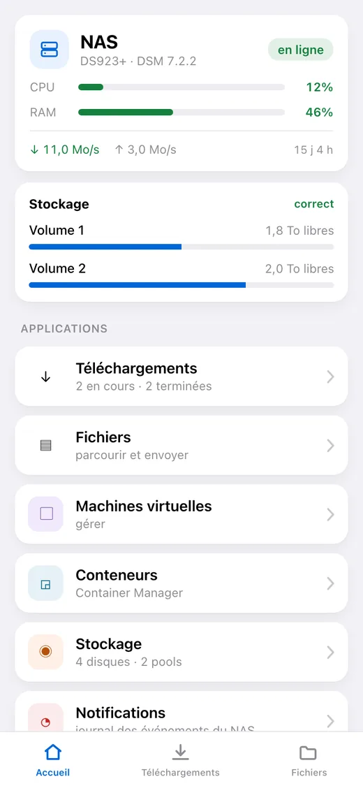
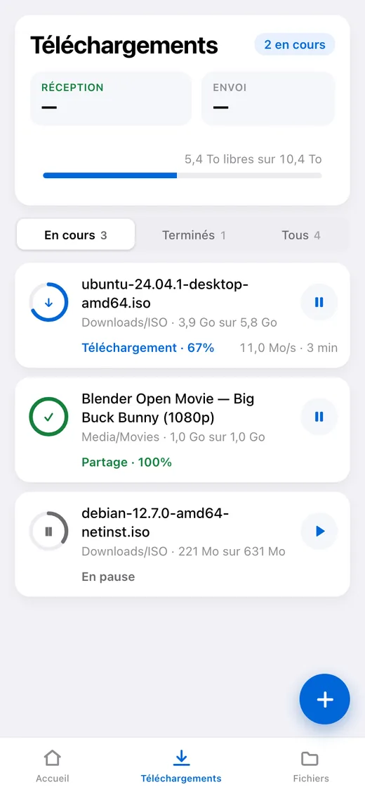
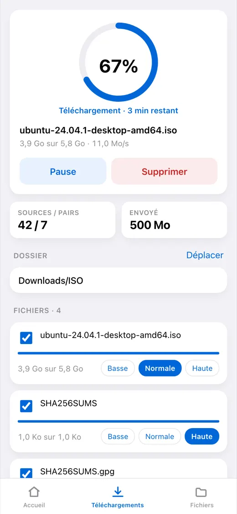
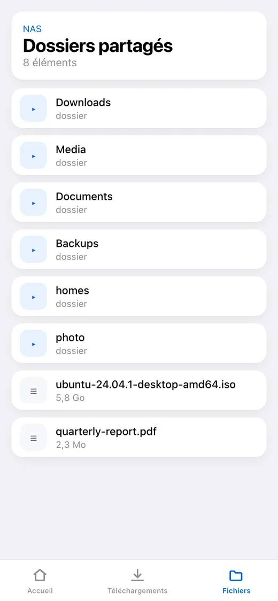
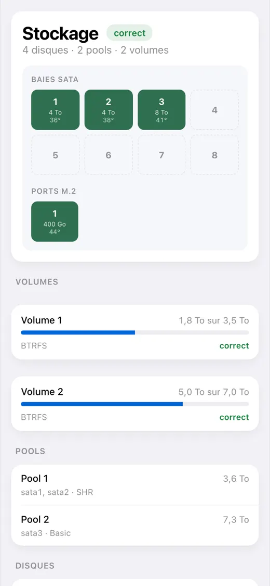

# dsm-mini

[English](README.md) · [Русский](README_RU.md) · [Español](README_ES.md) · [Português](README_PT.md) · [Deutsch](README_DE.md) · **Français** · [Italiano](README_IT.md) · [Türkçe](README_TR.md) · [Українська](README_UK.md) · [Polski](README_PL.md)

[](https://github.com/alexlnos/dsm-mini/actions/workflows/ci.yml)
[](LICENSE)

Un bot Telegram avec Mini App pour piloter un NAS Synology domestique : les
téléchargements de Download Station et les fichiers de File Station directement
depuis la messagerie, sans VPN et sans l'interface web de DSM.

Vous lâchez un lien magnet dans la discussion — le bot demande avec des boutons
où le mettre et le met en file. Vous ouvrez l'application — et vous voyez ce qui
se télécharge, ce qu'il reste, ce qu'il y a sur les disques et comment se porte
le NAS.

<p align="center">
  
  
  
  
  
</p>

> Ce qui marche : le bot, la Mini App et les notifications. Il faut DSM 7 ou
> plus récent — sur DSM 6 le paquet ne s'installera pas, et personne ne l'y a
> testé. Vérifié sur DSM 7.2.2 avec Download Station 4.1.2 et File Station
> 1.4.4.

## Ce qu'il sait faire

**Téléchargements**

- La liste des tâches : progression, vitesse, temps restant, sources et pairs
- Mettre en pause, reprendre, supprimer
- Ajout par lien magnet, par lien direct et par fichier `.torrent`
- Choix du dossier de destination, avec une liste d'accès rapide configurable
- Choix des fichiers à l'intérieur d'un torrent et de leur priorité
- Un message dans la discussion quand une tâche se termine ou échoue

**Fichiers**

- Parcourir les dossiers, aperçus, envoi vers le NAS
- Renommer, copier, déplacer, supprimer

**État du NAS**

- Charge processeur et mémoire, temps de fonctionnement, réseau
- Disques, groupes et volumes : température, espace occupé, santé
- Machines virtuelles et conteneurs : démarrage et arrêt
- Le journal des événements DSM

**Notifications et réglages**

- Ce que DSM annonce lui-même — conseiller de sécurité, disques, mises à jour — arrive dans le chat
- Le choix de ce que le bot peut envoyer : rien, seulement les téléchargements, tout
- Un écran à lui dans le menu principal de DSM : tous les réglages, sans modifier un fichier en SSH

**Langue**

L'application et le bot parlent la langue choisie dans Telegram : anglais, russe,
espagnol, portugais, allemand, français, italien, turc, ukrainien, polonais. Une
langue inconnue reçoit l'anglais.

---

## Installation

Une demi-heure, dont l'essentiel passe dans le certificat et non dans le
service. Il faut un NAS Synology avec DSM 7 et Download Station ; rien d'autre
à installer au préalable.

> **Pourquoi une adresse publique est nécessaire.** Telegram n'ouvre une Mini
> App qu'en `https://` avec un vrai certificat : un `192.168.…` local ou un
> auto-signé ne s'ouvriront pas. Le bot, lui, fonctionne sans adresse — mais
> sans le bouton.

**1. Créer le bot.** [@BotFather](https://t.me/BotFather) → `/newbot` → un nom
et un identifiant se terminant par `bot`. Il répond par un jeton ; gardez-le,
c'est le mot de passe de votre bot.

**2. Connaître son numéro.** [@userinfobot](https://t.me/userinfobot) → Start.
Il répond par la ligne `Id`.

**3. Créer un utilisateur DSM pour le service.** Panneau de configuration →
Utilisateur et groupe → Créer. Accès à Download Station et File Station
uniquement, sans vérification en deux étapes : un code à usage unique ne peut
pas venir d'un fichier de configuration. Pas d'administrateur : le service sait
supprimer des fichiers.

**4. Obtenir une adresse et un certificat.** À sauter si le NAS a déjà un
domaine avec un certificat valide.

- Panneau de configuration → Accès externe → DDNS → Ajouter, fournisseur
  `Synology` : on obtient quelque chose comme `alex-nas.synology.me`.
- Sur le routeur, redirigez vers le NAS les ports **80** et **443**. Sans le 80
  le certificat ne sera pas délivré, sans le 443 l'application ne s'ouvrira pas.
- Panneau de configuration → Sécurité → Certificat → Ajouter → de Let's
  Encrypt, pour ce même nom.

Vérifiez depuis un téléphone en données mobiles :
`https://alex-nas.synology.me:5001` doit ouvrir DSM sans avertissement.

**5. Installer le paquet.** Centre de paquets → Paramètres → Sources de paquets
→ Ajouter, nom `dsm-mini` et l'adresse de votre architecture :

- Intel et AMD, la plupart des modèles : `https://alexlnos.github.io/dsm-mini/amd64.json`
- ARM, modèles d'entrée de gamme : `https://alexlnos.github.io/dsm-mini/arm64.json`

Ensuite Paramètres → Général → Niveau de confiance → **N'importe quel éditeur**,
et installez **DSM mini (Telegram Mini App)** depuis la section
**Communauté**. Un doute sur l'architecture ? Essayez `amd64` : un paquet qui
ne convient pas est simplement refusé.

L'installateur demande cinq valeurs et explique chacune au passage — tout ce
qu'il faut a été rassemblé aux étapes ci-dessus. Ou installez le `.spk` des
[versions](https://github.com/alexlnos/dsm-mini/releases) à la main, par Centre
de paquets → Installation manuelle.

**6. Diriger l'adresse vers le service.** Panneau de configuration → Portail de
connexion → Avancé → Proxy inversé → Créer. Source : `HTTPS`, votre nom, port
`443`. Destination : `HTTP`, `localhost`, port `8080`.

> Ne faites pas passer le port **80** par le proxy pour ce nom : c'est par lui
> que DSM renouvelle le certificat, et l'intercepter casse le renouvellement
> trois mois plus tard.

**7. Vérifier.** `https://votre-adresse/healthz` dans un navigateur doit
répondre `{"status":"ok"}`. Sans signature Telegram, rien n'est livré.

**8. Ouvrir l'application.** Trouvez le bot par son identifiant, appuyez sur
Start : à côté du champ de saisie apparaît un bouton **Téléchargements**.
Envoyez-lui n'importe quel lien magnet, il proposera des dossiers en boutons.

## Si quelque chose s'est mal passé

| Ce que vous voyez | De quoi il s'agit | Que faire |
|---|---|---|
| Le bot reste muet sur `/start` | Mauvais jeton, ou le paquet ne tourne pas | Centre de paquets → **DSM mini (Telegram Mini App)** → le journal |
| « L'accès à ce bot est fermé » | Votre identifiant n'est pas dans la liste | Mettez le numéro de l'étape 2 dans les identifiants autorisés (voir « Changer les réglages » plus bas) |
| Il n'y a pas de bouton d'application | L'adresse publique est vide ou pas en `https://` | Au même endroit : le fichier de réglages, puis redémarrez le paquet |
| Le bouton est là, l'application ne s'ouvre pas | Le proxy inversé ou le certificat ne fonctionnent pas | Ouvrez `https://votre-adresse/healthz` dans un navigateur |
| « Ouvrez l'application par le bot » | L'application a été ouverte par un lien direct dans un navigateur | C'est voulu : ouvrez-la depuis le bot |
| « Accès refusé : votre identifiant Telegram… » | Le service ne vous a pas reconnu | Dans les identifiants autorisés, des chiffres seulement, séparés par des virgules |
| `authentication with DSM failed` dans le journal | Le mot de passe, la 2FA ou les droits de l'utilisateur | Étape 3 : mot de passe sans faute de frappe, 2FA désactivée, applications autorisées |
| `Could not get the task list` dans le journal | Download Station n'est pas installé, ou est refusé à l'utilisateur | Centre de paquets et les droits de l'étape 3 |
| Le paquet s'arrête juste après le démarrage | Un réglage est faux — le journal dit lequel | La raison arrive aussi dans le centre de notifications de DSM |

Le journal du paquet est la source de vérité principale : il nomme exactement ce
qui manque. Il se trouve dans `/var/packages/dsm-mini/var/dsm-mini.log` et
s'ouvre depuis le Centre de paquets. Le journal est en anglais, l'interface et
les messages du bot dans votre langue.

### Changer les réglages

Tout ce que l'assistant a demandé tient dans un fichier sur le NAS,
`/var/packages/dsm-mini/var/config.env`, droits `600`.

Installer le paquet par-dessus lui-même ne redemande **rien** : l'assistant
tourne à l'installation, et une mise à jour laisse le fichier exprès — c'est
pour cela que les réglages survivent. Restent trois voies :

- **Ouvrez DSM mini dans le menu principal de DSM** — l'écran de réglages
  change n'importe lequel, et le mot de passe et le jeton y sont en écriture
  seule : un champ laissé vide garde l'ancienne valeur. Redémarrez ensuite le
  paquet ; le réglage des notifications prend effet aussitôt.

- **Modifier le fichier en SSH** (Panneau de configuration → Terminal et SNMP
  → activer SSH), puis redémarrer le paquet dans le Centre de paquets. Tout le
  reste est conservé :

  ```bash
  sudo sed -i "s|^TELEGRAM_BOT_TOKEN=.*|TELEGRAM_BOT_TOKEN='votre-nouveau-jeton'|" /var/packages/dsm-mini/var/config.env
  sudo synopkg restart dsm-mini
  ```

- **Désinstaller puis réinstaller** — l'assistant redemande tout. Avec les
  réglages disparaît aussi la base à côté : les dossiers épinglés, la langue et
  les derniers états connus des tâches.

## Mise à jour

Si la source de paquets a été ajoutée, le Centre de paquets montre la mise à jour
tout seul. Sans source, téléchargez le `.spk` récent depuis les
[versions](https://github.com/alexlnos/dsm-mini/releases) et installez-le
par-dessus.

Les réglages et la base restent dans les deux cas : ils sont dans le répertoire
`var` du paquet, auquel une mise à jour ne touche pas.

## Où sont gardées les données

Tout est dans `/var/packages/dsm-mini/var/` :

- `config.env` — ce que l'assistant a demandé, droits `600` ;
- `dsm-mini.db` — une base SQLite : les dossiers épinglés, la langue et les
  derniers états connus des tâches, à partir desquels le service sait ce dont il
  a déjà rendu compte ;
- `dsm-mini.log` — le journal.

Une mise à jour du paquet garde les trois. La désinstallation les supprime.

## Sécurité

Le service est exposé sur Internet et sait supprimer des fichiers sur le NAS,
donc :

- **Un utilisateur DSM à part**, pas un administrateur (étape 3).
- **Sans vérification en deux étapes** sur ce compte : un code à usage unique ne
  peut pas fonctionner depuis un fichier de configuration.
- **Les identifiants autorisés sont une liste blanche.** Une liste vide ferme
  l'accès à tout le monde, elle ne l'ouvre pas.
- Chaque requête vers `/api/` est vérifiée deux fois : la signature `initData`
  avec une clé dérivée du jeton du bot, et l'identifiant face à la liste. La
  signature prouve seulement que quelqu'un a ouvert le bot — et l'ouvrir, tout
  le monde le peut.
- Vers l'extérieur part une phrase générale, les détails vont au journal : un
  message disant ce qui exactement n'a pas collé dans la signature indiquerait
  comment la fabriquer.
- Le jeton du bot et le mot de passe DSM ne vivent que dans `config.env` sur le
  NAS lui-même, droits `600`, et n'atteignent jamais le journal : sur un refus
  c'est la raison qui est écrite, jamais la valeur.
- Le service n'écoute que sur `127.0.0.1` — c'est-à-dire depuis le NAS
  lui-même. Tout ce qui vient de l'extérieur passe par le proxy inversé de DSM,
  qui termine aussi le TLS.

## Développement

```bash
cd web && npm install && npm run build   # la Mini App atterrit dans internal/web/dist
cd .. && go build ./cmd/dsm-mini         # un binaire avec l'application intégrée
go test ./...
```

Le frontend à part, avec rechargement automatique :

```bash
cd web && npm run dev    # parle au backend sur localhost:8080
```

Lancer le backend en local lit les mêmes variables que l'assistant du paquet
écrit dans `config.env`. Il est commode de les garder dans un fichier :

```bash
cp .env.example .env     # remplissez-le
set -a; . ./.env; set +a
go run ./cmd/dsm-mini
```

L'interface construite est dans le dépôt (`internal/web/dist`) — c'est de là que
`go:embed` la prend. Après une retouche du frontend, reconstruisez et validez le
résultat, sinon les vérifications ne passeront pas.

Les tests d'intégration tournent contre un vrai NAS et sont ignorés par défaut :

```bash
DSM_URL=https://192.168.1.10:5001 DSM_USER=... DSM_PASSWORD=... \
  DSM_INSECURE_TLS=true go test -tags=integration ./...
```

Les tests qui changent l'état du NAS demandent une permission à part :
`DSM_TEST_MUTATIONS=1`, et pour les opérations sur les fichiers aussi
`DSM_TEST_FOLDER` — le dossier à l'intérieur duquel des fichiers temporaires
peuvent être créés. Ils suppriment tout ce qu'ils ont créé.

Une nouvelle langue d'interface, c'est un fichier de dictionnaire de chaque côté :
`web/src/i18n/<code>.ts` et `internal/i18n/<code>.go`. Impossible d'oublier une
chaîne : sur le frontend le type y veille, sur le serveur un test.

Le code, les commentaires et le journal du projet sont en anglais ; les autres
langues ne vivent que dans les dictionnaires. Les détails sont dans
[CLAUDE.md](CLAUDE.md).

## Particularités de l'API Synology

L'API web de Synology se comporte par endroits autrement que sa documentation :
une même action répond en trois formats différents, `limit = -1` met File Station
à terre, et le `_sid` lors de l'envoi d'un fichier doit être transmis autrement
que partout ailleurs. Tout ce qui a été découvert sur un vrai NAS est rassemblé
dans [docs/synology-api.md](docs/synology-api.md).

## Licence

[MIT](LICENSE)
