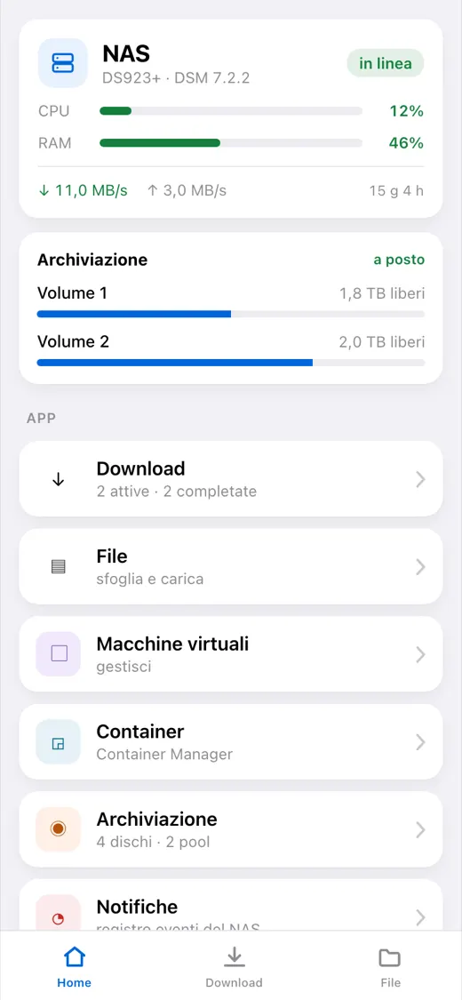
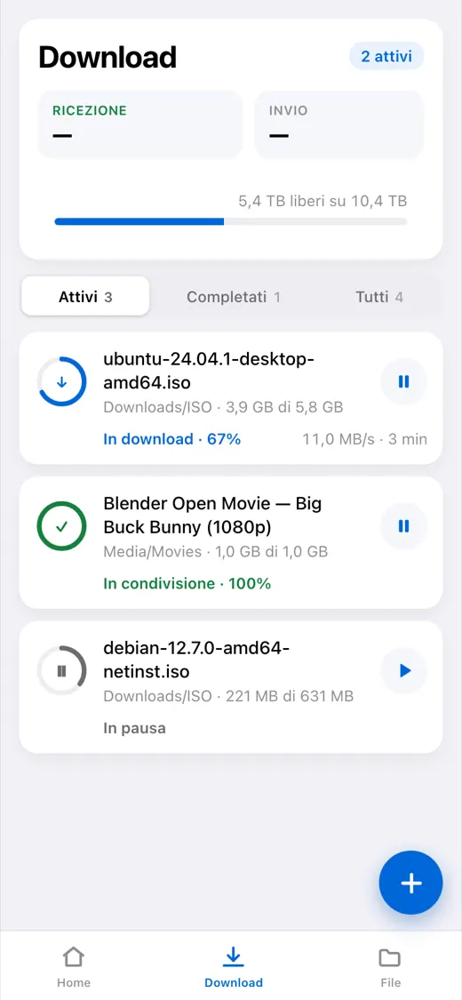
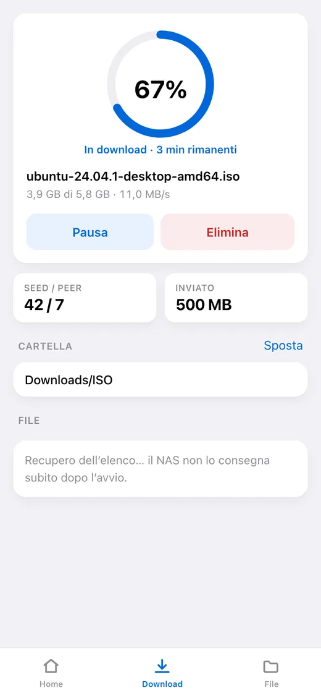
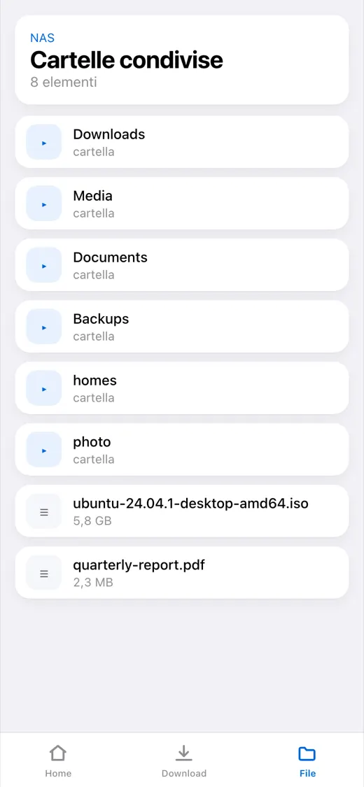
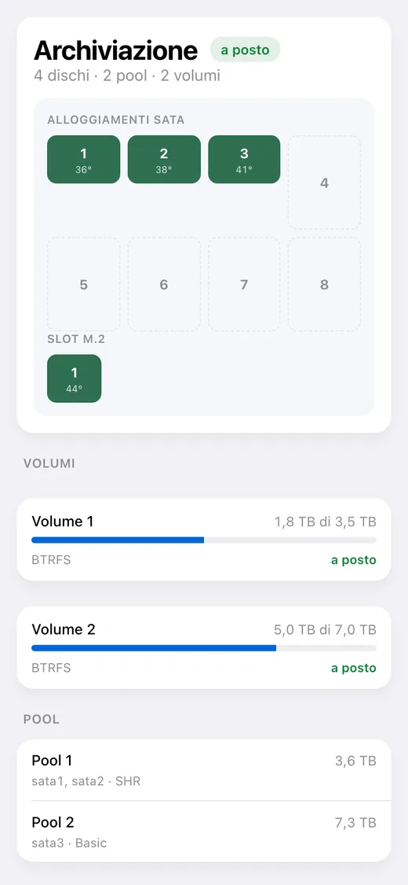

# dsm-mini

[English](README.md) · [Русский](README_RU.md) · [Español](README_ES.md) · [Português](README_PT.md) · [Deutsch](README_DE.md) · [Français](README_FR.md) · **Italiano** · [Türkçe](README_TR.md) · [Українська](README_UK.md) · [Polski](README_PL.md)

[](https://github.com/alexlnos/dsm-mini/actions/workflows/ci.yml)
[](LICENSE)

Un bot Telegram con Mini App per governare un NAS Synology di casa: i download di
Download Station e i file di File Station direttamente dalla messaggistica, senza
VPN e senza l'interfaccia web di DSM.

Butti un link magnet in chat — il bot chiede con dei pulsanti dove metterlo e lo
mette in coda. Apri l'applicazione — e vedi cosa sta scaricando, quanto manca,
cosa c'è sui dischi e come sta il NAS.

<p align="center">
  
  
  
  
  
</p>

> Funzionano: il bot, la Mini App e le notifiche. Serve DSM 7 o più recente: su
> DSM 6 il pacchetto non si installa e lì non l'ha provato nessuno. Verificato
> su DSM 7.2.2 con Download Station 4.1.2 e File Station 1.4.4.

## Cosa sa fare

**Download**

- L'elenco delle attività: avanzamento, velocità, tempo rimasto, seed e peer
- Mettere in pausa, riprendere, eliminare
- Aggiunta con link magnet, con link diretto e con file `.torrent`
- Scelta della cartella di destinazione, con un elenco di accesso rapido
  configurabile
- Scelta dei file dentro un torrent e della loro priorità
- Un messaggio in chat quando un'attività finisce o fallisce

**File**

- Sfogliare le cartelle, anteprime, caricamento sul NAS
- Rinominare, copiare, spostare, eliminare

**Stato del NAS**

- Carico di processore e memoria, tempo di attività, rete
- Dischi, pool e volumi: temperatura, spazio occupato, salute
- Macchine virtuali e contenitori: avvio e arresto
- Il registro eventi di DSM

**Lingua**

L'applicazione e il bot parlano la lingua scelta in Telegram: inglese, russo,
spagnolo, portoghese, tedesco, francese, italiano, turco, ucraino, polacco. Una
lingua sconosciuta riceve l'inglese.

---

## Installazione

Mezz'ora, e il grosso se ne va nel certificato, non nel servizio. Serve un NAS
Synology con DSM 7 e Download Station; nient'altro va installato prima.

> **Perché serve un indirizzo pubblico.** Telegram apre una Mini App solo via
> `https://` con un certificato vero: un `192.168.…` locale o uno autofirmato
> non si apriranno. Il bot invece funziona anche senza indirizzo, solo senza il
> pulsante.

**1. Creare il bot.** [@BotFather](https://t.me/BotFather) → `/newbot` → un
nome e un nome utente che finisca in `bot`. Risponde con un token: conservalo,
è la password del tuo bot.

**2. Scoprire il proprio numero.** [@userinfobot](https://t.me/userinfobot) →
Start. Risponde con la riga `Id`.

**3. Creare un utente DSM per il servizio.** Pannello di controllo → Utente e
gruppo → Crea. Accesso solo a Download Station e File Station, senza verifica
in due passaggi: un codice usa e getta non può arrivare da un file di
configurazione. Niente amministratore: il servizio sa cancellare file.

**4. Ottenere indirizzo e certificato.** Salta se il NAS ha già un dominio con
certificato valido.

- Pannello di controllo → Accesso esterno → DDNS → Aggiungi, fornitore
  `Synology`: viene fuori qualcosa come `alex-nas.synology.me`.
- Sul router inoltra al NAS le porte **80** e **443**. Senza la 80 il
  certificato non verrà emesso, senza la 443 l'applicazione non si apre.
- Pannello di controllo → Sicurezza → Certificato → Aggiungi → da Let's
  Encrypt, per quello stesso nome.

Controlla dal telefono con la rete mobile: `https://alex-nas.synology.me:5001`
deve aprire DSM senza avvisi.

**5. Installare il pacchetto.** Centro pacchetti → Impostazioni → Origini
pacchetti → Aggiungi, nome `dsm-mini` e l'indirizzo della tua architettura:

- Intel e AMD, la maggior parte dei modelli: `https://alexlnos.github.io/dsm-mini/amd64.json`
- ARM, modelli economici: `https://alexlnos.github.io/dsm-mini/arm64.json`

Poi Impostazioni → Generale → Livello di attendibilità → **Qualsiasi editore**,
e installa **DSM mini (Telegram Mini App)** dalla sezione **Community**. Dubbi
sull'architettura? Prova `amd64`: un pacchetto che non va bene viene
semplicemente rifiutato.

L'installer chiede sette valori e spiega ognuno mentre lo chiede: tutto quello
che serve è stato raccolto nei passi qui sopra. Oppure installa lo `.spk` dalle
[versioni](https://github.com/alexlnos/dsm-mini/releases) a mano, da Centro
pacchetti → Installazione manuale.

**6. Puntare l'indirizzo sul servizio.** Pannello di controllo → Portale di
accesso → Avanzate → Proxy inverso → Crea. Origine: `HTTPS`, il tuo nome, porta
`443`. Destinazione: `HTTP`, `localhost`, porta `8080`.

> Non passare per il proxy la porta **80** di questo nome: è da lì che DSM
> rinnova il certificato, e intercettarla rompe il rinnovo tre mesi dopo.

**7. Verificare.** `https://tuo-indirizzo/healthz` in un browser deve
rispondere `{"status":"ok"}`. Senza firma di Telegram non viene dato niente.

**8. Aprire l'applicazione.** Trova il bot dal nome utente, premi Start e
accanto al campo di scrittura compare un pulsante **Download**. Mandagli un
link magnet qualsiasi: ti propone le cartelle con dei pulsanti.

## Se qualcosa è andato storto

| Cosa vedi | Di cosa si tratta | Cosa fare |
|---|---|---|
| Il bot tace su `/start` | Token sbagliato, o il pacchetto non è in funzione | Centro pacchetti → **DSM mini (Telegram Mini App)** → il registro |
| «L'accesso a questo bot è chiuso» | Il tuo ID non è nell'elenco | Metti il numero del passo 2 negli ID consentiti (vedi «Cambiare le impostazioni» più sotto) |
| Non c'è il pulsante dell'applicazione | L'indirizzo pubblico è vuoto o non è `https://` | Stesso posto: il file delle impostazioni, poi riavvia il pacchetto |
| Il pulsante c'è, l'applicazione non si apre | Il proxy inverso o il certificato non funzionano | Apri `https://tuo-indirizzo/healthz` in un browser |
| «Apri l'applicazione dal bot» | L'applicazione è stata aperta con un link diretto nel browser | È voluto: aprila dal bot |
| «Accesso negato: il tuo ID Telegram…» | Il servizio non ti ha riconosciuto | Negli ID consentiti solo cifre, separate da virgole |
| `authentication with DSM failed` nel registro | La password, la 2FA o i diritti dell'utente | Passo 3: password senza errori di battitura, 2FA spenta, applicazioni consentite |
| `Could not get the task list` nel registro | Download Station non è installato, o è negato all'utente | Centro pacchetti e i diritti del passo 3 |
| Il pacchetto si ferma subito dopo l'avvio | Un'impostazione è sbagliata — il registro dice quale | Il centro notifiche di DSM riporta anche il motivo |

Il registro del pacchetto è la fonte di verità principale: dice esattamente cosa
manca. Sta in `/var/packages/dsm-mini/var/dsm-mini.log` e si apre dal Centro
pacchetti. Il registro è in inglese, l'interfaccia e i messaggi del bot nella tua
lingua.

### Cambiare le impostazioni

Tutto quello che ha chiesto la procedura guidata sta in un file sul NAS,
`/var/packages/dsm-mini/var/config.env`, permessi `600`.

Installare il pacchetto sopra sé stesso **non** chiede di nuovo: la procedura
guidata gira all'installazione, e un aggiornamento lascia il file apposta — è
per questo che le impostazioni sopravvivono. Restano due strade:

- **Modificare il file via SSH** (Pannello di controllo → Terminale e SNMP →
  attivare SSH) e riavviare il pacchetto dal Centro pacchetti. Così resta
  tutto il resto:

  ```bash
  sudo sed -i "s|^TELEGRAM_BOT_TOKEN=.*|TELEGRAM_BOT_TOKEN='il-tuo-nuovo-token'|" /var/packages/dsm-mini/var/config.env
  sudo synopkg restart dsm-mini
  ```

- **Disinstallare e installare di nuovo**: la procedura guidata richiede tutto
  daccapo. Insieme alle impostazioni sparisce il database lì accanto: cartelle
  fissate, lingua e ultimi stati noti delle attività.

## Aggiornare

Se l'origine pacchetti è stata aggiunta, il Centro pacchetti mostra
l'aggiornamento da solo. Senza origine, scarica lo `.spk` fresco dalle
[versioni](https://github.com/alexlnos/dsm-mini/releases) e installalo sopra.

Le impostazioni e il database restano in entrambi i casi: stanno nella cartella
`var` del pacchetto, che un aggiornamento non tocca.

## Dove sono tenuti i dati

Tutto sta in `/var/packages/dsm-mini/var/`:

- `config.env` — quello che ha chiesto la procedura guidata, permessi `600`;
- `dsm-mini.db` — un database SQLite: le cartelle fissate, la lingua e gli ultimi
  stati noti delle attività, da cui il servizio capisce di cosa ha già riferito;
- `dsm-mini.log` — il registro.

Un aggiornamento del pacchetto li mantiene tutti e tre. La disinstallazione li
cancella.

## Sicurezza

Il servizio è esposto a internet e sa cancellare file sul NAS, perciò:

- **Un utente DSM a parte**, non un amministratore (passo 3).
- **Senza verifica in due passaggi** su quell'account: un codice usa e getta non
  può funzionare da un file di configurazione.
- **Gli ID consentiti sono una lista di ammessi.** Una lista vuota chiude
  l'accesso a tutti, non lo apre.
- Ogni richiesta a `/api/` viene controllata due volte: la firma `initData` con
  una chiave ricavata dal token del bot, e l'identificatore contro l'elenco. La
  firma dimostra soltanto che qualcuno ha aperto il bot — e aprirlo può chiunque.
- Verso l'esterno va una frase generica, i dettagli nel registro: un messaggio
  che dicesse cosa esattamente non tornava nella firma sarebbe un suggerimento su
  come falsificarla.
- Il token del bot e la password DSM vivono solo in `config.env` sul NAS stesso,
  permessi `600`, e non finiscono mai nel registro: in un rifiuto si scrive il
  motivo, mai il valore.
- Il servizio ascolta solo su `127.0.0.1`, cioè dal NAS stesso. Tutto quello che
  arriva da fuori passa dal proxy inverso di DSM, che chiude anche il TLS.

## Sviluppo

```bash
cd web && npm install && npm run build   # la Mini App finisce in internal/web/dist
cd .. && go build ./cmd/dsm-mini         # un binario con l'applicazione incorporata
go test ./...
```

Il frontend da solo, con ricaricamento automatico:

```bash
cd web && npm run dev    # parla col backend su localhost:8080
```

Avviare il backend in locale legge le stesse variabili che la procedura guidata
del pacchetto scrive in `config.env`. È comodo tenerle in un file:

```bash
cp .env.example .env     # compilalo
set -a; . ./.env; set +a
go run ./cmd/dsm-mini
```

L'interfaccia compilata sta nel repository (`internal/web/dist`) — è da lì che la
prende `go:embed`. Dopo aver toccato il frontend, ricompila e fai il commit del
risultato, altrimenti i controlli non passano.

I test di integrazione girano contro un NAS vero e di default vengono saltati:

```bash
DSM_URL=https://192.168.1.10:5001 DSM_USER=... DSM_PASSWORD=... \
  DSM_INSECURE_TLS=true go test -tags=integration ./...
```

I test che cambiano lo stato del NAS richiedono un permesso a parte:
`DSM_TEST_MUTATIONS=1`, e per le operazioni sui file anche `DSM_TEST_FOLDER` — la
cartella dentro cui si possono creare file temporanei. Cancellano tutto quello
che creano.

Una nuova lingua dell'interfaccia è un file di dizionario per parte:
`web/src/i18n/<codice>.ts` e `internal/i18n/<codice>.go`. Saltare una stringa non
si può: sul frontend ci pensa il tipo, sul server un test.

Codice, commenti e registro nel progetto sono in inglese; le altre lingue vivono
solo nei dizionari. I dettagli sono in [CLAUDE.md](CLAUDE.md).

## Particolarità dell'API Synology

La Web API di Synology a tratti si comporta diversamente da come sta scritto
nella documentazione: la stessa azione risponde in tre formati diversi,
`limit = -1` stende File Station, e il `_sid` durante il caricamento di un file va
passato in modo diverso che altrove. Tutto quello che è emerso su un NAS vero è
raccolto in [docs/synology-api.md](docs/synology-api.md).

## Licenza

[MIT](LICENSE)
