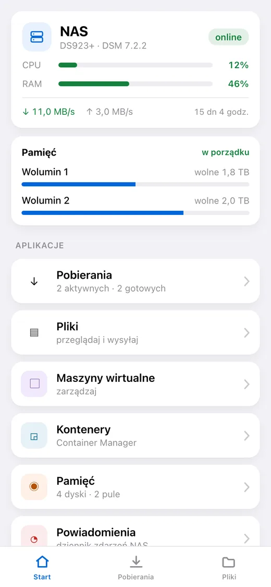
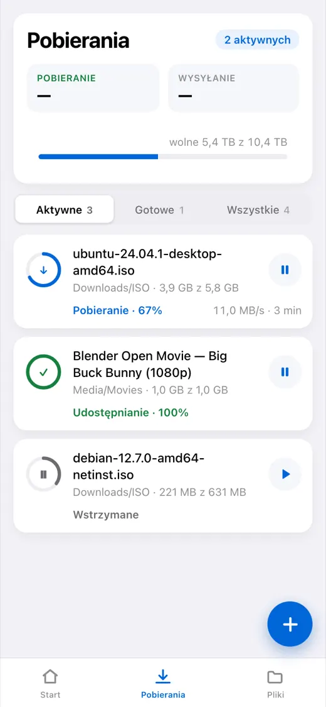
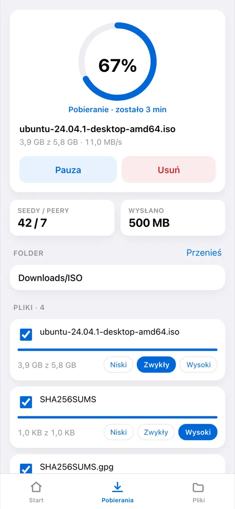
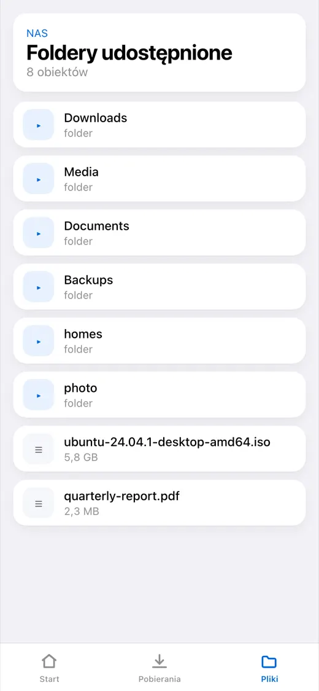
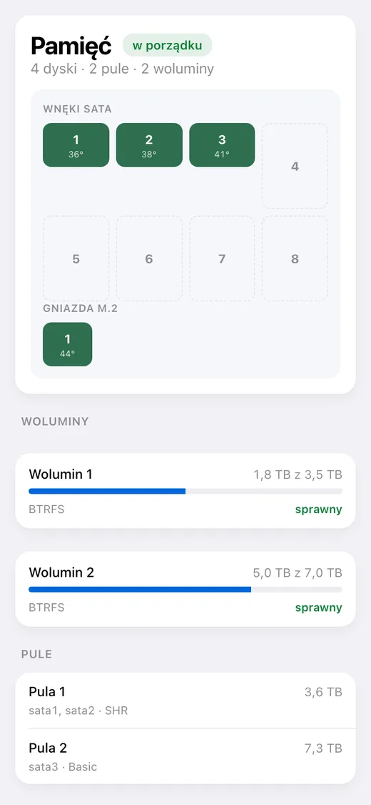

# dsm-mini

[English](README.md) · [Русский](README_RU.md) · [Español](README_ES.md) · [Português](README_PT.md) · [Deutsch](README_DE.md) · [Français](README_FR.md) · [Italiano](README_IT.md) · [Türkçe](README_TR.md) · [Українська](README_UK.md) · **Polski**

[](https://github.com/alexlnos/dsm-mini/actions/workflows/ci.yml)
[](LICENSE)

Bot Telegrama z Mini App do zarządzania domowym NAS-em Synology: pobierania
Download Station i pliki File Station prosto z komunikatora, bez VPN-a i bez
interfejsu webowego DSM.

Wrzucasz link magnet na czat — bot pyta przyciskami, gdzie pobrać, i wstawia do
kolejki. Otwierasz aplikację — widać, co się pobiera, ile zostało, co leży na
dyskach i jak się miewa NAS.

<p align="center">
  
  
  
  
  
</p>

> Działa: bot, Mini App i powiadomienia. Potrzebny jest DSM 7 albo nowszy — na
> DSM 6 pakiet się nie zainstaluje i nikt go tam nie sprawdzał. Sprawdzone na
> DSM 7.2.2 z Download Station 4.1.2 i File Station 1.4.4.

## Co to potrafi

**Pobierania**

- Lista zadań: postęp, prędkość, pozostały czas, seedy i peery
- Wstrzymanie, wznowienie, usunięcie
- Dodawanie linkiem magnet, linkiem bezpośrednim i plikiem `.torrent`
- Wybór folderu docelowego, z konfigurowalną listą szybkiego dostępu
- Wybór plików wewnątrz torrenta i ich priorytetu
- Wiadomość na czacie, gdy zadanie się skończy albo padnie

**Pliki**

- Przeglądanie folderów, podgląd, wysyłanie na NAS
- Zmiana nazwy, kopiowanie, przenoszenie, usuwanie

**Stan NAS-a**

- Obciążenie procesora i pamięci, czas pracy, sieć
- Dyski, pule i woluminy: temperatura, zajęte miejsce, kondycja
- Maszyny wirtualne i kontenery: uruchamianie i zatrzymywanie
- Dziennik zdarzeń DSM

**Język**

Aplikacja i bot mówią w języku wybranym w Telegramie: angielski, rosyjski,
hiszpański, portugalski, niemiecki, francuski, włoski, turecki, ukraiński,
polski. Nieznany język dostaje angielski.

---

## Instalacja

Dalej idzie krok po kroku. Nie trzeba nic wiedzieć wcześniej, ale zarezerwuj pół
godziny: większość czasu pochłania certyfikat, a nie sama usługa.

### Co będzie potrzebne

- **NAS Synology** z DSM 7. Niczego nie trzeba instalować wcześniej: usługa
  przychodzi jako pakiet DSM i działa na samym NAS-ie.
- **Download Station** — zainstaluj z Centrum pakietów, jeśli jeszcze go nie ma.
- **Telegram** w telefonie.
- **Dostęp do routera** — trzeba będzie przekierować dwa porty.

> **Dlaczego potrzebny jest publiczny adres.** Telegram otwiera Mini App
> wyłącznie po `https://` z prawdziwym certyfikatem. Samopodpisany, lokalny
> `192.168.…` i adres w rodzaju `nas:5001` nie wystarczą: aplikacja po prostu się
> nie otworzy. Bot działa i bez adresu — tylko bez przycisku.

---

### Krok 1. Utworzyć bota

1. Otwórz w Telegramie [@BotFather](https://t.me/BotFather) i naciśnij **Start**.
2. Wyślij `/newbot`.
3. Wpisz **nazwę** bota — dowolną, widać ją w nagłówku czatu. Na przykład:
   `Mój NAS`.
4. Wpisz **login** bota — łacińskimi literami i koniecznie kończący się na `bot`.
   Na przykład: `alex_home_nas_bot`. Jeśli zajęty, BotFather poprosi o inny.
5. W odpowiedzi przyjdzie linia w rodzaju
   `1234567890:AAExampleTokenReplaceThisWithYours0`. To **token**. Skopiuj go —
   przyda się w kroku 5.

> Token to hasło do bota. Kto go ma, ten steruje botem. Nie wrzucaj go na czaty
> ani na GitHuba.

### Krok 2. Poznać swoje Telegram ID

To liczba, po której usługa pozna, że piszesz właśnie ty, a nie ktoś obcy.

1. Otwórz [@userinfobot](https://t.me/userinfobot) i naciśnij **Start**.
2. Odpowie liczbą w wierszu `Id`, na przykład `123456789`. Zapisz.

### Krok 3. Założyć osobnego użytkownika na NAS-ie

Usługa potrafi kasować pliki, więc dawanie jej administratora to zły pomysł.

1. W DSM: **Panel sterowania → Użytkownik i grupa → Użytkownik → Utwórz**.
2. Nazwa: `dsm-mini`. Hasło długie i losowe; zapisz je.
3. **Nie włączaj weryfikacji dwuetapowej.** Kodu jednorazowego nie ma skąd wziąć
   i logowanie po prostu nie przejdzie.
4. Grupy: zostaw `users`.
5. Foldery współdzielone: daj dostęp **tylko** do tych, do których będziesz
   pobierać (zwykle `download` albo `Media`). Reszcie — „Brak dostępu”.
6. Aplikacje: pozwól na **Download Station** i **File Station**, resztę zabroń.

> Jeśli w kroku 5 w dzienniku pojawi się `authentication with DSM failed` —
> wróć tutaj i pozwól temu użytkownikowi jeszcze na aplikację **DSM**: na części
> wersji bez niej logowanie nie przechodzi nawet przez API.

### Krok 4. Zdobyć adres i certyfikat

Jeśli masz już domenę z ważnym certyfikatem na NAS-ie — pomiń krok.

1. **Nazwa.** Panel sterowania → **Dostęp zewnętrzny → DDNS → Dodaj**.
   Usługodawca `Synology`, nazwa hosta dowolna wolna, na przykład `alex-nas`.
   Wyjdzie adres `alex-nas.synology.me`. Zapisz.
2. **Porty na routerze.** W ustawieniach routera przekieruj na wewnętrzny adres
   NAS-a **port 80** i **port 443**. Bez 80 nie wystawi się certyfikat, bez 443
   nie otworzy się aplikacja.
3. **Certyfikat.** Panel sterowania → **Zabezpieczenia → Certyfikat → Dodaj →
   Uzyskaj certyfikat z Let's Encrypt**. Nazwa domeny to ten sam
   `alex-nas.synology.me`, e-mail twój. Wystawienie trwa minutę.

Sprawdź: otwórz `https://alex-nas.synology.me:5001` z telefonu przez internet
mobilny (nie przez domowe Wi-Fi). DSM powinien się otworzyć bez ostrzeżeń o
certyfikacie.

### Krok 5. Zainstalować pakiet

Najprostsza droga to **dodać źródło pakietów**, wtedy instalacja i aktualizacje
idą prosto z Centrum pakietów:

1. **Centrum pakietów → Ustawienia → Źródła pakietów → Dodaj**.
2. Nazwa: `dsm-mini`. Adres według twojej architektury:
   - Intel i AMD (większość modeli): `https://alexlnos.github.io/dsm-mini/amd64.json`
   - ARM (modele budżetowe): `https://alexlnos.github.io/dsm-mini/arm64.json`
3. Pozwól na pakiety z zewnątrz: **Ustawienia → Ogólne → Poziom zaufania →
   Dowolny wydawca**.
4. Po lewej pojawi się sekcja **Społeczność**, a w niej **DSM mini (Telegram Mini App)**. Naciśnij
   Zainstaluj — dalej kreator zapyta o ustawienia.

Nie znasz swojej architektury — spróbuj `amd64`: niepasującego pakietu DSM po
prostu nie zainstaluje, niczego się tym nie zepsuje.

**Albo ręcznie, bez źródła:**

1. Pobierz `.spk` ze strony
   [wydań](https://github.com/alexlnos/dsm-mini/releases): `-amd64` dla modeli na
   Intelu i AMD (DS918+, DS923+, DS1522+, SA6400 i podobne), `-arm64` dla
   budżetowych na ARM (DS223, DS124). Nie masz pewności — bierz `amd64`:
   niepasującego pakietu DSM po prostu nie zainstaluje.
2. **Centrum pakietów → Instalacja ręczna → Przeglądaj** i wybierz pobrany plik.
3. DSM powie, że wydawca jest nieznany. To normalne przy pakiecie z zewnątrz:
   pozwól raz w **Centrum pakietów → Ustawienia → Ogólne → Poziom zaufania →
   Dowolny wydawca**.

#### O co pyta kreator

Instalator ma dwa ekrany i siedem pól. Wszystko, czego one potrzebują, zebrano w
krokach od 1 do 4.

| Pole | Co wpisać |
|---|---|
| Adres DSM | Już wpisany: `https://localhost:5001`. Usługa działa na samym NAS-ie, więc zostaw tak |
| Użytkownik DSM | Nazwa użytkownika z kroku 3, na przykład `dsm-mini` |
| Hasło DSM | Hasło tego użytkownika |
| Token bota | Token z kroku 1 |
| Dozwolone identyfikatory Telegrama | Twoja liczba z kroku 2. Kilka osób — po przecinku |
| Publiczny adres HTTPS | Twój adres z kroku 4, na przykład `https://alex-nas.synology.me` |
| Port lokalny | Zostaw `8080`. Zmieniaj tylko wtedy, gdy ten port na NAS-ie jest już zajęty |

**Błędy, które naprawdę się tu zdarzają:**

| Napisane | Poprawnie |
|---|---|
| `alex-nas.synology.me` | `https://alex-nas.synology.me` — z protokołem |
| `https://alex-nas.synology.me/` | bez ukośnika na końcu |
| Pusta lista identyfikatorów | puste znaczy **nikomu**; wpisz swoją liczbę |
| Publiczny adres w polu adresu DSM | adres DSM zostaje `https://localhost:5001` |
| Jednorazowy kod 2FA zamiast hasła | konto w ogóle nie może mieć weryfikacji dwuetapowej (krok 3) |

Po instalacji pakiet uruchomi się sam i będzie wstawał razem z NAS-em.
Ustawienia wylądują w `/var/packages/dsm-mini/var/config.env` (uprawnienia
`600`), dziennik obok, w `dsm-mini.log`.

Jeśli usługa nie zdoła wystartować — zły token, złe hasło, brak sieci — powie o
tym w **centrum powiadomień DSM** i poda przyczynę. Pełny dziennik leży w
Centrum pakietów, na stronie pakietu.

### Krok 6. Skierować adres na usługę

Teraz usługa słucha tylko wewnątrz NAS-a, na porcie 8080. Zwrotny serwer proxy
przyjmuje żądania z internetu po HTTPS i przekazuje je do niej.

1. **Panel sterowania → Portal logowania → Zaawansowane → Zwrotny serwer proxy →
   Utwórz**.
   (W DSM 7.0–7.1 to **Panel sterowania → Portal aplikacji → Zwrotny serwer
   proxy**.)
2. **Źródło**: protokół `HTTPS`, nazwa hosta `alex-nas.synology.me`, port `443`.
3. **Miejsce docelowe**: protokół `HTTP`, nazwa hosta `localhost`, port `8080`.
4. Zapisz.

> **Portu 80 dla tej nazwy nie przepuszczaj przez proxy**: przez niego DSM
> odnawia certyfikat Let's Encrypt, a przechwycenie zepsuje odnowienie trzy
> miesiące później.

### Krok 7. Sprawdzić

Otwórz w przeglądarce `https://alex-nas.synology.me/healthz`. Powinno
odpowiedzieć:

```json
{"status":"ok"}
```

Odpowiedziało — czyli usługa żyje i jest dostępna z zewnątrz. Danych przy tym nie
oddaje: każde żądanie bez podpisu Telegrama dostaje odmowę.

### Krok 8. Otworzyć aplikację

1. Znajdź swojego bota w Telegramie po loginie z kroku 1.
2. Naciśnij **Start**.
3. Na dole, obok pola wpisywania, pojawi się przycisk **Pobierania** — to on
   otwiera aplikację. Przycisk bot stawia sam przy starcie, ręcznie nie trzeba
   nic ustawiać.
4. Wyślij botowi dowolny link magnet — zaproponuje folder przyciskami.

Gotowe.

---

## Jeśli coś poszło nie tak

| Co widzisz | O co chodzi | Co zrobić |
|---|---|---|
| Bot milczy na `/start` | Zły token albo pakiet nie jest uruchomiony | Centrum pakietów → **DSM mini (Telegram Mini App)** → dziennik |
| „Dostęp do tego bota jest zamknięty” | Twojego ID nie ma na liście | Wpisz liczbę z kroku 2 do dozwolonych identyfikatorów (patrz „Zmienić ustawienia” niżej) |
| Nie ma przycisku aplikacji | Publiczny adres jest pusty albo nie jest `https://` | To samo miejsce: plik ustawień, potem zrestartuj pakiet |
| Przycisk jest, aplikacja się nie otwiera | Nie działa zwrotny serwer proxy albo certyfikat | Otwórz `https://twoj-adres/healthz` w przeglądarce |
| „Otwórz aplikację przez bota” | Aplikację otwarto bezpośrednim linkiem w przeglądarce | Tak ma być: otwieraj z bota |
| „Dostęp zamknięty: twoje Telegram ID…” | Usługa cię nie rozpoznała | W dozwolonych identyfikatorach tylko cyfry, po przecinku |
| W dzienniku `authentication with DSM failed` | Hasło, 2FA albo uprawnienia użytkownika | Krok 3: hasło bez literówek, 2FA wyłączona, aplikacje dozwolone |
| W dzienniku `Could not get the task list` | Download Station nie jest zainstalowany albo zabroniony użytkownikowi | Centrum pakietów i uprawnienia z kroku 3 |
| Pakiet zatrzymuje się zaraz po starcie | Jakieś ustawienie jest złe — dziennik powie które | Przyczyna trafia też do centrum powiadomień DSM |

Dziennik pakietu to główne źródło prawdy: wprost mówi, czego brakuje. Leży w
`/var/packages/dsm-mini/var/dsm-mini.log` i otwiera się z Centrum pakietów.
Dziennik prowadzony jest po angielsku, interfejs i wiadomości bota — w twoim
języku.

### Zmienić ustawienia

Wszystko, o co pytał kreator, leży na NAS-ie w jednym pliku
`/var/packages/dsm-mini/var/config.env` z uprawnieniami `600`.

Instalacja pakietu na samym sobie **o nic nie zapyta**: kreator działa przy
instalacji, a aktualizacja celowo nie rusza tego pliku — właśnie dlatego
ustawienia ją przeżywają. Zostają dwie drogi:

- **Poprawić plik przez SSH** (Panel sterowania → Terminal i SNMP → włącz SSH)
  i zrestartować pakiet w Centrum pakietów. Tak zostaje cała reszta:

  ```bash
  sudo sed -i "s|^TELEGRAM_BOT_TOKEN=.*|TELEGRAM_BOT_TOKEN='twoj-nowy-token'|" /var/packages/dsm-mini/var/config.env
  sudo synopkg restart dsm-mini
  ```

- **Odinstalować i zainstalować ponownie** — kreator zapyta o wszystko od nowa.
  Razem z ustawieniami zniknie baza obok: przypięte foldery, język i ostatnie
  znane statusy zadań.

## Aktualizacja

Jeśli źródło pakietów jest dodane, Centrum pakietów samo pokaże aktualizację. Bez
źródła — pobierz świeży `.spk` z
[wydań](https://github.com/alexlnos/dsm-mini/releases) i zainstaluj na wierzchu.

Ustawienia i baza w obu przypadkach zostaną: leżą w katalogu `var` pakietu, a
aktualizacja go nie rusza.

## Gdzie trzymane są dane

Wszystko w `/var/packages/dsm-mini/var/`:

- `config.env` — to, o co pytał kreator, uprawnienia `600`;
- `dsm-mini.db` — baza SQLite: przypięte foldery, język i ostatnie znane statusy
  zadań, po których usługa wie, o czym już powiadomiła;
- `dsm-mini.log` — dziennik.

Aktualizacja pakietu zachowuje wszystkie trzy. Odinstalowanie je kasuje.

## Bezpieczeństwo

Usługa jest wystawiona do internetu i potrafi kasować pliki na NAS-ie, dlatego:

- **Osobny użytkownik DSM**, a nie administrator (krok 3).
- **Bez weryfikacji dwuetapowej** na tym koncie: kod jednorazowy nie ma prawa
  zadziałać z pliku konfiguracyjnego.
- **Dozwolone identyfikatory to biała lista.** Pusta lista zamyka dostęp
  wszystkim, a nie otwiera.
- Każde żądanie do `/api/` sprawdzane jest dwa razy: podpis `initData` kluczem z
  tokenu bota i identyfikator wobec listy dozwolonych. Podpis dowodzi tylko
  tego, że ktoś otworzył bota — a otworzyć go może każdy.
- Na zewnątrz idzie ogólne zdanie, szczegóły do dziennika: komunikat mówiący, co
  dokładnie nie zgadzało się w podpisie, podpowiadałby, jak go podrobić.
- Token bota i hasło DSM żyją wyłącznie w `config.env` na samym NAS-ie z
  uprawnieniami `600` i nigdy nie trafiają do dziennika: przy odmowie zapisywana
  jest przyczyna, nigdy wartość.
- Usługa słucha tylko na `127.0.0.1` — czyli z samego NAS-a. Wszystko z zewnątrz
  idzie przez zwrotny serwer proxy DSM, który kończy też TLS.

## Rozwój

```bash
cd web && npm install && npm run build   # Mini App trafi do internal/web/dist
cd .. && go build ./cmd/dsm-mini         # jeden plik binarny z wbudowaną aplikacją
go test ./...
```

Frontend osobno, z automatycznym przeładowaniem:

```bash
cd web && npm run dev    # rozmawia z backendem na localhost:8080
```

Lokalne uruchomienie backendu czyta te same zmienne, które kreator pakietu
zapisuje w `config.env`. Wygodnie trzymać je w pliku:

```bash
cp .env.example .env     # wypełnij
set -a; . ./.env; set +a
go run ./cmd/dsm-mini
```

Zbudowany interfejs leży w repozytorium (`internal/web/dist`) — stamtąd bierze go
`go:embed`. Po zmianach we frontendzie przebuduj i zacommituj wynik, bo inaczej
kontrole nie przejdą.

Testy integracyjne działają na prawdziwym NAS-ie i domyślnie są pomijane:

```bash
DSM_URL=https://192.168.1.10:5001 DSM_USER=... DSM_PASSWORD=... \
  DSM_INSECURE_TLS=true go test -tags=integration ./...
```

Testy zmieniające stan NAS-a wymagają osobnej zgody: `DSM_TEST_MUTATIONS=1`, a
do operacji na plikach jeszcze `DSM_TEST_FOLDER` — folderu, wewnątrz którego
wolno tworzyć pliki tymczasowe. Wszystko, co utworzą, sprzątają po sobie.

Nowy język interfejsu to jeden plik słownika po każdej stronie:
`web/src/i18n/<kod>.ts` i `internal/i18n/<kod>.go`. Pominąć linii się nie da: na
froncie pilnuje tego typ, na serwerze — test.

Kod, komentarze i dziennik w projekcie są po angielsku; pozostałe języki żyją
tylko w słownikach. Szczegóły w [CLAUDE.md](CLAUDE.md).

## Osobliwości API Synology

Web API Synology miejscami zachowuje się inaczej, niż napisano w dokumentacji: ta
sama akcja odpowiada w trzech różnych formatach, `limit = -1` kładzie File
Station, a `_sid` przy wysyłaniu pliku trzeba przekazać inaczej niż wszędzie.
Wszystko, co ustalono na żywym NAS-ie, zebrano w
[docs/synology-api.md](docs/synology-api.md).

## Licencja

[MIT](LICENSE)
