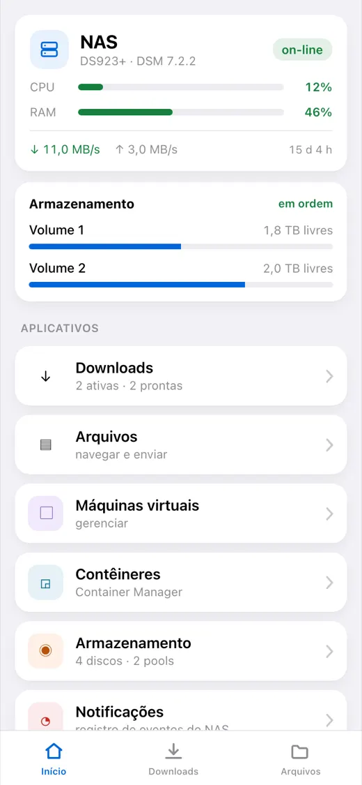
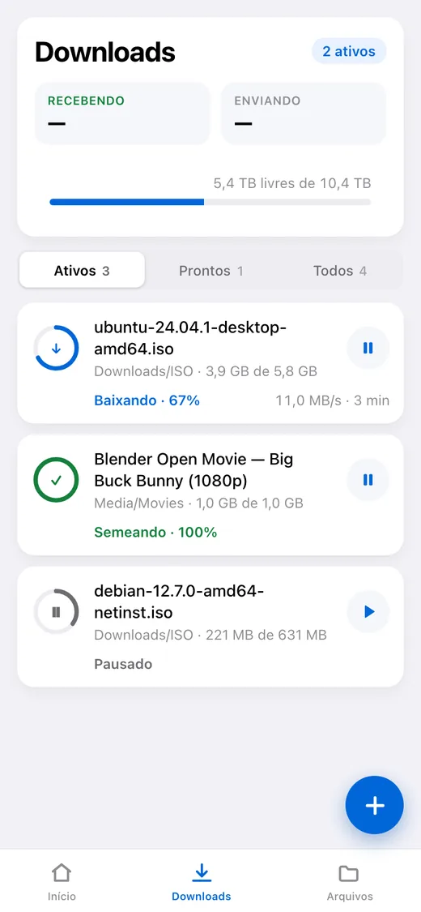
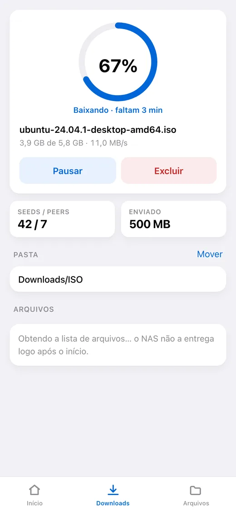
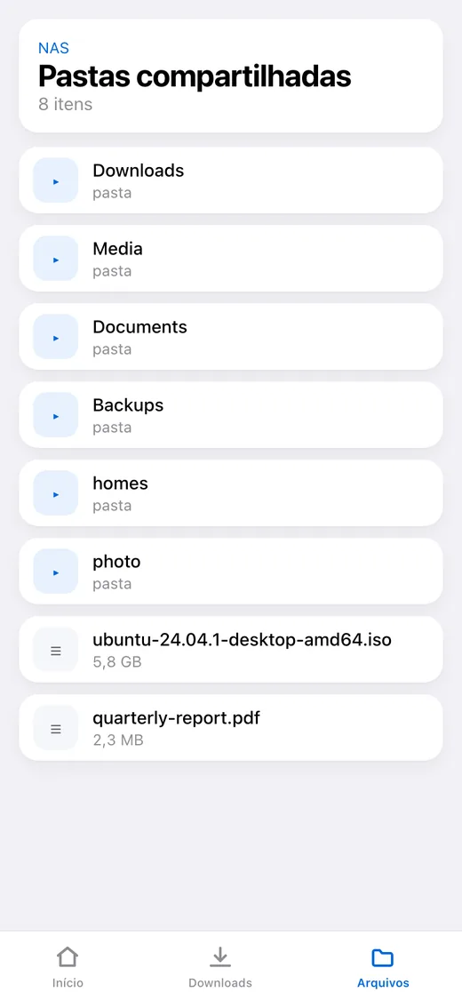
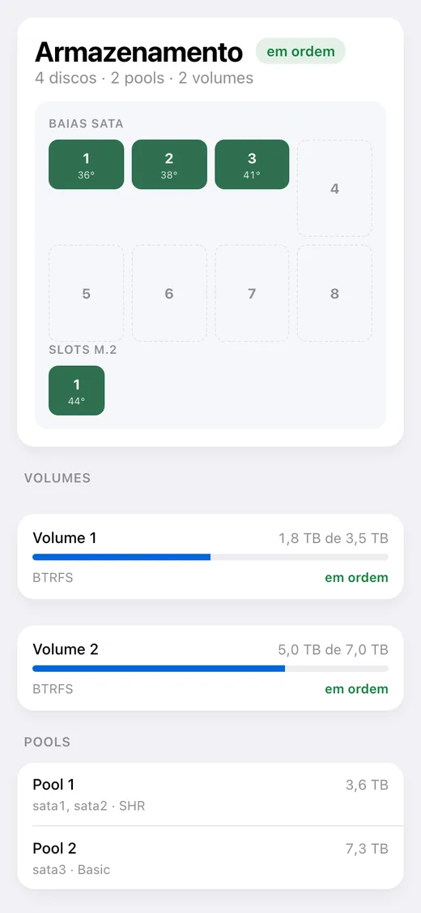

# dsm-mini

[English](README.md) · [Русский](README_RU.md) · [Español](README_ES.md) · **Português** · [Deutsch](README_DE.md) · [Français](README_FR.md) · [Italiano](README_IT.md) · [Türkçe](README_TR.md) · [Українська](README_UK.md) · [Polski](README_PL.md)

[](https://github.com/alexlnos/dsm-mini/actions/workflows/ci.yml)
[](LICENSE)

Um bot do Telegram com Mini App para cuidar de um NAS Synology doméstico:
downloads do Download Station e arquivos do File Station direto do mensageiro,
sem VPN e sem a interface web do DSM.

Jogue um link magnet no chat — o bot pergunta com botões onde colocar e põe na
fila. Abra o aplicativo e você vê o que está baixando, quanto falta, o que há nos
discos e como o NAS está se sentindo.

<p align="center">
  
  
  
  
  
</p>

> Funcionando: o bot, o Mini App e as notificações. Exige DSM 7 ou mais novo —
> no DSM 6 o pacote não instala e ninguém o testou lá. Testado no DSM 7.2.2
> com Download Station 4.1.2 e File Station 1.4.4.

## O que ele faz

**Downloads**

- A lista de tarefas: progresso, velocidade, tempo restante, seeds e peers
- Pausar, retomar, excluir
- Adicionar por link magnet, por link direto e por arquivo `.torrent`
- Escolher a pasta de destino, com uma lista de acesso rápido configurável
- Escolher os arquivos dentro de um torrent e a prioridade deles
- Uma mensagem no chat quando uma tarefa termina ou falha

**Arquivos**

- Navegar pelas pastas, pré-visualizar, enviar para o NAS
- Renomear, copiar, mover, excluir

**Estado do NAS**

- Carga de CPU e memória, tempo ligado, rede
- Discos, pools e volumes: temperatura, espaço usado, saúde
- Máquinas virtuais e contêineres: iniciar e parar
- O registro de eventos do DSM

**Idioma**

O aplicativo e o bot falam o idioma escolhido no Telegram: inglês, russo,
espanhol, português, alemão, francês, italiano, turco, ucraniano, polonês. Um
idioma desconhecido recebe inglês.

---

## Instalação

O que vem a seguir é passo a passo. Não é preciso saber nada de antemão, mas
reserve meia hora: a maior parte vai no certificado, não no serviço em si.

### Do que você vai precisar

- **Um NAS Synology** com DSM 7. Não é preciso instalar nada antes: o serviço
  vem como pacote do DSM e roda no próprio NAS.
- **Download Station** — instale pela Central de Pacotes, se ainda não tiver.
- **Telegram** no celular.
- **Acesso ao roteador** — será preciso encaminhar duas portas.

> **Por que é preciso um endereço público.** O Telegram só abre um Mini App por
> `https://` com um certificado de verdade. Um autoassinado, um `192.168.…` local
> ou um endereço do tipo `nas:5001` não servem: o aplicativo simplesmente não
> abre. O bot funciona sem endereço — só que sem o botão.

---

### Passo 1. Criar o bot

1. Abra o [@BotFather](https://t.me/BotFather) no Telegram e aperte **Start**.
2. Envie `/newbot`.
3. Digite o **nome** do bot — qualquer um, é o que aparece no cabeçalho do chat.
   Por exemplo: `Meu NAS`.
4. Digite o **usuário** do bot — em letras latinas e terminando obrigatoriamente
   em `bot`. Por exemplo: `alex_home_nas_bot`. Se estiver ocupado, o BotFather
   pede outro.
5. A resposta é uma linha como
   `1234567890:AAExampleTokenReplaceThisWithYours0`. Esse é o **token**.
   Copie — você precisa dele no passo 5.

> O token é a senha do bot. Quem tiver ele controla o bot. Não publique em chats
> nem no GitHub.

### Passo 2. Descobrir o seu ID do Telegram

É o número pelo qual o serviço entende que quem escreve é você, e não um
estranho.

1. Abra o [@userinfobot](https://t.me/userinfobot) e aperte **Start**.
2. Ele responde com um número na linha `Id`, por exemplo `123456789`. Anote.

### Passo 3. Criar um usuário separado no NAS

O serviço consegue excluir arquivos, então dar a ele um administrador é má ideia.

1. No DSM: **Painel de Controle → Usuário e grupo → Usuário → Criar**.
2. Nome: `dsm-mini`. A senha, longa e aleatória; anote.
3. **Não ligue a verificação em duas etapas.** Não há de onde tirar o código
   único e o login simplesmente não passa.
4. Grupos: deixe `users`.
5. Pastas compartilhadas: dê acesso **apenas** àquelas para onde você vai baixar
   (normalmente `download` ou `Media`). Para as outras, «Sem acesso».
6. Aplicativos: permita **Download Station** e **File Station**, negue o resto.

> Se no passo 5 o registro disser `authentication with DSM failed`, volte aqui e
> permita a esse usuário também o aplicativo **DSM**: em algumas versões o login
> não passa sem ele, nem mesmo pela API.

### Passo 4. Conseguir um endereço e um certificado

Se você já tem um domínio com certificado válido no NAS, pule o passo.

1. **O nome.** Painel de Controle → **Acesso externo → DDNS → Adicionar**.
   Provedor `Synology`, nome de host qualquer um livre, por exemplo `alex-nas`.
   Sai o endereço `alex-nas.synology.me`. Salve.
2. **Portas no roteador.** Nas configurações do roteador, encaminhe a **porta 80**
   e a **porta 443** para o endereço interno do NAS. Sem a 80 o certificado não
   será emitido, sem a 443 o aplicativo não abre.
3. **O certificado.** Painel de Controle → **Segurança → Certificado → Adicionar
   → Obter um certificado da Let's Encrypt**. O nome do domínio é esse mesmo
   `alex-nas.synology.me`, o e-mail é o seu. A emissão leva um minuto.

Confira: abra `https://alex-nas.synology.me:5001` pelo celular na internet móvel
(não pelo Wi-Fi de casa). O DSM deve abrir sem avisos de certificado.

### Passo 5. Instalar o pacote

O jeito mais fácil é **adicionar uma origem de pacotes**, aí instalação e
atualizações passam pela própria Central de Pacotes:

1. **Central de Pacotes → Configurações → Origens de pacotes → Adicionar**.
2. Nome: `dsm-mini`. O endereço depende da sua arquitetura:
   - Intel e AMD (a maioria dos modelos): `https://alexlnos.github.io/dsm-mini/amd64.json`
   - ARM (modelos de entrada): `https://alexlnos.github.io/dsm-mini/arm64.json`
3. Permita pacotes de terceiros: **Configurações → Geral → Nível de confiança →
   Qualquer editor**.
4. À esquerda aparece a seção **Comunidade**, e dentro dela `dsm-mini`. Aperte
   Instalar — o assistente então pergunta as configurações.

Não sabe sua arquitetura? Tente `amd64`: o DSM simplesmente se recusa a instalar
um pacote que não serve, nada quebra com isso.

**Ou na mão, sem origem:**

1. Baixe o `.spk` na página de
   [versões](https://github.com/alexlnos/dsm-mini/releases): `-amd64` para
   modelos Intel e AMD (DS918+, DS923+, DS1522+, SA6400 e parecidos), `-arm64`
   para os de entrada com ARM (DS223, DS124). Na dúvida, pegue `amd64`: o DSM
   simplesmente se recusa a instalar um pacote que não serve.
2. **Central de Pacotes → Instalação manual → Procurar** e escolha o arquivo
   baixado.
3. O DSM vai dizer que o editor é desconhecido. É normal num pacote de
   terceiros: permita uma vez em **Central de Pacotes → Configurações → Geral →
   Nível de confiança → Qualquer editor**.

#### O que o assistente pergunta

O instalador tem duas telas e sete campos. Tudo o que eles precisam foi reunido
nos passos de 1 a 4.

| Campo | O que colocar |
|---|---|
| Endereço do DSM | Já vem preenchido: `https://localhost:5001`. O serviço roda no próprio NAS, então deixe assim |
| Usuário do DSM | O nome do usuário do passo 3, por exemplo `dsm-mini` |
| Senha do DSM | A senha desse usuário |
| Token do bot | O token do passo 1 |
| IDs do Telegram permitidos | O seu número do passo 2. Várias pessoas: separadas por vírgula |
| Endereço público HTTPS | O seu endereço do passo 4, por exemplo `https://alex-nas.synology.me` |
| Porta local | Deixe `8080`. Só troque se algo no NAS já ocupar essa porta |

**Os erros que de fato acontecem aqui:**

| Escrito | Certo |
|---|---|
| `alex-nas.synology.me` | `https://alex-nas.synology.me` — com o protocolo |
| `https://alex-nas.synology.me/` | sem barra no fim |
| Uma lista de IDs vazia | vazio quer dizer **ninguém**; ponha o seu número |
| O seu endereço público no campo do endereço do DSM | o endereço do DSM continua `https://localhost:5001` |
| Um código 2FA de uso único como senha | a conta não pode ter verificação em duas etapas de jeito nenhum (passo 3) |

Depois da instalação o pacote sobe sozinho e volta junto com o NAS. As
configurações ficam em `/var/packages/dsm-mini/var/config.env` (permissões
`600`), e o registro ao lado, em `dsm-mini.log`.

Se o serviço não conseguir subir — token errado, senha errada, sem rede — ele
avisa na **central de notificações do DSM**, com o motivo. O registro completo
está na Central de Pacotes, na página do pacote.

### Passo 6. Apontar o endereço para o serviço

Agora o serviço só escuta dentro do NAS, na porta 8080. O proxy reverso recebe os
pedidos da internet por HTTPS e passa para ele.

1. **Painel de Controle → Portal de login → Avançado → Proxy reverso → Criar**.
   (No DSM 7.0–7.1 é **Painel de Controle → Portal de aplicativos → Proxy
   reverso**.)
2. **Origem**: protocolo `HTTPS`, nome de host `alex-nas.synology.me`, porta
   `443`.
3. **Destino**: protocolo `HTTP`, nome de host `localhost`, porta `8080`.
4. Salve.

> **Não faça proxy da porta 80 para esse nome**: é por ela que o DSM renova o
> certificado da Let's Encrypt, e interceptar quebra a renovação três meses
> depois.

### Passo 7. Conferir

Abra `https://alex-nas.synology.me/healthz` num navegador. Deve responder:

```json
{"status":"ok"}
```

Respondeu: o serviço está vivo e alcançável de fora. E não entrega dados com
isso: qualquer pedido sem assinatura do Telegram é recusado.

### Passo 8. Abrir o aplicativo

1. Ache o seu bot no Telegram pelo usuário do passo 1.
2. Aperte **Start**.
3. Embaixo, ao lado do campo de escrita, aparece um botão **Downloads** que abre
   o aplicativo. O bot coloca o botão sozinho ao subir, não é preciso configurar
   nada na mão.
4. Mande ao bot qualquer link magnet — ele oferece pastas com botões.

Pronto.

---

## Se algo deu errado

| O que você vê | Qual é o problema | O que fazer |
|---|---|---|
| O bot fica mudo no `/start` | Token errado, ou o pacote não está rodando | Central de Pacotes → `dsm-mini` → o registro |
| «O acesso a este bot está fechado» | Seu ID não está na lista | Ponha o número do passo 2 nos IDs permitidos (veja «Mudar as configurações» abaixo) |
| Não há botão do aplicativo | O endereço público está vazio ou não é `https://` | No mesmo lugar: o arquivo de configurações, depois reinicie o pacote |
| O botão existe, o aplicativo não abre | O proxy reverso ou o certificado não funcionam | Abra `https://seu-endereco/healthz` num navegador |
| «Abra o aplicativo pelo bot» | O aplicativo foi aberto por link direto no navegador | É assim mesmo: abra pelo bot |
| «Acesso negado: o seu ID do Telegram…» | O serviço não reconheceu você | Nos IDs permitidos só dígitos, separados por vírgula |
| `authentication with DSM failed` no registro | A senha, a 2FA ou as permissões do usuário | Passo 3: senha sem erro de digitação, 2FA desligada, aplicativos permitidos |
| `Could not get the task list` no registro | O Download Station não está instalado ou está negado ao usuário | Central de Pacotes e as permissões do passo 3 |
| O pacote para logo depois de subir | Uma configuração está errada — o registro diz qual | O motivo chega também na central de notificações do DSM |

O registro do pacote é a principal fonte de verdade: ele diz exatamente o que
falta. Fica em `/var/packages/dsm-mini/var/dsm-mini.log` e abre pela Central de
Pacotes. O registro é em inglês, a interface e as mensagens do bot são no seu
idioma.

### Mudar as configurações

Tudo o que o assistente perguntou está num único arquivo,
`/var/packages/dsm-mini/var/config.env`. O jeito mais simples de mudar um valor é
instalar o pacote sobre ele mesmo — o assistente pergunta de novo. Para editar o
arquivo direto é preciso SSH no NAS; depois de editar, pare e inicie o pacote na
Central de Pacotes.

## Atualizar

Se a origem de pacotes foi adicionada, a Central de Pacotes mostra a atualização
sozinha. Sem origem, baixe o `.spk` novo das
[versões](https://github.com/alexlnos/dsm-mini/releases) e instale por cima.

As configurações e o banco ficam nos dois casos: eles moram no diretório `var` do
pacote, e uma atualização não mexe nele.

## Onde os dados ficam

Tudo está em `/var/packages/dsm-mini/var/`:

- `config.env` — o que o assistente perguntou, permissões `600`;
- `dsm-mini.db` — um banco SQLite: as pastas fixadas, o idioma e os últimos
  estados conhecidos das tarefas, pelos quais o serviço sabe do que já avisou;
- `dsm-mini.log` — o registro.

Atualizar o pacote mantém os três. Desinstalar apaga.

## Segurança

O serviço está exposto à internet e consegue excluir arquivos no NAS, por isso:

- **Um usuário do DSM separado**, não um administrador (passo 3).
- **Sem verificação em duas etapas** nessa conta: um código único não tem como
  funcionar a partir de um arquivo de configuração.
- **Os IDs permitidos são uma lista de liberados.** Uma lista vazia fecha o
  acesso a todos, não abre.
- Cada pedido a `/api/` é verificado duas vezes: a assinatura do `initData` com
  uma chave derivada do token do bot, e o identificador contra a lista. A
  assinatura só prova que alguém abriu o bot — e abrir, qualquer um pode.
- Para fora vai uma frase genérica e os detalhes para o registro: uma mensagem
  dizendo o que exatamente não bateu na assinatura seria uma dica de como
  forjá-la.
- O token do bot e a senha do DSM moram só no `config.env`, no próprio NAS, com
  permissões `600`, e nunca chegam ao registro: numa recusa escreve-se o motivo,
  nunca o valor.
- O serviço escuta só em `127.0.0.1`, ou seja, a partir do próprio NAS. Tudo que
  vem de fora passa pelo proxy reverso do DSM, que também encerra o TLS.

## Desenvolvimento

```bash
cd web && npm install && npm run build   # o Mini App vai parar em internal/web/dist
cd .. && go build ./cmd/dsm-mini         # um binário com o aplicativo embutido
go test ./...
```

O frontend separado, com recarga automática:

```bash
cd web && npm run dev    # conversa com o backend em localhost:8080
```

Rodar o backend localmente lê as mesmas variáveis que o assistente do pacote
escreve no `config.env`. Fica prático mantê-las num arquivo:

```bash
cp .env.example .env     # preencha
set -a; . ./.env; set +a
go run ./cmd/dsm-mini
```

A interface compilada está no repositório (`internal/web/dist`) — é de lá que o
`go:embed` pega. Depois de mexer no frontend, recompile e faça commit do
resultado, senão as verificações não passam.

Os testes de integração rodam contra um NAS real e são pulados por padrão:

```bash
DSM_URL=https://192.168.1.10:5001 DSM_USER=... DSM_PASSWORD=... \
  DSM_INSECURE_TLS=true go test -tags=integration ./...
```

Os testes que mudam o estado do NAS precisam de permissão à parte:
`DSM_TEST_MUTATIONS=1`, e para as operações de arquivo também `DSM_TEST_FOLDER` —
a pasta dentro da qual é permitido criar arquivos temporários. Eles apagam tudo o
que criam.

Um idioma novo da interface é um arquivo de dicionário de cada lado:
`web/src/i18n/<código>.ts` e `internal/i18n/<código>.go`. Não dá para esquecer uma
linha: no frontend o tipo cuida disso, no servidor um teste.

O código, os comentários e o registro do projeto são em inglês; os outros idiomas
moram só nos dicionários. Os detalhes estão em [CLAUDE.md](CLAUDE.md).

## Particularidades da API da Synology

A Web API da Synology às vezes se comporta de forma diferente da documentação: a
mesma ação responde em três formatos diferentes, `limit = -1` derruba o File
Station, e o `_sid` no envio de um arquivo precisa ser passado de outro jeito que
no resto. Tudo o que foi descoberto num NAS real está reunido em
[docs/synology-api.md](docs/synology-api.md).

## Licença

[MIT](LICENSE)
