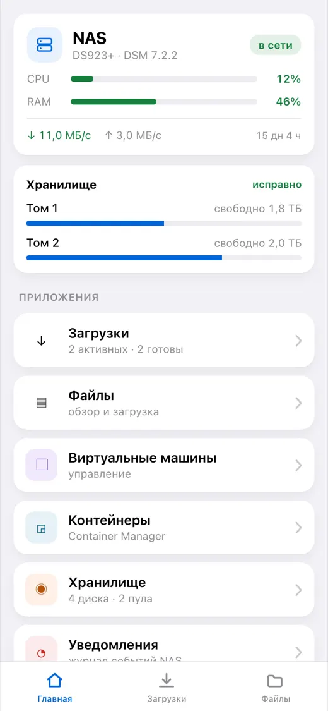
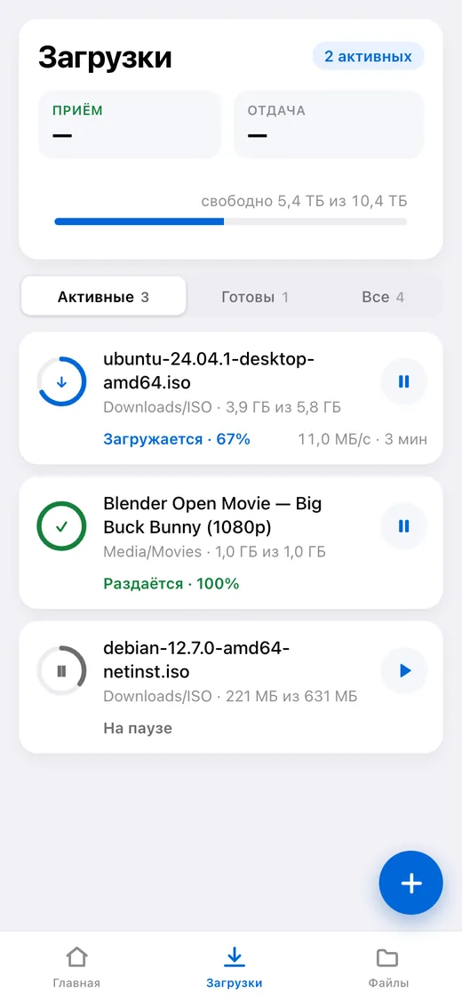
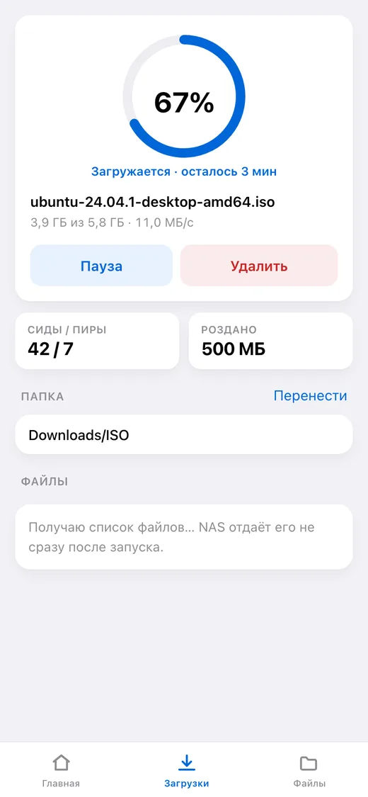
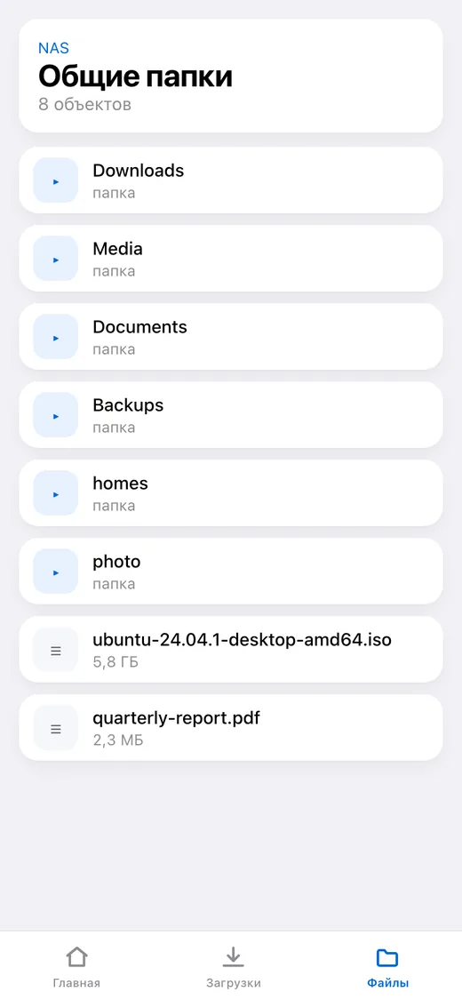
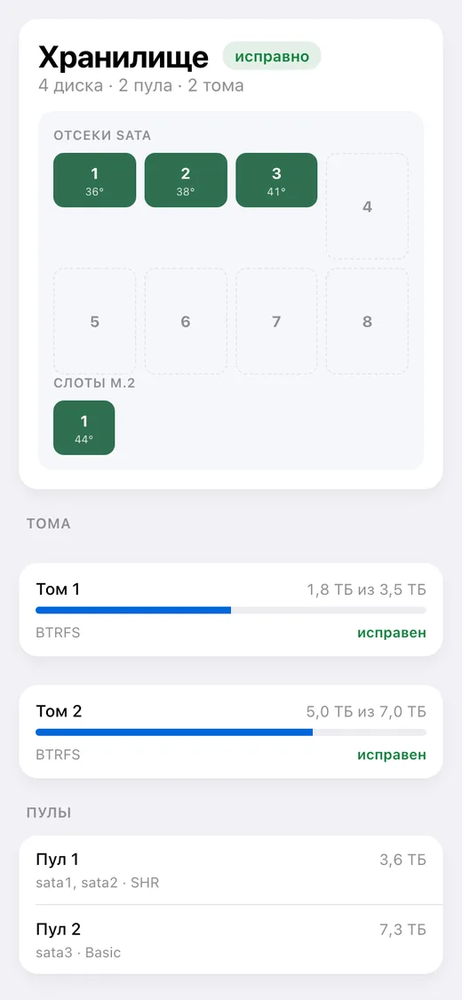

# dsm-mini

[English](README.md) · **Русский** · [Español](README_ES.md) · [Português](README_PT.md) · [Deutsch](README_DE.md) · [Français](README_FR.md) · [Italiano](README_IT.md) · [Türkçe](README_TR.md) · [Українська](README_UK.md) · [Polski](README_PL.md)

[](https://github.com/alexlnos/dsm-mini/actions/workflows/ci.yml)
[](LICENSE)

Telegram-бот с Mini App для управления домашним NAS Synology: закачки Download
Station и файлы File Station прямо из мессенджера, без VPN и веб-интерфейса DSM.

Кинули magnet-ссылку в чат — бот спросил кнопками, куда качать, и поставил в
очередь. Открыли приложение — видно, что качается, сколько осталось, что лежит
на дисках и как себя чувствует NAS.

<p align="center">
  
  
  
  
  
</p>

> Работает: бот, Mini App и уведомления. Нужен DSM 7 или новее — на DSM 6
> пакет не встанет, и там его никто не проверял. Проверено на DSM 7.2.2 с
> Download Station 4.1.2 и File Station 1.4.4.

## Что это умеет

**Загрузки**

- Список задач: прогресс, скорость, оставшееся время, сиды и пиры
- Пауза, возобновление, удаление
- Добавление magnet-ссылкой, прямой ссылкой и файлом `.torrent`
- Выбор папки назначения с настраиваемым списком быстрого доступа
- Выбор файлов внутри раздачи и их приоритета
- Сообщение в чат, когда задача завершилась или упала

**Файлы**

- Обзор папок, предпросмотр, загрузка на NAS
- Переименование, копирование, перенос, удаление

**Состояние NAS**

- Загрузка процессора и памяти, время работы, сеть
- Диски, пулы и тома: температура, занятое место, здоровье
- Виртуальные машины и контейнеры: запуск и остановка
- Журнал событий DSM

**Язык**

Приложение и бот говорят на языке, выбранном в Telegram: английский, русский,
испанский, португальский, немецкий, французский, итальянский, турецкий,
украинский, польский. Незнакомый язык получает английский.

---

## Установка

Дальше — по шагам. Знать заранее ничего не нужно, но приготовьте полчаса:
большая часть времени уйдёт на сертификат, а не на сам сервис.

### Что понадобится

- **NAS Synology** с DSM 7. Заранее ставить ничего не нужно: служба приходит
  пакетом DSM и работает на самом NAS.
- **Download Station** — установите из Центра пакетов, если ещё нет.
- **Telegram** на телефоне.
- **Доступ к роутеру** — понадобится пробросить два порта.

> **Почему нужен публичный адрес.** Telegram открывает Mini App только по
> `https://` с настоящим сертификатом. Самоподписанный, локальный `192.168.…`
> и адрес вида `nas:5001` не подойдут: приложение просто не откроется. Бот при
> этом работает и без адреса — но без кнопки.

---

### Шаг 1. Создать бота

1. Откройте в Telegram [@BotFather](https://t.me/BotFather) и нажмите **Start**.
2. Отправьте `/newbot`.
3. Введите **имя** бота — любое, его видно в шапке чата. Например: `Мой NAS`.
4. Введите **логин** бота — латиницей и обязательно заканчивается на `bot`.
   Например: `alex_home_nas_bot`. Если занят, BotFather попросит другой.
5. В ответ придёт строка вида
   `1234567890:AAExampleTokenReplaceThisWithYours0`. Это **токен**.
   Скопируйте его — понадобится на шаге 5.

> Токен — это пароль от бота. Кто его получил, тот управляет ботом. Не
> выкладывайте его в чаты и на GitHub.

### Шаг 2. Узнать свой Telegram ID

Это число, по которому сервис поймёт, что пишете именно вы, а не посторонний.

1. Откройте [@userinfobot](https://t.me/userinfobot) и нажмите **Start**.
2. Он ответит числом в строке `Id`, например `123456789`. Запишите.

### Шаг 3. Завести отдельного пользователя на NAS

Сервис умеет удалять файлы, поэтому давать ему администратора — плохая идея.

1. В DSM: **Панель управления → Пользователь и группа → Пользователь →
   Создать**.
2. Имя: `dsm-mini`. Пароль — длинный, случайный; запишите его.
3. **Двухэтапную проверку не включайте.** Одноразовый код неоткуда взять, и
   вход просто не пройдёт.
4. Группы: оставьте `users`.
5. Общие папки: дайте доступ **только** к тем, куда будете качать
   (обычно `download` или `Media`). Остальным — «Нет доступа».
6. Приложения: разрешите **Download Station** и **File Station**, остальное
   запретите.

> Если на шаге 5 в журнале появится `authentication with DSM failed` —
> вернитесь сюда и разрешите этому пользователю ещё и приложение **DSM**: на
> части версий без него не проходит вход даже по API.

### Шаг 4. Получить адрес и сертификат

Если у вас уже есть домен с валидным сертификатом на NAS — пропустите шаг.

1. **Имя.** Панель управления → **Внешний доступ → DDNS → Добавить**.
   Поставщик услуг — `Synology`, имя хоста — любое свободное, например
   `alex-nas`. Получится адрес `alex-nas.synology.me`. Сохраните.
2. **Порты на роутере.** В настройках роутера пробросьте на внутренний адрес
   NAS **порт 80** и **порт 443**. Без 80 не выпустится сертификат, без 443 не
   откроется приложение.
3. **Сертификат.** Панель управления → **Безопасность → Сертификат →
   Добавить → Получить сертификат от Let's Encrypt**. Имя домена — тот самый
   `alex-nas.synology.me`, почта — ваша. Выпуск занимает минуту.

Проверьте: откройте `https://alex-nas.synology.me:5001` с телефона по мобильному
интернету (не по домашнему Wi-Fi). Должен открыться DSM без предупреждений о
сертификате.

### Шаг 5. Установить пакет

Самый простой путь — **добавить источник пакетов**, тогда установка и
обновления идут прямо из Центра пакетов:

1. **Центр пакетов → Настройки → Источники пакетов → Добавить**.
2. Имя: `dsm-mini`. Адрес — по вашей архитектуре:
   - Intel и AMD (большинство моделей): `https://alexlnos.github.io/dsm-mini/amd64.json`
   - ARM (бюджетные модели): `https://alexlnos.github.io/dsm-mini/arm64.json`
3. Разрешите сторонние пакеты: **Настройки → Общие → Доверенный уровень →
   Любой издатель**.
4. Слева появится раздел **Сообщество**, а в нём `dsm-mini`. Нажмите
   «Установить» — дальше мастер спросит настройки.

Не знаете свою архитектуру — попробуйте `amd64`: неподходящий пакет DSM просто
откажется ставить, сломать этим ничего нельзя.

**Или вручную, без источника:**

1. Скачайте `.spk` со страницы
   [релизов](https://github.com/alexlnos/dsm-mini/releases): `-amd64` для
   моделей на Intel и AMD (DS918+, DS923+, DS1522+, SA6400 и подобные),
   `-arm64` для бюджетных на ARM (DS223, DS124). Не уверены — берите `amd64`:
   неподходящий пакет DSM просто откажется ставить.
2. **Центр пакетов → Ручная установка → Обзор** и выберите скачанный файл.
3. DSM скажет, что издатель неизвестен. Это нормально для стороннего пакета:
   разрешите один раз в **Центр пакетов → Настройки → Общие → Доверенный
   уровень → Любой издатель**.

#### Что спросит мастер

У мастера установки два экрана и семь полей. Всё, что для них нужно, собрано
на шагах с первого по четвёртый.

| Поле | Что вписать |
|---|---|
| Адрес DSM | Уже подставлен: `https://localhost:5001`. Служба работает на самом NAS, так и оставьте |
| Пользователь DSM | Имя пользователя из шага 3, например `dsm-mini` |
| Пароль DSM | Пароль этого пользователя |
| Токен бота | Токен из шага 1 |
| Разрешённые Telegram ID | Ваш номер из шага 2. Несколько человек — через запятую |
| Публичный адрес HTTPS | Ваш адрес из шага 4, например `https://alex-nas.synology.me` |
| Локальный порт | Оставьте `8080`. Менять, только если этот порт на NAS уже кем-то занят |

**Частые ошибки именно здесь:**

| Написано | Правильно |
|---|---|
| `alex-nas.synology.me` | `https://alex-nas.synology.me` — с протоколом |
| `https://alex-nas.synology.me/` | без слеша в конце |
| Пустой список ID | пусто — значит **никому**; впишите свой номер |
| Публичный адрес в поле адреса DSM | адрес DSM остаётся `https://localhost:5001` |
| Одноразовый код 2FA вместо пароля | у учётной записи двухэтапной проверки не должно быть вовсе (шаг 3) |

После установки пакет запустится сам и будет подниматься вместе с NAS.
Настройки лягут в `/var/packages/dsm-mini/var/config.env` (права `600`), журнал
рядом, в `dsm-mini.log`.

Если служба не сможет запуститься — неверный токен, неверный пароль, нет сети —
она скажет об этом в **Центр уведомлений DSM** и назовёт причину. Полный журнал
лежит в Центре пакетов, на странице пакета.

### Шаг 6. Направить адрес на сервис

Сейчас сервис слушает только внутри NAS, на порту 8080. Обратный прокси
принимает запросы из интернета по HTTPS и передаёт их ему.

1. **Панель управления → Портал входа → Дополнительно → Обратный
   прокси-сервер → Создать**.
   (В DSM 7.0–7.1 это **Панель управления → Портал приложений → Обратный
   прокси-сервер**.)
2. **Источник**: протокол `HTTPS`, имя `alex-nas.synology.me`, порт `443`.
3. **Назначение**: протокол `HTTP`, имя `localhost`, порт `8080`.
4. Сохраните.

> **Порт 80 для этого имени не проксируйте**: через него DSM продлевает
> сертификат Let's Encrypt, и перехват сломает продление через три месяца.

### Шаг 7. Проверить

Откройте в браузере `https://alex-nas.synology.me/healthz`. Должно ответить:

```json
{"status":"ok"}
```

Ответило — значит сервис жив и доступен снаружи. Данные он при этом не отдаёт:
любой запрос без подписи Telegram получает отказ.

### Шаг 8. Открыть приложение

1. Найдите своего бота в Telegram по логину из шага 1.
2. Нажмите **Start**.
3. Внизу, рядом с полем ввода, появится кнопка **Загрузки** — она открывает
   приложение. Кнопку бот ставит сам при запуске, вручную настраивать ничего
   не нужно.
4. Пришлите боту любую magnet-ссылку — он предложит папку кнопками.

Готово.

---

## Если что-то пошло не так

| Что видите | В чём дело | Что делать |
|---|---|---|
| Бот молчит на `/start` | Неверный токен или пакет не запущен | Центр пакетов → `dsm-mini` → журнал |
| «Доступ к этому боту закрыт» | Вашего ID нет в списке | Впишите номер из шага 2 в разрешённые ID (см. «Поменять настройки» ниже) |
| Кнопки приложения нет | Публичный адрес пустой или не `https://` | Там же: в файле настроек, потом перезапустить пакет |
| Кнопка есть, приложение не открывается | Не работает обратный прокси или сертификат | Откройте `https://ваш-адрес/healthz` в браузере |
| «Откройте приложение через бота» | Приложение открыто прямой ссылкой в браузере | Так и задумано: открывайте из бота |
| «Доступ закрыт: вашего Telegram ID…» | Сервис вас не узнал | В разрешённых ID только цифры, через запятую |
| В журнале `authentication with DSM failed` | Пароль, 2FA или права пользователя | Шаг 3: пароль без опечаток, 2FA выключена, приложения разрешены |
| В журнале `Could not get the task list` | Download Station не установлен или запрещён пользователю | Центр пакетов и права из шага 3 |
| Пакет останавливается сразу после запуска | Настройка неверна — журнал назовёт какая | Причина приходит и в Центр уведомлений DSM |

Журнал пакета — главный источник правды: он прямо называет, чего не хватает.
Лежит в `/var/packages/dsm-mini/var/dsm-mini.log` и открывается из Центра
пакетов. Журнал ведётся по-английски, интерфейс и сообщения бота — на вашем
языке.

### Поменять настройки

Всё, что спрашивал мастер, лежит на NAS в одном файле
`/var/packages/dsm-mini/var/config.env` с правами `600`.

Установка пакета поверх себя **ничего не спросит**: мастер работает при
установке, а обновление файл намеренно не трогает — потому настройки его и
переживают. Значит способов два:

- **Поправить файл по SSH** (Панель управления → Терминал и SNMP → включить
  SSH) и перезапустить пакет в Центре пакетов. Так сохраняется всё остальное:

  ```bash
  sudo sed -i "s|^TELEGRAM_BOT_TOKEN=.*|TELEGRAM_BOT_TOKEN='ваш-новый-токен'|" /var/packages/dsm-mini/var/config.env
  sudo synopkg restart dsm-mini
  ```

- **Удалить пакет и поставить заново** — мастер спросит всё сначала. Вместе с
  настройками удалится и лежащая рядом база, то есть закреплённые папки, язык
  и последние известные статусы задач.

## Обновление

Если добавлен источник пакетов, Центр пакетов сам покажет обновление. Без
источника — скачайте свежий `.spk` из
[релизов](https://github.com/alexlnos/dsm-mini/releases) и поставьте поверх.

Настройки и база в обоих случаях останутся: они лежат в каталоге `var` пакета,
а его обновление не трогает.

## Где хранятся данные

Всё в `/var/packages/dsm-mini/var/`:

- `config.env` — то, что спрашивал мастер, права `600`;
- `dsm-mini.db` — база SQLite: закреплённые папки, язык и последние известные
  статусы задач, по которым сервис понимает, о чём уже сообщал;
- `dsm-mini.log` — журнал.

Обновление пакета сохраняет все три. Удаление пакета — удаляет.

## Безопасность

Сервис выставлен в интернет и умеет удалять файлы на NAS, поэтому:

- **Отдельный пользователь DSM**, а не администратор (шаг 3).
- **Без двухэтапной проверки** у этой учётной записи: одноразовый код в
  конфигурации работать не будет.
- **Разрешённые ID — белый список.** Пустой список закрывает доступ всем, а не
  открывает.
- Каждый запрос к `/api/` проверяется дважды: подпись `initData` ключом от
  токена бота и идентификатор в списке разрешённых. Подпись доказывает лишь
  то, что человек открыл бота, — открыть его может любой.
- Наружу отдаётся общая фраза, подробности — в журнал: сообщение о том, что
  именно не сошлось в подписи, подсказывало бы, как её подобрать.
- Токен бота и пароль DSM живут только в `config.env` на самом NAS с правами
  `600` и в журнал не попадают: при отказе пишется причина, но не значение.
- Служба слушает только `127.0.0.1` — то есть с самого NAS. Всё снаружи идёт
  через обратный прокси DSM, он же разбирает TLS.

## Разработка

```bash
cd web && npm install && npm run build   # Mini App попадёт в internal/web/dist
cd .. && go build ./cmd/dsm-mini         # бинарник со встроенным приложением
go test ./...
```

Фронтенд отдельно, с автообновлением:

```bash
cd web && npm run dev    # ходит в бэкенд на localhost:8080
```

Локальный запуск бэкенда читает те же переменные, что мастер пакета пишет в
`config.env`. Удобно держать их в файле:

```bash
cp .env.example .env     # заполните
set -a; . ./.env; set +a
go run ./cmd/dsm-mini
```

Собранный интерфейс лежит в репозитории (`internal/web/dist`) — его забирает
`go:embed`. После правок фронтенда пересоберите и закоммитьте результат, иначе
проверки не пройдут.

Интеграционные тесты работают против настоящего NAS и по умолчанию
пропускаются:

```bash
DSM_URL=https://192.168.1.10:5001 DSM_USER=... DSM_PASSWORD=... \
  DSM_INSECURE_TLS=true go test -tags=integration ./...
```

Тесты, которые меняют состояние NAS, требуют отдельного разрешения:
`DSM_TEST_MUTATIONS=1`, а для файловых операций ещё и `DSM_TEST_FOLDER` —
папку, внутри которой можно создавать временные файлы. Всё созданное они
удаляют за собой.

Новый язык интерфейса — один файл словаря на каждой стороне:
`web/src/i18n/<код>.ts` и `internal/i18n/<код>.go`. Пропустить строку не выйдет:
на фронтенде за этим следит тип, на сервере — тест.

Код, комментарии и журнал в проекте — по-английски; русский живёт только в
словарях перевода. Подробности — в [CLAUDE.md](CLAUDE.md).

## Особенности Synology API

Web API Synology местами ведёт себя не так, как написано в документации: одно и
то же действие отвечает в трёх разных форматах, `limit = -1` роняет File
Station, а `_sid` при загрузке файла нужно передавать иначе, чем везде.
Всё, что выяснено на живом NAS, собрано в [docs/synology-api.md](docs/synology-api.md).

## Лицензия

[MIT](LICENSE)
