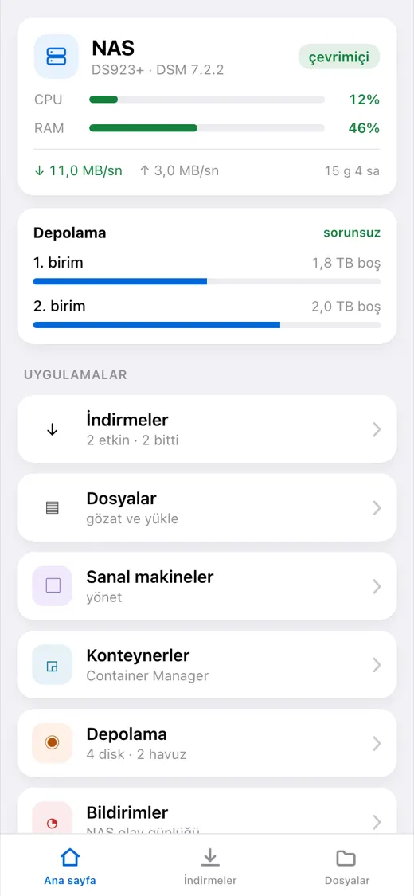
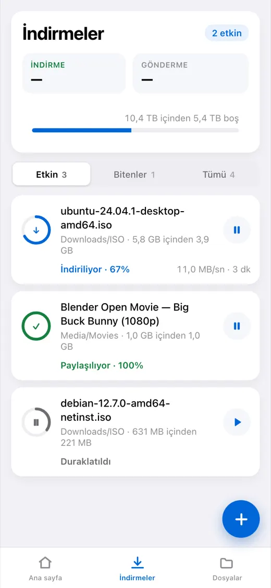
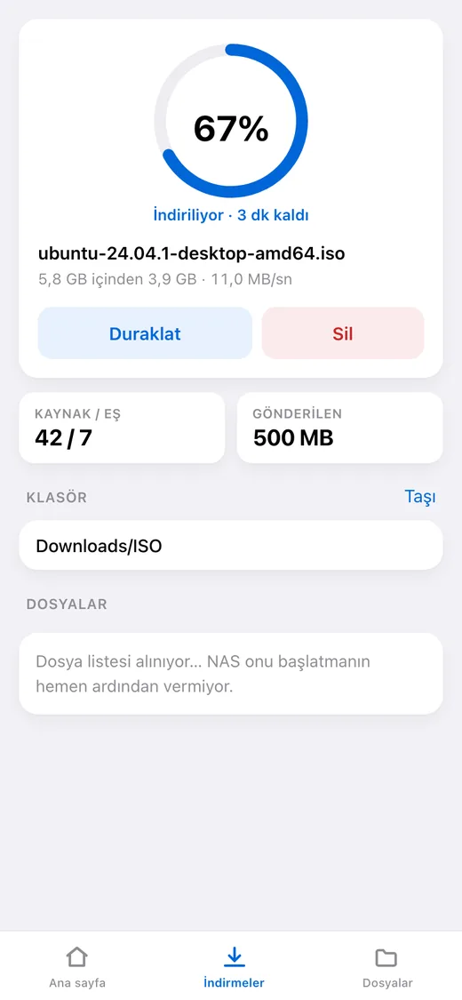
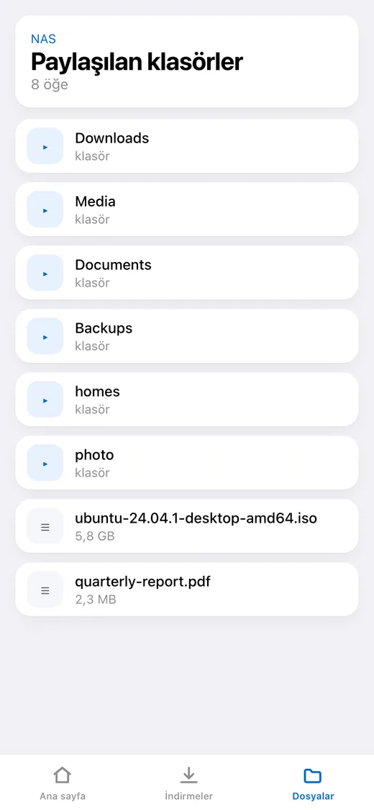
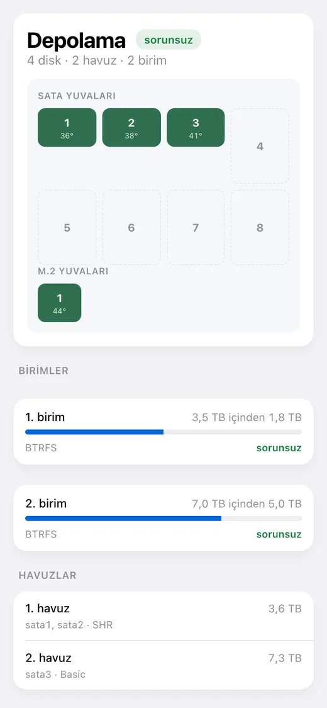

# dsm-mini

[English](README.md) · [Русский](README_RU.md) · [Español](README_ES.md) · [Português](README_PT.md) · [Deutsch](README_DE.md) · [Français](README_FR.md) · [Italiano](README_IT.md) · **Türkçe** · [Українська](README_UK.md) · [Polski](README_PL.md)

[](https://github.com/alexlnos/dsm-mini/actions/workflows/ci.yml)
[](LICENSE)

Ev tipi bir Synology NAS'ı yönetmek için Mini App'li bir Telegram botu: Download
Station indirmeleri ve File Station dosyaları doğrudan mesajlaşmadan, VPN ve DSM
web arayüzü olmadan.

Sohbete bir magnet bağlantısı atın — bot düğmelerle nereye indireceğini sorar ve
kuyruğa alır. Uygulamayı açın — ne indiğini, ne kadar kaldığını, disklerde ne
olduğunu ve NAS'ın durumunu görürsünüz.

<p align="center">
  
  
  
  
  
</p>

> Çalışıyor: bot, Mini App ve bildirimler. DSM 7 ya da daha yenisi gerekir —
> DSM 6'ya paket kurulmaz ve orada hiç denenmedi. DSM 7.2.2 üzerinde Download
> Station 4.1.2 ve File Station 1.4.4 ile denendi.

## Neler yapabiliyor

**İndirmeler**

- Görev listesi: ilerleme, hız, kalan süre, kaynaklar ve eşler
- Duraklatma, sürdürme, silme
- Magnet bağlantısı, doğrudan bağlantı ve `.torrent` dosyasıyla ekleme
- Hedef klasörü seçme, ayarlanabilir bir hızlı erişim listesiyle
- Torrent içindeki dosyaları ve önceliklerini seçme
- Bir görev bittiğinde ya da başarısız olduğunda sohbete mesaj

**Dosyalar**

- Klasörlere göz atma, önizleme, NAS'a yükleme
- Yeniden adlandırma, kopyalama, taşıma, silme

**NAS durumu**

- İşlemci ve bellek yükü, çalışma süresi, ağ
- Diskler, havuzlar ve birimler: sıcaklık, kullanılan alan, sağlık
- Sanal makineler ve kapsayıcılar: başlatma ve durdurma
- DSM olay günlüğü

**Dil**

Uygulama ve bot, Telegram'da seçilen dili konuşur: İngilizce, Rusça, İspanyolca,
Portekizce, Almanca, Fransızca, İtalyanca, Türkçe, Ukraynaca, Lehçe. Bilinmeyen
bir dil İngilizce alır.

---

## Kurulum

Bundan sonrası adım adım. Önceden bir şey bilmeniz gerekmiyor ama yarım saat
ayırın: zamanın çoğu servise değil, sertifikaya gidiyor.

### Neler gerekecek

- **DSM 7'li bir Synology NAS.** Önceden bir şey kurmanız gerekmiyor: servis DSM
  paketi olarak geliyor ve NAS'ın kendisinde çalışıyor.
- **Download Station** — henüz yoksa Paket Merkezi'nden kurun.
- Telefonda **Telegram**.
- **Yönlendiriciye erişim** — iki bağlantı noktasını yönlendirmek gerekecek.

> **Genel bir adres neden gerekli.** Telegram bir Mini App'i yalnızca gerçek
> sertifikalı `https://` üzerinden açar. Kendinden imzalı bir sertifika, yerel
> bir `192.168.…` ve `nas:5001` türü bir adres işe yaramaz: uygulama basitçe
> açılmaz. Bot ise adres olmadan da çalışır — yalnızca düğmesiz.

---

### Adım 1. Botu oluşturmak

1. Telegram'da [@BotFather](https://t.me/BotFather)'ı açın ve **Start**'a basın.
2. `/newbot` gönderin.
3. Botun **adını** yazın — herhangi bir şey, sohbet başlığında görünen budur.
   Örneğin: `NAS'ım`.
4. Botun **kullanıcı adını** yazın — Latin harfleriyle ve mutlaka `bot` ile
   bitecek. Örneğin: `alex_home_nas_bot`. Doluysa BotFather başkasını ister.
5. Yanıt olarak şuna benzer bir satır gelir:
   `1234567890:AAExampleTokenReplaceThisWithYours0`. Bu, **belirteç**. Kopyalayın
   — 5. adımda gerekecek.

> Belirteç botun parolasıdır. Elinde olan botu yönetir. Sohbetlerde ve GitHub'da
> paylaşmayın.

### Adım 2. Kendi Telegram kimliğinizi öğrenmek

Servisin, yazanın siz olduğunuzu, bir yabancı olmadığınızı anladığı sayı budur.

1. [@userinfobot](https://t.me/userinfobot)'u açın ve **Start**'a basın.
2. `Id` satırında bir sayıyla yanıt verir, örneğin `123456789`. Not alın.

### Adım 3. NAS'ta ayrı bir kullanıcı açmak

Servis dosya silebiliyor, bu yüzden ona yönetici vermek kötü bir fikir.

1. DSM'de: **Denetim Masası → Kullanıcı ve Grup → Kullanıcı → Oluştur**.
2. Ad: `dsm-mini`. Parola uzun ve rastgele olsun; not alın.
3. **İki aşamalı doğrulamayı açmayın.** Tek kullanımlık kodu alacak bir yer yok,
   oturum açma basitçe geçmez.
4. Gruplar: `users` kalsın.
5. Paylaşılan klasörler: **yalnızca** indirme yapacağınız klasörlere erişim verin
   (genelde `download` ya da `Media`). Geri kalanına «Erişim yok».
6. Uygulamalar: **Download Station** ve **File Station**'a izin verin, geri
   kalanını yasaklayın.

> 5. adımda günlükte `authentication with DSM failed` görürseniz buraya dönün ve
> bu kullanıcıya bir de **DSM** uygulamasına izin verin: bazı sürümlerde onsuz
> oturum açma API üzerinden bile geçmiyor.

### Adım 4. Adres ve sertifika almak

NAS'ta geçerli sertifikalı bir alan adınız zaten varsa bu adımı atlayın.

1. **Ad.** Denetim Masası → **Harici Erişim → DDNS → Ekle**. Hizmet sağlayıcı
   `Synology`, ana bilgisayar adı boş olan herhangi biri, örneğin `alex-nas`.
   `alex-nas.synology.me` adresi çıkar. Kaydedin.
2. **Yönlendiricideki bağlantı noktaları.** Yönlendirici ayarlarında **80** ve
   **443** numaralı bağlantı noktalarını NAS'ın iç adresine yönlendirin. 80
   olmadan sertifika verilmez, 443 olmadan uygulama açılmaz.
3. **Sertifika.** Denetim Masası → **Güvenlik → Sertifika → Ekle → Let's
   Encrypt'ten sertifika al**. Alan adı yine o `alex-nas.synology.me`, e-posta
   sizinki. Verilmesi bir dakika sürer.

Deneyin: telefondan mobil veriyle (ev Wi-Fi'siyle değil)
`https://alex-nas.synology.me:5001` adresini açın. DSM, sertifika uyarısı
olmadan açılmalı.

### Adım 5. Paketi kurmak

En kolay yol **bir paket kaynağı eklemek**; böylece kurulum ve güncellemeler
doğrudan Paket Merkezi'nden gider:

1. **Paket Merkezi → Ayarlar → Paket Kaynakları → Ekle**.
2. Ad: `dsm-mini`. Adres, mimarinize göre:
   - Intel ve AMD (modellerin çoğu): `https://alexlnos.github.io/dsm-mini/amd64.json`
   - ARM (giriş seviyesi modeller): `https://alexlnos.github.io/dsm-mini/arm64.json`
3. Üçüncü taraf paketlere izin verin: **Ayarlar → Genel → Güven Düzeyi →
   Herhangi bir yayıncı**.
4. Solda **Topluluk** bölümü, içinde de **DSM mini (Telegram Mini App)** görünür. Kur'a basın — sonra
   sihirbaz ayarları sorar.

Mimarinizi bilmiyorsanız `amd64`'ü deneyin: uymayan bir paketi DSM zaten kurmayı
reddeder, bununla bir şey bozulmaz.

**Ya da kaynak olmadan, elle:**

1. `.spk` dosyasını
   [sürümler](https://github.com/alexlnos/dsm-mini/releases) sayfasından indirin:
   Intel ve AMD modelleri için `-amd64` (DS918+, DS923+, DS1522+, SA6400 ve
   benzerleri), ARM'li giriş seviyesi modeller için `-arm64` (DS223, DS124).
   Emin değilseniz `amd64` alın: uymayan bir paketi DSM zaten kurmayı reddeder.
2. **Paket Merkezi → Elle Yükleme → Gözat** ve indirdiğiniz dosyayı seçin.
3. DSM yayıncının bilinmediğini söyler. Üçüncü taraf bir paket için bu normal:
   **Paket Merkezi → Ayarlar → Genel → Güven Düzeyi → Herhangi bir yayıncı**
   ile bir kereliğine izin verin.

#### Sihirbaz ne soruyor

Yükleyicide iki ekran ve yedi alan var. Bunlar için gereken her şey 1–4.
adımlarda toplandı.

| Alan | Ne yazılacak |
|---|---|
| DSM adresi | Zaten dolu: `https://localhost:5001`. Servis NAS'ın kendisinde çalışıyor, olduğu gibi bırakın |
| DSM kullanıcısı | 3. adımdaki kullanıcının adı, örneğin `dsm-mini` |
| DSM parolası | O kullanıcının parolası |
| Bot belirteci | 1. adımdaki belirteç |
| İzin verilen Telegram kimlikleri | 2. adımdaki numaranız. Birkaç kişi: virgülle ayrılmış |
| Genel HTTPS adresi | 4. adımdaki adresiniz, örneğin `https://alex-nas.synology.me` |
| Yerel bağlantı noktası | `8080` kalsın. Yalnızca NAS'ta bu bağlantı noktası doluysa değiştirin |

**Burada gerçekten yapılan hatalar:**

| Yazılan | Doğrusu |
|---|---|
| `alex-nas.synology.me` | `https://alex-nas.synology.me` — protokolüyle |
| `https://alex-nas.synology.me/` | sonunda eğik çizgi olmadan |
| Boş kimlik listesi | boş, **hiç kimse** demek; numaranızı yazın |
| Genel adresin DSM adresi alanına yazılması | DSM adresi `https://localhost:5001` olarak kalır |
| Parola yerine tek kullanımlık 2FA kodu | hesapta iki aşamalı doğrulama hiç olmamalı (3. adım) |

Kurulumdan sonra paket kendi başlar ve NAS ile birlikte açılır. Ayarlar
`/var/packages/dsm-mini/var/config.env` dosyasında (izinler `600`), günlük ise
yanında, `dsm-mini.log` dosyasında durur.

Servis başlayamazsa — yanlış belirteç, yanlış parola, ağ yok — bunu nedeniyle
birlikte **DSM bildirim merkezinde** söyler. Günlüğün tamamı Paket Merkezi'nde,
paketin sayfasındadır.

### Adım 6. Adresi servise yönlendirmek

Şu anda servis yalnızca NAS'ın içinde, 8080 numaralı bağlantı noktasını
dinliyor. Ters proxy, internetten gelen istekleri HTTPS üzerinden alıp ona
aktarır.

1. **Denetim Masası → Oturum Açma Portalı → Gelişmiş → Ters Proxy → Oluştur**.
   (DSM 7.0–7.1'de bu **Denetim Masası → Uygulama Portalı → Ters Proxy**.)
2. **Kaynak**: protokol `HTTPS`, ana bilgisayar adı `alex-nas.synology.me`,
   bağlantı noktası `443`.
3. **Hedef**: protokol `HTTP`, ana bilgisayar adı `localhost`, bağlantı noktası
   `8080`.
4. Kaydedin.

> **Bu ad için 80 numaralı bağlantı noktasını proxy'lemeyin**: DSM Let's Encrypt
> sertifikasını oradan yeniliyor, araya girmek yenilemeyi üç ay sonra bozar.

### Adım 7. Denemek

Tarayıcıda `https://alex-nas.synology.me/healthz` adresini açın. Şöyle yanıt
vermeli:

```json
{"status":"ok"}
```

Yanıt verdiyse servis ayakta ve dışarıdan erişilebilir. Bunu yaparken veri de
vermez: Telegram imzası olmayan her istek reddedilir.

### Adım 8. Uygulamayı açmak

1. Botunuzu Telegram'da 1. adımdaki kullanıcı adıyla bulun.
2. **Start**'a basın.
3. Aşağıda, yazma alanının yanında bir **İndirmeler** düğmesi belirir —
   uygulamayı o açar. Düğmeyi bot açılışta kendi koyar, elle bir şey ayarlamak
   gerekmez.
4. Bota herhangi bir magnet bağlantısı gönderin — klasörleri düğmelerle önerir.

Hazır.

---

## Bir şeyler ters gittiyse

| Gördüğünüz | Sorun ne | Ne yapmalı |
|---|---|---|
| Bot `/start` komutuna susuyor | Yanlış belirteç ya da paket çalışmıyor | Paket Merkezi → **DSM mini (Telegram Mini App)** → günlük |
| «Bu bota erişim kapalı» | Kimliğiniz listede değil | 2. adımdaki numarayı izin verilen kimliklere ekleyin (aşağıda «Ayarları değiştirmek») |
| Uygulama düğmesi yok | Genel adres boş ya da `https://` değil | Aynı yer: ayar dosyası, sonra paketi yeniden başlatın |
| Düğme var, uygulama açılmıyor | Ters proxy ya da sertifika çalışmıyor | Tarayıcıda `https://adresiniz/healthz` açın |
| «Uygulamayı bot üzerinden açın» | Uygulama tarayıcıda doğrudan bağlantıyla açıldı | Böyle olması gerekiyor: bottan açın |
| «Erişim reddedildi: Telegram kimliğiniz…» | Servis sizi tanımadı | İzin verilen kimliklerde yalnızca rakamlar, virgülle ayrılmış |
| Günlükte `authentication with DSM failed` | Parola, 2FA ya da kullanıcının yetkileri | 3. adım: parola yazım hatasız, 2FA kapalı, uygulamalara izinli |
| Günlükte `Could not get the task list` | Download Station kurulu değil ya da kullanıcıya yasak | Paket Merkezi ve 3. adımdaki yetkiler |
| Paket başlar başlamaz duruyor | Bir ayar yanlış — günlük hangisi olduğunu söyler | Neden DSM bildirim merkezine de düşer |

Paketin günlüğü ana doğruluk kaynağıdır: neyin eksik olduğunu açıkça söyler.
`/var/packages/dsm-mini/var/dsm-mini.log` dosyasında durur ve Paket
Merkezi'nden açılır. Günlük İngilizce tutulur, arayüz ve bot mesajları sizin
dilinizde olur.

### Ayarları değiştirmek

Sihirbazın sorduğu her şey NAS'ta tek bir dosyada:
`/var/packages/dsm-mini/var/config.env`, izinler `600`.

Paketi kendi üzerine kurmak yeniden **sormaz**: sihirbaz kurulumda çalışır ve
bir güncelleme dosyaya bilerek dokunmaz — ayarların güncellemeyi atlatmasının
nedeni budur. Geriye iki yol kalıyor:

- **Dosyayı SSH ile düzenlemek** (Denetim Masası → Terminal ve SNMP → SSH'i
  açın), sonra paketi Paket Merkezi'nden yeniden başlatmak. Böylece geri kalan
  her şey durur:

  ```bash
  sudo sed -i "s|^TELEGRAM_BOT_TOKEN=.*|TELEGRAM_BOT_TOKEN='yeni-belirteciniz'|" /var/packages/dsm-mini/var/config.env
  sudo synopkg restart dsm-mini
  ```

- **Kaldırıp yeniden kurmak** — sihirbaz her şeyi baştan sorar. Ayarlarla
  birlikte yanındaki veritabanı da gider: sabitlenen klasörler, dil ve
  görevlerin son bilinen durumları.

## Güncelleme

Paket kaynağı eklendiyse Paket Merkezi güncellemeyi kendi gösterir. Kaynak yoksa
yeni `.spk` dosyasını
[sürümlerden](https://github.com/alexlnos/dsm-mini/releases) indirip üzerine
kurun.

Ayarlar ve veritabanı iki durumda da kalır: paketin `var` dizininde duruyorlar,
güncelleme oraya dokunmuyor.

## Veriler nerede duruyor

Her şey `/var/packages/dsm-mini/var/` içinde:

- `config.env` — sihirbazın sorduğu şeyler, izinler `600`;
- `dsm-mini.db` — bir SQLite veritabanı: sabitlenen klasörler, dil ve görevlerin
  son bilinen durumları; servis neyi bildirdiğini bunlardan anlıyor;
- `dsm-mini.log` — günlük.

Paketin güncellenmesi üçünü de korur. Paketin kaldırılması siler.

## Güvenlik

Servis internete açık ve NAS'taki dosyaları silebiliyor, bu yüzden:

- **Ayrı bir DSM kullanıcısı**, yönetici değil (3. adım).
- Bu hesapta **iki aşamalı doğrulama olmadan**: tek kullanımlık bir kod bir
  yapılandırma dosyasından çalışamaz.
- **İzin verilen kimlikler bir beyaz listedir.** Boş liste erişimi herkese
  kapatır, açmaz.
- `/api/` altındaki her istek iki kez denetlenir: bot belirtecinden türetilen bir
  anahtarla `initData` imzası ve kimliğin listeye karşı denetimi. İmza yalnızca
  birinin botu açtığını kanıtlar — açmayı ise herkes yapabilir.
- Dışarıya genel bir ifade gider, ayrıntılar günlüğe: imzada tam olarak neyin
  tutmadığını söyleyen bir mesaj, onu nasıl taklit edeceğinin ipucu olurdu.
- Bot belirteci ve DSM parolası yalnızca NAS'ın kendisindeki `config.env`
  dosyasında, `600` izinleriyle durur ve hiçbir zaman günlüğe düşmez: bir
  reddedişte neden yazılır, değer değil.
- Servis yalnızca `127.0.0.1` üzerinde dinler — yani NAS'ın kendisinden.
  Dışarıdan gelen her şey, TLS'i de sonlandıran DSM ters proxy'sinden geçer.

## Geliştirme

```bash
cd web && npm install && npm run build   # Mini App internal/web/dist içine düşer
cd .. && go build ./cmd/dsm-mini         # uygulaması gömülü tek bir ikili dosya
go test ./...
```

Ön yüz ayrı, otomatik yenilemeyle:

```bash
cd web && npm run dev    # localhost:8080 üzerindeki arka uçla konuşur
```

Arka ucu yerelde çalıştırmak, paket sihirbazının `config.env` içine yazdığı
değişkenlerin aynısını okur. Bunları bir dosyada tutmak elverişli:

```bash
cp .env.example .env     # doldurun
set -a; . ./.env; set +a
go run ./cmd/dsm-mini
```

Derlenmiş arayüz depoda duruyor (`internal/web/dist`) — onu `go:embed` alıyor. Ön
yüzü değiştirdikten sonra yeniden derleyip sonucu işleyin, yoksa denetimler
geçmez.

Tümleştirme testleri gerçek bir NAS'a karşı çalışır ve öntanımlı olarak atlanır:

```bash
DSM_URL=https://192.168.1.10:5001 DSM_USER=... DSM_PASSWORD=... \
  DSM_INSECURE_TLS=true go test -tags=integration ./...
```

NAS'ın durumunu değiştiren testler ayrı izin ister: `DSM_TEST_MUTATIONS=1`, dosya
işlemleri için ayrıca `DSM_TEST_FOLDER` — içinde geçici dosya oluşturulabilecek
klasör. Oluşturdukları her şeyi kendileri siler.

Yeni bir arayüz dili, her iki tarafta birer sözlük dosyası demek:
`web/src/i18n/<kod>.ts` ve `internal/i18n/<kod>.go`. Bir metni atlamak mümkün
değil: ön yüzde bunu tür, sunucuda bir test denetliyor.

Projede kod, açıklamalar ve günlük İngilizce; öteki diller yalnızca sözlüklerde
yaşıyor. Ayrıntılar [CLAUDE.md](CLAUDE.md) dosyasında.

## Synology API'sinin tuhaflıkları

Synology Web API'si yer yer belgelerinde yazandan başka türlü davranıyor: aynı
eylem üç ayrı biçimde yanıt veriyor, `limit = -1` File Station'ı deviriyor ve
dosya yüklerken `_sid` her yerdekinden başka türlü verilmek zorunda. Gerçek bir
NAS üzerinde öğrenilenlerin tamamı
[docs/synology-api.md](docs/synology-api.md) dosyasında toplandı.

## Lisans

[MIT](LICENSE)
