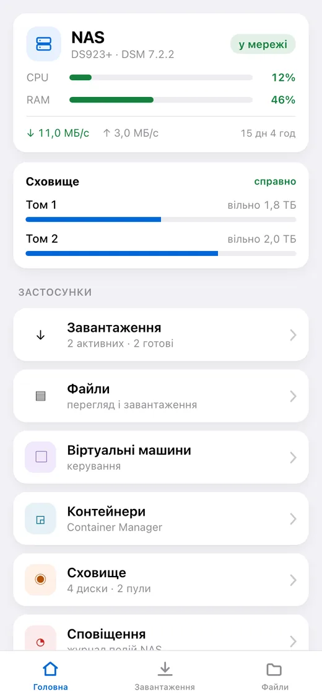
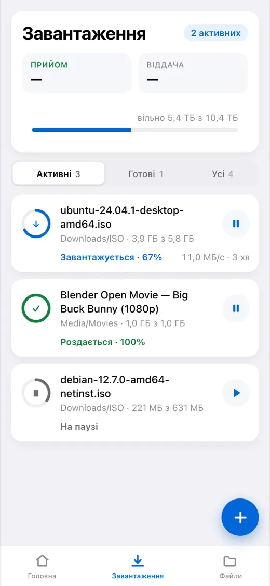
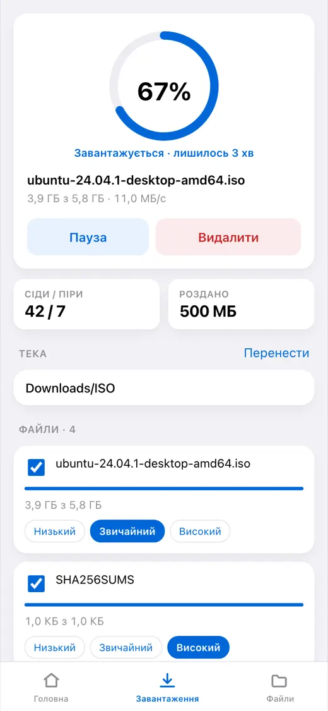
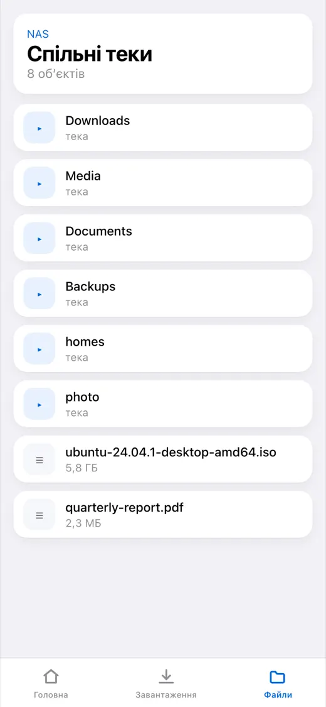
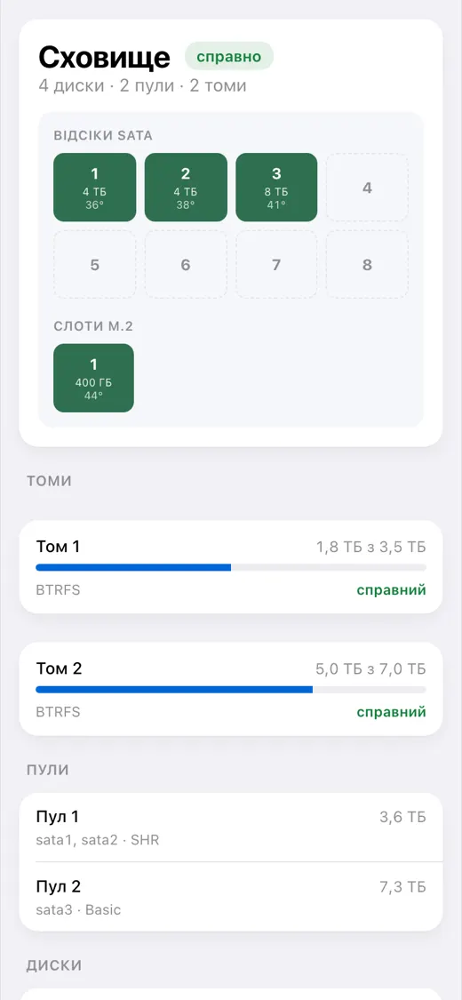

# dsm-mini

[English](README.md) · [Русский](README_RU.md) · [Español](README_ES.md) · [Português](README_PT.md) · [Deutsch](README_DE.md) · [Français](README_FR.md) · [Italiano](README_IT.md) · [Türkçe](README_TR.md) · **Українська** · [Polski](README_PL.md)

[](https://github.com/alexlnos/dsm-mini/actions/workflows/ci.yml)
[](LICENSE)

Telegram-бот з Mini App для керування домашнім NAS Synology: завантаження
Download Station і файли File Station просто з месенджера, без VPN і
вебінтерфейсу DSM.

Кинули magnet-посилання в чат — бот кнопками запитав, куди качати, і поставив у
чергу. Відкрили застосунок — видно, що завантажується, скільки лишилося, що
лежить на дисках і як почувається NAS.

<p align="center">
  
  
  
  
  
</p>

> Працює: бот, Mini App і сповіщення. Потрібен DSM 7 або новіший — на DSM 6
> пакет не встановиться, і там його ніхто не перевіряв. Перевірено на DSM 7.2.2
> з Download Station 4.1.2 та File Station 1.4.4.

## Що воно вміє

**Завантаження**

- Список завдань: поступ, швидкість, час до кінця, сіди й піри
- Пауза, відновлення, видалення
- Додавання magnet-посиланням, прямим посиланням і файлом `.torrent`
- Вибір теки призначення з налаштовуваним списком швидкого доступу
- Вибір файлів усередині роздачі та їхнього пріоритету
- Повідомлення в чат, коли завдання завершилося або впало

**Файли**

- Огляд тек, попередній перегляд, вивантаження на NAS
- Перейменування, копіювання, перенесення, видалення

**Стан NAS**

- Навантаження процесора й пам'яті, час роботи, мережа
- Диски, пули та томи: температура, зайняте місце, здоров'я
- Віртуальні машини та контейнери: запуск і зупинка
- Журнал подій DSM

**Мова**

Застосунок і бот говорять мовою, вибраною в Telegram: англійська, російська,
іспанська, португальська, німецька, французька, італійська, турецька,
українська, польська. Незнайома мова отримує англійську.

---

## Встановлення

Далі — покроково. Знати наперед нічого не треба, але приготуйте півгодини:
більшість часу піде на сертифікат, а не на сам сервіс.

### Що знадобиться

- **NAS Synology** з DSM 7. Наперед нічого ставити не треба: служба приходить
  пакетом DSM і працює на самому NAS.
- **Download Station** — встановіть із Центру пакетів, якщо ще немає.
- **Telegram** на телефоні.
- **Доступ до роутера** — знадобиться прокинути два порти.

> **Чому потрібна публічна адреса.** Telegram відкриває Mini App лише через
> `https://` зі справжнім сертифікатом. Самопідписаний, локальний `192.168.…` і
> адреса на кшталт `nas:5001` не підійдуть: застосунок просто не відкриється.
> Бот при цьому працює і без адреси — але без кнопки.

---

### Крок 1. Створити бота

1. Відкрийте в Telegram [@BotFather](https://t.me/BotFather) і натисніть
   **Start**.
2. Надішліть `/newbot`.
3. Введіть **ім'я** бота — будь-яке, його видно в шапці чату. Наприклад:
   `Мій NAS`.
4. Введіть **логін** бота — латиницею і обов'язково закінчується на `bot`.
   Наприклад: `alex_home_nas_bot`. Якщо зайнятий, BotFather попросить інший.
5. У відповідь прийде рядок на кшталт
   `1234567890:AAExampleTokenReplaceThisWithYours0`. Це **токен**. Скопіюйте
   його — знадобиться на кроці 5.

> Токен — це пароль від бота. Хто його отримав, той керує ботом. Не викладайте
> його в чати і на GitHub.

### Крок 2. Дізнатися свій Telegram ID

Це число, за яким сервіс зрозуміє, що пишете саме ви, а не стороння людина.

1. Відкрийте [@userinfobot](https://t.me/userinfobot) і натисніть **Start**.
2. Він відповість числом у рядку `Id`, наприклад `123456789`. Запишіть.

### Крок 3. Завести окремого користувача на NAS

Сервіс уміє видаляти файли, тому давати йому адміністратора — погана ідея.

1. У DSM: **Панель керування → Користувач і група → Користувач → Створити**.
2. Ім'я: `dsm-mini`. Пароль — довгий, випадковий; запишіть його.
3. **Двоетапну перевірку не вмикайте.** Одноразовий код нізвідки взяти, і вхід
   просто не пройде.
4. Групи: залиште `users`.
5. Спільні теки: дайте доступ **лише** до тих, куди качатимете (зазвичай
   `download` або `Media`). Решті — «Немає доступу».
6. Застосунки: дозвольте **Download Station** і **File Station**, решту
   заборонте.

> Якщо на кроці 5 в журналі з'явиться `authentication with DSM failed` —
> поверніться сюди й дозвольте цьому користувачеві ще й застосунок **DSM**: на
> частині версій без нього не проходить вхід навіть через API.

### Крок 4. Отримати адресу й сертифікат

Якщо у вас уже є домен із чинним сертифікатом на NAS — пропустіть крок.

1. **Ім'я.** Панель керування → **Зовнішній доступ → DDNS → Додати**.
   Постачальник — `Synology`, ім'я хоста — будь-яке вільне, наприклад
   `alex-nas`. Вийде адреса `alex-nas.synology.me`. Збережіть.
2. **Порти на роутері.** У налаштуваннях роутера прокиньте на внутрішню адресу
   NAS **порт 80** і **порт 443**. Без 80 не випуститься сертифікат, без 443 не
   відкриється застосунок.
3. **Сертифікат.** Панель керування → **Безпека → Сертифікат → Додати →
   Отримати сертифікат від Let's Encrypt**. Ім'я домену — той самий
   `alex-nas.synology.me`, пошта — ваша. Випуск триває хвилину.

Перевірте: відкрийте `https://alex-nas.synology.me:5001` з телефона мобільним
інтернетом (не домашнім Wi-Fi). Має відкритися DSM без попереджень про
сертифікат.

### Крок 5. Встановити пакет

Найпростіший шлях — **додати джерело пакетів**, тоді встановлення й оновлення
йдуть просто з Центру пакетів:

1. **Центр пакетів → Налаштування → Джерела пакетів → Додати**.
2. Ім'я: `dsm-mini`. Адреса — за вашою архітектурою:
   - Intel і AMD (більшість моделей): `https://alexlnos.github.io/dsm-mini/amd64.json`
   - ARM (бюджетні моделі): `https://alexlnos.github.io/dsm-mini/arm64.json`
3. Дозвольте сторонні пакети: **Налаштування → Загальні → Рівень довіри →
   Будь-який видавець**.
4. Ліворуч з'явиться розділ **Спільнота**, а в ньому `dsm-mini`. Натисніть
   «Встановити» — далі майстер запитає налаштування.

Не знаєте своєї архітектури — спробуйте `amd64`: невідповідний пакет DSM просто
відмовиться ставити, зламати цим нічого не можна.

**Або вручну, без джерела:**

1. Завантажте `.spk` зі сторінки
   [випусків](https://github.com/alexlnos/dsm-mini/releases): `-amd64` для
   моделей на Intel і AMD (DS918+, DS923+, DS1522+, SA6400 і подібні), `-arm64`
   для бюджетних на ARM (DS223, DS124). Не впевнені — беріть `amd64`:
   невідповідний пакет DSM просто відмовиться ставити.
2. **Центр пакетів → Ручне встановлення → Огляд** і виберіть завантажений файл.
3. DSM скаже, що видавець невідомий. Це нормально для стороннього пакета:
   дозвольте один раз у **Центр пакетів → Налаштування → Загальні → Рівень
   довіри → Будь-який видавець**.

#### Що запитає майстер

У майстра встановлення два екрани й сім полів. Усе, що для них потрібно,
зібрано на кроках з першого до четвертого.

| Поле | Що вписати |
|---|---|
| Адреса DSM | Уже підставлена: `https://localhost:5001`. Служба працює на самому NAS, так і залиште |
| Користувач DSM | Ім'я користувача з кроку 3, наприклад `dsm-mini` |
| Пароль DSM | Пароль цього користувача |
| Токен бота | Токен із кроку 1 |
| Дозволені Telegram ID | Ваш номер із кроку 2. Кілька людей — через кому |
| Публічна адреса HTTPS | Ваша адреса з кроку 4, наприклад `https://alex-nas.synology.me` |
| Локальний порт | Залиште `8080`. Міняти, лише якщо цей порт на NAS уже кимось зайнятий |

**Часті помилки саме тут:**

| Написано | Правильно |
|---|---|
| `alex-nas.synology.me` | `https://alex-nas.synology.me` — з протоколом |
| `https://alex-nas.synology.me/` | без скісної риски в кінці |
| Порожній список ID | порожньо — означає **нікому**; впишіть свій номер |
| Публічна адреса в полі адреси DSM | адреса DSM лишається `https://localhost:5001` |
| Одноразовий код 2FA замість пароля | в облікового запису двоетапної перевірки не має бути взагалі (крок 3) |

Після встановлення пакет запуститься сам і підніматиметься разом із NAS.
Налаштування ляжуть у `/var/packages/dsm-mini/var/config.env` (права `600`),
журнал поруч, у `dsm-mini.log`.

Якщо служба не зможе запуститися — хибний токен, хибний пароль, немає мережі —
вона скаже про це в **Центр сповіщень DSM** і назве причину. Повний журнал лежить
у Центрі пакетів, на сторінці пакета.

### Крок 6. Направити адресу на сервіс

Зараз сервіс слухає лише всередині NAS, на порту 8080. Зворотний проксі приймає
запити з інтернету через HTTPS і передає їх йому.

1. **Панель керування → Портал входу → Додатково → Зворотний проксі →
   Створити**.
   (У DSM 7.0–7.1 це **Панель керування → Портал застосунків → Зворотний
   проксі**.)
2. **Джерело**: протокол `HTTPS`, ім'я `alex-nas.synology.me`, порт `443`.
3. **Призначення**: протокол `HTTP`, ім'я `localhost`, порт `8080`.
4. Збережіть.

> **Порт 80 для цього імені не проксіюйте**: через нього DSM продовжує
> сертифікат Let's Encrypt, і перехоплення зламає продовження за три місяці.

### Крок 7. Перевірити

Відкрийте у браузері `https://alex-nas.synology.me/healthz`. Має відповісти:

```json
{"status":"ok"}
```

Відповіло — отже, сервіс живий і доступний ззовні. Даних він при цьому не
віддає: будь-який запит без підпису Telegram отримує відмову.

### Крок 8. Відкрити застосунок

1. Знайдіть свого бота в Telegram за логіном із кроку 1.
2. Натисніть **Start**.
3. Унизу, поряд із полем введення, з'явиться кнопка **Завантаження** — вона
   відкриває застосунок. Кнопку бот ставить сам під час запуску, вручну
   налаштовувати нічого не треба.
4. Надішліть боту будь-яке magnet-посилання — він запропонує теку кнопками.

Готово.

---

## Якщо щось пішло не так

| Що бачите | У чому річ | Що робити |
|---|---|---|
| Бот мовчить на `/start` | Хибний токен або пакет не запущений | Центр пакетів → `dsm-mini` → журнал |
| «Доступ до цього бота закрито» | Вашого ID немає в списку | Впишіть номер із кроку 2 в дозволені ID (див. «Змінити налаштування» нижче) |
| Кнопки застосунку немає | Публічна адреса порожня або не `https://` | Там само: файл налаштувань, потім перезапустити пакет |
| Кнопка є, застосунок не відкривається | Не працює зворотний проксі або сертифікат | Відкрийте `https://ваша-адреса/healthz` у браузері |
| «Відкрийте застосунок через бота» | Застосунок відкрито прямим посиланням у браузері | Так і задумано: відкривайте з бота |
| «Доступ закрито: вашого Telegram ID…» | Сервіс вас не впізнав | У дозволених ID лише цифри, через кому |
| У журналі `authentication with DSM failed` | Пароль, 2FA або права користувача | Крок 3: пароль без описок, 2FA вимкнена, застосунки дозволені |
| У журналі `Could not get the task list` | Download Station не встановлено або заборонено користувачеві | Центр пакетів і права з кроку 3 |
| Пакет зупиняється одразу після запуску | Налаштування хибне — журнал назве яке | Причина приходить і в Центр сповіщень DSM |

Журнал пакета — головне джерело правди: він прямо називає, чого бракує. Лежить
у `/var/packages/dsm-mini/var/dsm-mini.log` і відкривається з Центру пакетів.
Журнал ведеться англійською, інтерфейс і повідомлення бота — вашою мовою.

### Змінити налаштування

Усе, що запитував майстер, лежить на NAS в одному файлі
`/var/packages/dsm-mini/var/config.env` з правами `600`.

Встановлення пакета поверх себе **нічого не запитає**: майстер працює під час
встановлення, а оновлення файл навмисно не чіпає — саме тому налаштування його
переживають. Отже, шляхи два:

- **Виправити файл через SSH** (Панель керування → Термінал і SNMP → увімкнути
  SSH) і перезапустити пакет у Центрі пакетів. Так збережеться решта:

  ```bash
  sudo sed -i "s|^TELEGRAM_BOT_TOKEN=.*|TELEGRAM_BOT_TOKEN='ваш-новий-токен'|" /var/packages/dsm-mini/var/config.env
  sudo synopkg restart dsm-mini
  ```

- **Видалити пакет і встановити заново** — майстер запитає все спочатку. Разом
  із налаштуваннями зникне й база поруч: закріплені теки, мова та останні
  відомі статуси завдань.

## Оновлення

Якщо додано джерело пакетів, Центр пакетів сам покаже оновлення. Без джерела —
завантажте свіжий `.spk` із
[випусків](https://github.com/alexlnos/dsm-mini/releases) і поставте поверх.

Налаштування й база в обох випадках залишаться: вони лежать у каталозі `var`
пакета, а оновлення його не чіпає.

## Де зберігаються дані

Усе в `/var/packages/dsm-mini/var/`:

- `config.env` — те, що запитував майстер, права `600`;
- `dsm-mini.db` — база SQLite: закріплені теки, мова й останні відомі статуси
  завдань, за якими сервіс розуміє, про що вже повідомляв;
- `dsm-mini.log` — журнал.

Оновлення пакета зберігає всі три. Видалення пакета — видаляє.

## Безпека

Сервіс виставлений в інтернет і вміє видаляти файли на NAS, тому:

- **Окремий користувач DSM**, а не адміністратор (крок 3).
- **Без двоетапної перевірки** в цього облікового запису: одноразовий код у
  конфігурації працювати не буде.
- **Дозволені ID — білий список.** Порожній список закриває доступ усім, а не
  відкриває.
- Кожен запит до `/api/` перевіряється двічі: підпис `initData` ключем від
  токена бота й ідентифікатор у списку дозволених. Підпис доводить лише те, що
  людина відкрила бота, — відкрити його може будь-хто.
- Назовні віддається загальна фраза, подробиці — в журнал: повідомлення про те,
  що саме не зійшлося в підписі, підказувало б, як його підібрати.
- Токен бота й пароль DSM живуть лише в `config.env` на самому NAS із правами
  `600` і в журнал не потрапляють: при відмові пишеться причина, але не
  значення.
- Служба слухає тільки `127.0.0.1` — тобто із самого NAS. Усе ззовні йде через
  зворотний проксі DSM, він же розбирає TLS.

## Розробка

```bash
cd web && npm install && npm run build   # Mini App потрапить у internal/web/dist
cd .. && go build ./cmd/dsm-mini         # бінарник із вбудованим застосунком
go test ./...
```

Фронтенд окремо, з автооновленням:

```bash
cd web && npm run dev    # ходить у бекенд на localhost:8080
```

Локальний запуск бекенда читає ті самі змінні, що майстер пакета пише в
`config.env`. Зручно тримати їх у файлі:

```bash
cp .env.example .env     # заповніть
set -a; . ./.env; set +a
go run ./cmd/dsm-mini
```

Зібраний інтерфейс лежить у репозиторії (`internal/web/dist`) — його забирає
`go:embed`. Після правок фронтенду перезберіть і закомітьте результат, інакше
перевірки не пройдуть.

Інтеграційні тести працюють проти справжнього NAS і типово пропускаються:

```bash
DSM_URL=https://192.168.1.10:5001 DSM_USER=... DSM_PASSWORD=... \
  DSM_INSECURE_TLS=true go test -tags=integration ./...
```

Тести, які змінюють стан NAS, потребують окремого дозволу:
`DSM_TEST_MUTATIONS=1`, а для файлових операцій ще й `DSM_TEST_FOLDER` — теку,
всередині якої можна створювати тимчасові файли. Усе створене вони прибирають за
собою.

Нова мова інтерфейсу — один файл словника з кожного боку:
`web/src/i18n/<код>.ts` та `internal/i18n/<код>.go`. Пропустити рядок не вийде:
на фронтенді за цим стежить тип, на сервері — тест.

Код, коментарі та журнал у проєкті — англійською; інші мови живуть лише у
словниках. Подробиці — у [CLAUDE.md](CLAUDE.md).

## Особливості Synology API

Web API Synology подекуди поводиться не так, як написано в документації: та сама
дія відповідає в трьох різних форматах, `limit = -1` кладе File Station, а `_sid`
під час вивантаження файлу треба передавати інакше, ніж усюди. Усе, що з'ясовано
на живому NAS, зібрано в [docs/synology-api.md](docs/synology-api.md).

## Ліцензія

[MIT](LICENSE)
