# Поставить фильм на закачку по дороге домой. Оказалось, это сложно

Вечер, метро, полчаса до дома. Коллега скинул название фильма, и хочется, чтобы к моменту, когда я дойду до дивана, он уже лежал на NAS. Задача ровно в одно действие: взять magnet-ссылку и отдать её Download Station.

Давайте посмотрим, как это делается с телефона сегодня.

Открываю DSM в мобильном браузере. Это полноценный десктопный интерфейс, ужатый до пяти дюймов: окна, которые можно таскать мышью, только мыши нет. Нахожу иконку Download Station, жду, пока загрузится приложение внутри приложения, тыкаю в «Создать», попадаю в диалог выбора папки с деревом, в котором пункты меньше пальца. Где-то на этом месте у меня закрывается сессия, потому что DSM решил, что я слишком долго думал.

Есть официальное приложение DS get. Оно существует с 2012 года и выглядит соответственно. Оно умеет добавить ссылку — и на этом всё: посмотреть, что там с местом на дисках, нельзя, файлы внутри раздачи не выбрать, приоритеты не поставить.

И ещё одна деталь, про которую все забывают: чтобы всё это открылось снаружи, NAS должен торчать в интернет. Либо VPN до дома — и тогда нужно сначала его включить, подождать, а потом выключить, чтобы не гонять весь трафик через квартиру. Либо проброс портов и DSM голым задом наружу, что отдельное удовольствие с учётом того, сколько CVE выходит на DSM в год.

Итого: три минуты возни и раздражение вместо одного действия.

А мессенджер у меня и так открыт. Ссылка уже в нём. Почему нельзя просто переслать её боту?

## Что получилось

Можно. Получился `dsm-mini` — телеграм-бот с Mini App, который живёт пакетом на самом NAS.

Кидаешь боту magnet-ссылку, прямую ссылку или файл `.torrent`. Он спрашивает кнопками, в какую папку, и ставит задачу. Когда закачка завершилась или упала — пишет в чат. Это весь основной сценарий, он занимает два тапа.

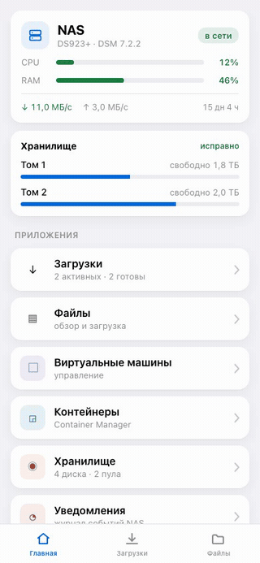

А если открыть приложение, там оказывается заметно больше.

## Экскурсия

**Главная.** Состояние NAS одним экраном: процессор, память, время работы, сеть, место на томах. Ниже — разделы, и только те, что реально установлены: если Virtual Machine Manager не стоит, карточки не будет.

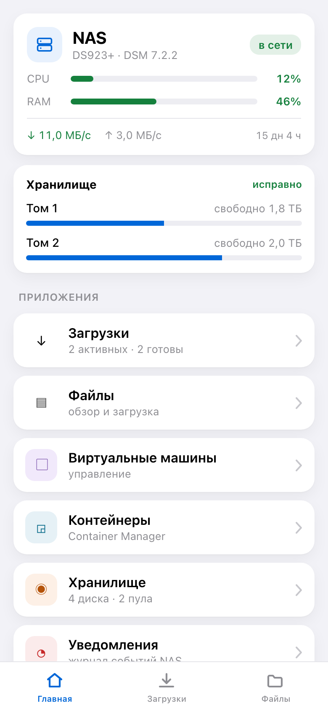

**Загрузки.** Список задач с прогрессом, скоростью, оставшимся временем, сидами и пирами. Вкладки «Активные / Готовые / Все». Пауза, возобновление и удаление — прямо из списка.

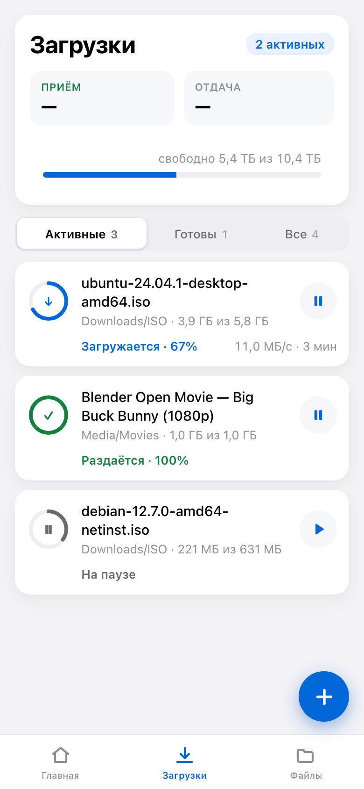

**Задача.** Кольцо прогресса, скорость, сколько роздано, папка назначения — её можно поменять уже у созданной задачи, Download Station это умеет.

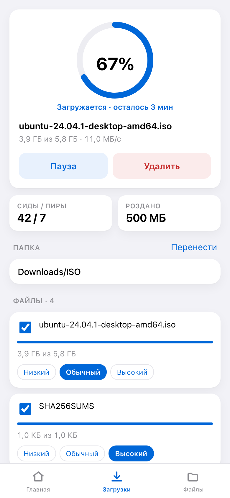

**Файлы внутри раздачи.** Вот это, на мой взгляд, самое полезное и чего нет в DS get: выбрать, что качать, а что нет, и расставить приоритеты по файлам. Скачать только нужную серию, а не весь сезон.

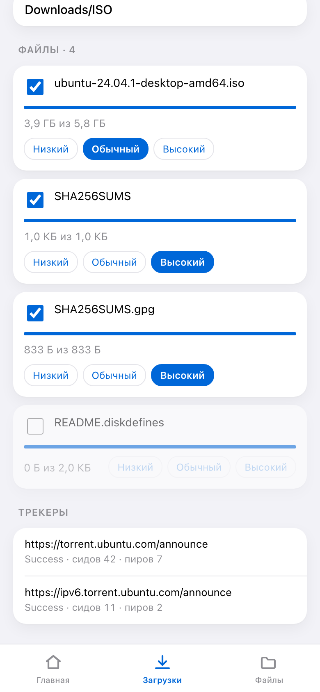

**Добавление.** Поле для ссылки, кнопка «Из буфера», список папок. Ссылку можно и не открывая приложение — просто переслать боту.

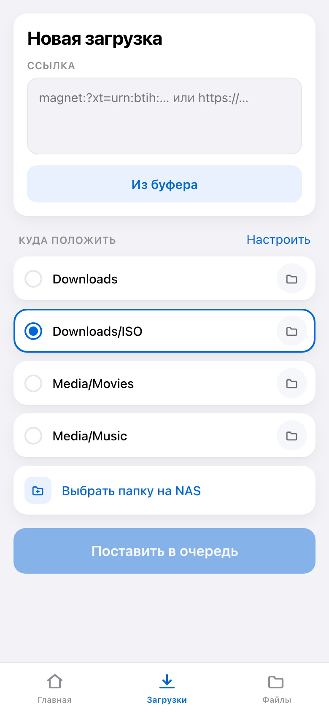

**Папки.** Закреплённые папки, которые появятся в списке выбора. Добавить можно руками или выбрать на NAS через проводник. Изменения сохраняются сразу, без кнопки «Сохранить».

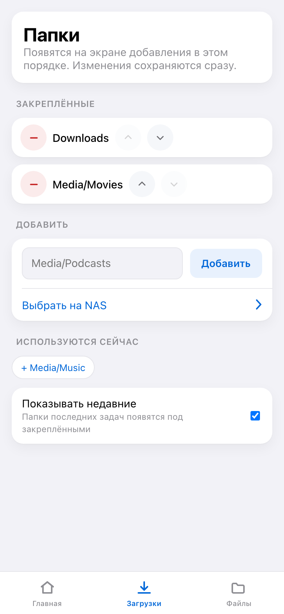

**Файлы.** File Station без веб-интерфейса: обзор папок, загрузка с телефона, переименование, копирование, перенос, удаление.

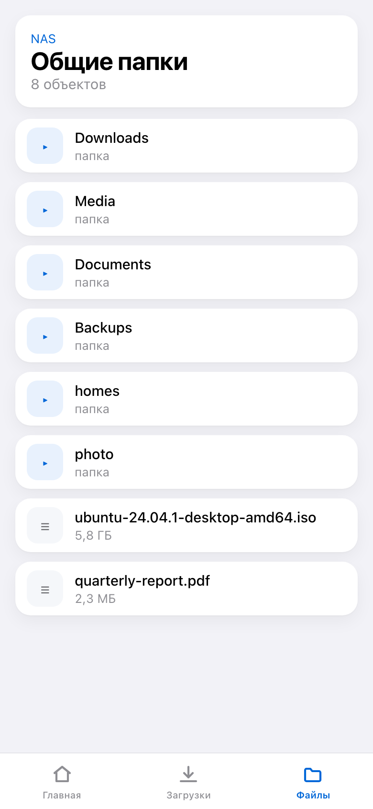

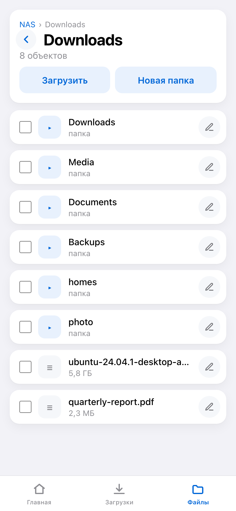

**Хранилище.** Отсеки с дисками и их температурой, пулы, тома, состояние здоровья. Полезно, когда диск начинает сыпаться, а ты не дома.

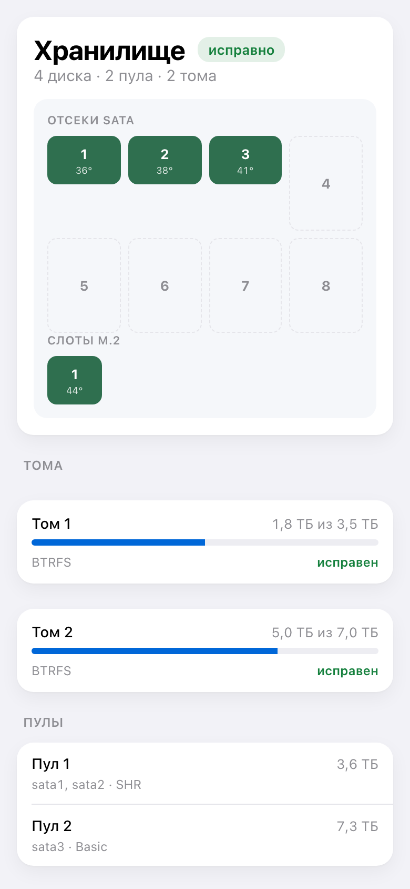

**Виртуальные машины и контейнеры.** Запустить и остановить. Не полноценный VMM, но когда нужно поднять машину удалённо — хватает.

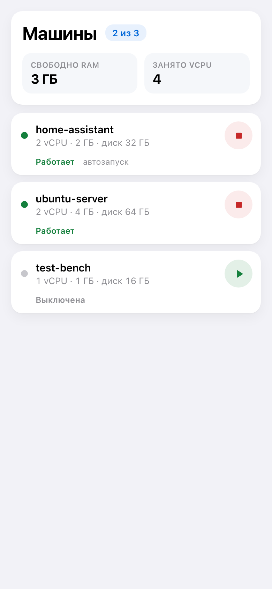

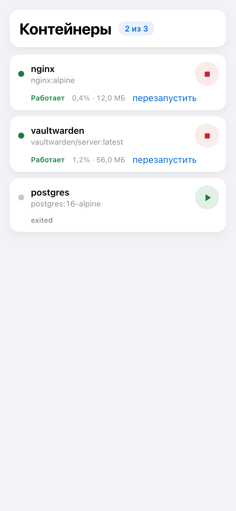

**Журнал событий DSM.** С фильтром по проблемным записям — обычно именно они и нужны.

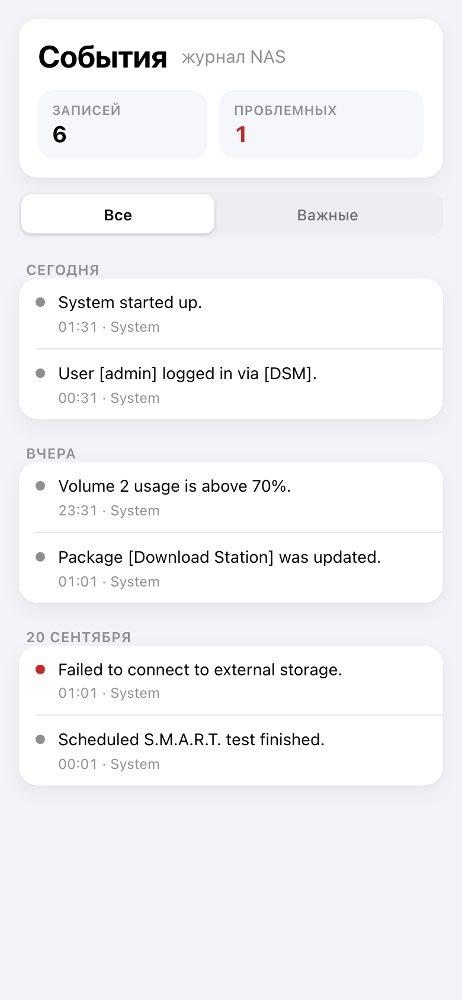

Интерфейс и бот говорят на десяти языках, выбирается по языку клиента Telegram.

## Как это устроено

Один статический бинарник на Go, внутрь которого через `go:embed` зашит собранный React. Никакого отдельного веб-сервера, никакого рантайма — файл и файл.

Ставится пакетом DSM. В Центре пакетов добавляется источник, дальше `dsm-mini` появляется в разделе «Сообщество» и обновляется оттуда же. Мастер установки спрашивает семь значений и объясняет каждое — про это ниже ещё будет.

Снаружи наружу торчит только обратный прокси DSM на 443, а сама служба слушает `127.0.0.1`. Доступ к API проверяется дважды: подпись `initData` ключом от токена бота и числовой идентификатор в белом списке. Пустой список закрывает доступ всем, а не открывает — это ровно та ошибка, которую хочется сделать в спешке.

Для DSM служба заводит отдельного пользователя, не администратора, и только с правами на Download Station и File Station.

## Грабли Synology API

Тут стоит остановиться, потому что документация Synology — это отдельный жанр.

**`SYNO.DownloadStation2.*` не документирован вообще.** Есть старый `SYNO.DownloadStation`, на него есть PDF. Есть новый, второй, который умеет больше, — и про него нет ничего. Способ узнать, что он умеет, ровно один: открыть на NAS код веб-морды в `/var/packages/DownloadStation/target/ui/*.js` и посмотреть, какие вызовы делает сам DSM.

**Пакетные действия отвечают в трёх разных формах.** И в двух из них отказ приходит под `success: true` — надо разбирать массив внутри. Если этого не делать, пользователь увидит «готово» там, где NAS ничего не сделал.

**`limit = -1` работает в Download Station и роняет File Station** в HTTP 502. На любой версии API.

**Кодирование параметров различается в трёх местах одного и того же API.** Обычные вызовы хотят JSON: строки в кавычках. `FileStation.Upload` хочет без кавычек. `DownloadStation2` при создании задачи файлом — снова JSON. А `_sid` при multipart надо класть в строку запроса, а не в тело.

**Пути.** File Station требует ведущий слеш, Download Station — наоборот, без него. Завершающий слеш в пути назначения `CopyMove` даёт ошибку 418.

**Приоритет задачи — это про eMule, а не про торренты.** Вызов принимается, возвращает успех и ничего не делает. Приоритет файлов внутри раздачи — рабочая штука, а приоритет самой задачи для BT существует только на бумаге.

Отдельная история — упаковка в `.spk` и каталог для «Источников пакетов». Формат каталога описан скупо, и обновление у меня падало с «Неверный формат файла» ровно потому, что в записи не было полей `md5` и `size`. Выяснилось это тем же способом: чтением `PkgManApp.js` на NAS, где видно, что Центр пакетов читает их из фида и передаёт в бэкенд как `checksum` и `filesize`.

Там же обнаружилось, что скриншоты в карточке пакета берутся только из каталога, поля `snapshot`, и грузит их не браузер, а сам NAS через `SYNO.Core.Package.Screenshot.Server`. Ни один пакет SynoCommunity этим не пользуется — у всех тридцати восьми в их каталоге это поле пустое.

И совсем мелочь, которая стоила итальянцам английского интерфейса: коды языков DSM — это не коды Telegram, и итальянский там `ita`, а не `itn`. Неизвестный суффикс DSM ошибкой не считает: молча показывает английский. Заметить это может только итальянец.

## Теперь про вайбкодинг

Всё это написано в паре с Claude Code. Я задавал направление и принимал решения, агент писал код, лез в API и собирал релизы. Работает это лучше, чем я ожидал, и ломается не там, где я ожидал.

Что получалось хорошо: рутина. Десять языков интерфейса, десять переводов README, генератор мастера установки, рецепт для SynoCommunity, CI — всё это скучная работа, которую делать руками я бы не стал, и проект остался бы на уровне «работает у меня».

Что получалось плохо — интереснее.

### Агент врёт уверенно

Первое правило, которое пришлось записать в инструкции проекта: **не объяснять поведение API догадкой.** Появилось оно после того, как на вопрос «почему падает» был выдан связный, правдоподобный и неверный ответ. Звучал он как знание, а был перебором вариантов.

Лечится только одним: сначала официальный PDF, потом проверка на живом NAS, и найденное сразу в файл с находками. Не «наверное, потому что», а «проверено вызовом, вот ответ».

### Документация расходится с кодом, и никто этого не видит

В README в разделе безопасности было написано: служба слушает только `127.0.0.1`, наружу всё идёт через обратный прокси. Красиво и правильно.

А установщик писал в конфиг `LISTEN_ADDR=":8080"`, то есть все интерфейсы. Приложение отвечало любому в локальной сети напрямую, мимо прокси. Обнаружилось это не чтением кода, а одной командой `curl` с соседней машины — после того, как я попросил проверить, всё ли готово к публикации.

Это, по-моему, главный урок: **утверждение в документации проверяется на живом порту, а не перечитыванием.** Агент написал и README, и установщик, и не заметил, что они противоречат друг другу. Я тоже не заметил, пока не проверили.

Там же нашлось второе такое же: в инструкции было сказано, что поменять настройку проще всего, установив пакет поверх себя — «мастер спросит заново». Неправда, и она противоречила соседнему абзацу той же страницы, где сказано, что настройки переживают обновление. Оба утверждения сразу верными быть не могут.

### И главное: в боте начали рекламировать порнуху

В README, в примере конфигурации, стоял токен бота. Настоящий. Мой.

Когда агент писал инструкцию по установке, ему нужен был пример токена — и он взял его из моего рабочего `.env` вместо того, чтобы выдумать. Токен уехал в публичный репозиторий, оттуда — в десять переводов README, в девять файлов мастера установки и в compose. Просканировали его быстро: в бота пошёл спам.

Дальше была не самая приятная, но полезная процедура. Отзыв токена в @BotFather — единственное, что реально закрывает дыру, потому что из истории git и из уже выпущенных архивов секрет не вычистить. Потом сверка каждого значения из `.env` по всей истории коммитов: пароль от DSM и публичный адрес, к счастью, не утекали, а вот мой числовой Telegram ID лежал в скрипте для скриншотов.

И только после этого — зачистка и заслон: в CI появилась задача, которая ищет строки формы токена среди файлов репозитория и падает на всём, что не равно заведомой подделке.

Отдельно стоит сказать про масштаб утечки. Токен бота — это не только «могут спамить от твоего имени». Подпись `initData`, которой Mini App доказывает, что человек пришёл из Telegram, считается HMAC на ключе, выведенном из токена. У кого токен — тот подпишет `initData` с любым идентификатором пользователя, пройдёт и проверку подписи, и белый список. То есть через публичный адрес можно было получить полный доступ к Download Station и File Station. Включая удаление файлов.

Так что если вы даёте агенту доступ к рабочему окружению: примеры в документации должны быть выдуманными, и это стоит написать ему явно.

## Что я из этого вынес

**Агент отлично делает то, что скучно, и уверенно врёт про то, чего не знает.** Разница между этими режимами со стороны не видна — интонация одинаковая.

**Поэтому ценность не в том, что он пишет код, а в том, что он может проверить написанное.** Сходить curl'ом, поднять локально настоящий бэкенд, прокликать интерфейс в браузере и посмотреть, что реально произошло. Каждая из трёх историй выше закрылась проверкой, а не рассуждением.

**И третье: правила надо записывать в репозиторий.** У проекта есть файл с инструкциями, который читается в начале каждой сессии, и он вырос из этих самых ошибок: не гадать про API, примеры выдумывать, обещание безопасности проверять на живом порту, сначала запись — потом переход между экранами. Каждая строчка там — чей-то потерянный вечер.

## Ссылки

Проект открытый, MIT: [github.com/alexlnos/dsm-mini](https://github.com/alexlnos/dsm-mini)

Ставится пакетом через «Источники пакетов» Центра пакетов, адрес по архитектуре есть в README. Нужен DSM 7 или новее, Download Station, бот от @BotFather и публичный HTTPS-адрес для Mini App — мастер установки спрашивает и объясняет каждое поле.

Если у вас Synology и телефон — буду рад отзывам и issue.
